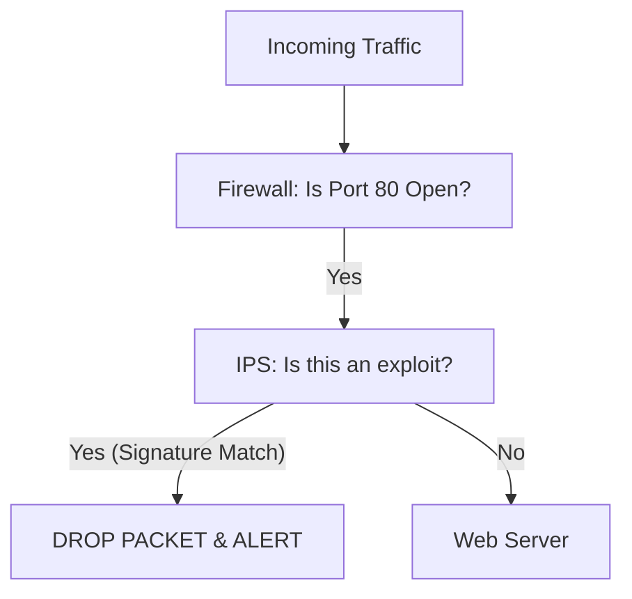

# Firewalls and IPS/IDS: The Digital Border Guard

## 1. Beginner-friendly Hinglish Explanation 🇮🇳
Bhai, **Firewall** tumhare network ka "Security Guard" hai. Iska kaam hai yeh decide karna ki kaunsi "Chitthi" (Packet) andar aayegi aur kaunsi bahar jayegi. 

**IDS (Intrusion Detection System)** ek "CCTV Camera" ki tarah hai jo sirf dekhta hai ki koi chor toh nahi aaya, aur alert bhejta hai. **IPS (Intrusion Prevention System)** ek "Armed Guard" ki tarah hai jo chor ko dekhte hi goli maar deta hai (block kar deta hai). Inke bina, tumhara network ek khule maidan ki tarah hai jahan koi bhi ghus sakta hai.

---

## 2. Deep Technical Explanation
- **Firewall Types**:
    - **Packet Filtering (Stateless)**: Inspects individual packets based on IP/Port. Very fast but "Dumb."
    - **Stateful Inspection**: Remembers the "State" of a connection (e.g., "I saw the SYN, now I'm expecting the ACK"). Much safer.
    - **Next-Generation Firewall (NGFW)**: Inspects the *content* of the packet (Layer 7). Can block "Facebook" or "Malicious SQL" even if it's on Port 443.
- **IDS vs. IPS**:
    - **IDS (Passive)**: Monitors traffic and alerts on signatures or anomalies. Doesn't stop the traffic.
    - **IPS (Active)**: Sits "In-line" and can drop malicious packets in real-time.
- **Detection Methods**:
    - **Signature-based**: Matches traffic against a database of known attacks (like Antivirus).
    - **Anomaly-based**: Learns "Normal" traffic and alerts if something looks weird (e.g., a printer suddenly talking to a Russian IP).

---

## 3. Attack Flow Diagrams
**IDS/IPS in Action:**

---

## 4. Real-world Attack Examples
- **Target Breach (2013)**: The hackers entered via a third-party vendor. The internal IDS actually flagged the activity, but the security team ignored the alerts because they were getting too many "False Positives."
- **Egress Bypass**: Hackers often try to hide their data inside "DNS requests" or "ICMP (Ping)" to bypass firewalls that only look at HTTP/HTTPS.

---

## 5. Defensive Mitigation Strategies
- **Default Deny**: Your firewall should block *everything* by default and only allow specific, known-good traffic.
- **Egress Filtering**: Strictly control what your servers can talk to on the internet (e.g., "The Database server should NEVER talk to the internet").
- **Regular Rule Audits**: Removing old, unused firewall rules that might be creating holes.

---

## 6. Failure Cases
- **False Positives**: When the IPS blocks a legitimate customer because they "Looked" like a hacker.
- **Performance Bottleneck**: A Layer 7 firewall can slow down your network if it's not powerful enough to inspect all the traffic.

---

## 7. Debugging and Investigation Guide
- **Suricata / Snort**: The two most popular open-source IDS/IPS engines.
- **Pfsense / OPNsense**: Open-source firewall operating systems used by many small businesses and prosumers.

---

## 8. Tradeoffs
| Feature | IDS | IPS |
|---|---|---|
| Impact on Latency | Zero | High |
| Protection | Detection Only | Prevention |
| Risk | Low (No false blocks) | High (Can block real users) |

---

## 9. Security Best Practices
- **In-line Deployment**: Always put your IPS *after* the firewall but *before* your critical servers.
- **Centralized Logging**: Send all firewall/IPS logs to a SIEM (like Splunk or ELK) for correlation.

---

## 10. Production Hardening Techniques
- **Geoblocking**: Blocking entire countries that you don't do business with.
- **SSL Inspection**: Using the firewall to "Decrypt" HTTPS traffic (carefully!) to see if there's malware inside.

---

## 11. Monitoring and Logging Considerations
- **Top Blocked IPs**: Who is trying to attack you the most?
- **Signature Updates**: Ensure your IDS/IPS gets daily updates for new "Zero-day" threats.

---

## 12. Common Mistakes
- **Set it and Forget it**: Thinking a firewall makes you safe without ever checking the logs or updating the rules.
- **Internal Blindness**: Only putting a firewall at the "Front Door" (Perimeter) and leaving the internal network completely open.

---

## 13. Compliance Implications
- **PCI-DSS Requirement 1**: Install and maintain a firewall configuration to protect cardholder data.

---

## 14. Interview Questions
1. What is the difference between a Stateful and Stateless firewall?
2. Why would you choose an IDS over an IPS?
3. How do hackers bypass Next-Gen Firewalls?

---

## 15. Latest 2026 Security Patterns and Threats
- **Distributed Cloud Firewalls**: Firewall rules that follow a "Container" or "Lambda function" rather than an IP address.
- **AI-Signature Generation**: IPS systems that use AI to create a new signature for a zero-day attack in milliseconds without human help.
- **Encrypted Traffic Analytics (ETA)**: Identifying malware inside encrypted traffic *without* decrypting it, by looking at packet sizes and timing.
