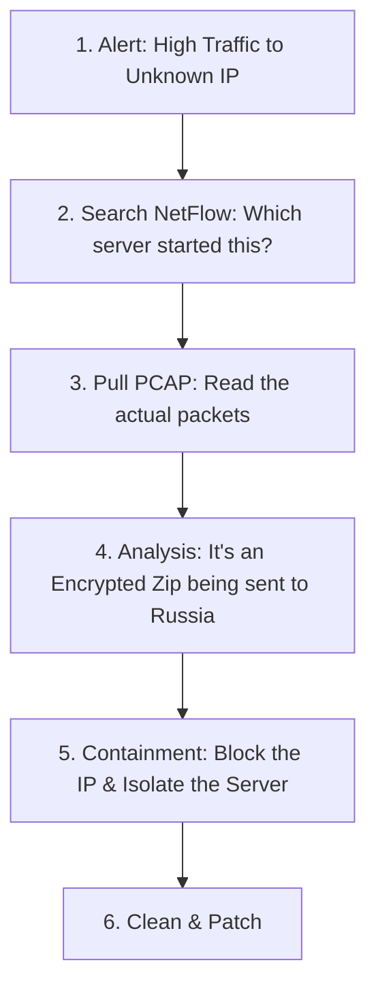

# Network Forensics and Monitoring: The Digital Detective

## 1. Beginner-friendly Hinglish Explanation 🇮🇳
Bhai, **Network Forensics** ka matlab hai "Crime scene investigation digital tareeke se." 

Jab koi hack ho jata hai, toh sabse bada sawaal hota hai: "Hacker andar kaise aaya? Usne kya churaya? Aur woh abhi bhi andar hai kya?" **Network Monitoring** woh tools hain jo har waqt network par nazar rakhte hain (jaise CCTV), aur **Forensics** woh process hai jahan hum purane records (Logs) ko check karke poori kahani decode karte hain. Bina monitoring ke, hacker mahino tak tumhare network mein baitha reh sakta hai aur tumhe pata bhi nahi chalega.

---

## 2. Deep Technical Explanation
- **Full Packet Capture (FPC)**: Recording every single bit that goes over the wire. (Expensive but provides the most evidence).
- **Flow Data (NetFlow)**: Recording the "Summary" of connections (Source IP, Dest IP, Time, Bytes). Much cheaper to store than FPC.
- **Log Correlation**: Combining network logs with Server logs and Application logs to see the "Big Picture."
- **Traffic Analysis**:
    - **Protocol Analysis**: Is someone sending non-DNS traffic over Port 53?
    - **Statistical Analysis**: Why is this server sending 10GB of data at 3 AM?
- **Timeline Analysis**: Creating a chronological list of every network event during the breach.

---

## 3. Attack Flow Diagrams
**Incident Investigation Workflow:**

---

## 4. Real-world Attack Examples
- **Sony Hack (2014)**: The hackers were inside the network for weeks. They used "Network Forensics" after the fact to realize the hackers had stolen terabytes of movies and emails because nobody was monitoring the "Egress" (Outbound) traffic.
- **SolarWinds (2020)**: The hackers used very stealthy "Beaconing" (sending tiny pulses of data). Only advanced network monitoring could have spotted the unusual heartbeat-like patterns.

---

## 5. Defensive Mitigation Strategies
- **SIEM (Security Information and Event Management)**: A central brain (like Splunk or Sentinel) that collects all logs and finds patterns.
- **Zeek (formerly Bro)**: A powerful network analysis framework that turns raw packets into searchable logs.
- **DLP (Data Loss Prevention)**: Network tools that "Look" for credit card numbers or secret keywords in outgoing traffic and block them.

---

## 6. Failure Cases
- **Missing Logs**: Realizing you need a certain log to solve a crime, but you never turned it on.
- **Encrypted Blindness**: If all your traffic is encrypted, your monitoring tools can't see "What" is being sent, only "Who" is sending it.

---

## 7. Debugging and Investigation Guide
- **Wireshark / Tshark**: Analyzing `.pcap` files.
- **NetworkMiner**: A tool that automatically extracts "Files" and "Images" from a network capture.
- **ELK Stack (Elasticsearch, Logstash, Kibana)**: A popular open-source way to build your own monitoring dashboard.

---

## 8. Tradeoffs
| Feature | NetFlow | Full Packet Capture |
|---|---|---|
| Storage Cost | Low | Very High |
| Investigative Value | Medium | Maximum |
| Search Speed | Fast | Slow |

---

## 9. Security Best Practices
- **NTP Synchronization**: Ensure all your servers and routers have the EXACT same time. If times are off by even 1 second, you can't correlate the logs.
- **Retain Logs for 90+ Days**: Many breaches are only discovered months later.

---

## 10. Production Hardening Techniques
- **TAP / SPAN Ports**: Using special hardware to "Mirror" traffic to your monitoring tools without slowing down the actual network.
- **Decryption Mirrors**: Decrypting traffic at the Load Balancer and sending a "Plaintext Copy" to the IDS for inspection.

---

## 11. Monitoring and Logging Considerations
- **Baseline Creation**: Spend 2 weeks learning what "Normal" looks like before you start setting up "Alerts."
- **Internal vs External**: Monitor not just the "Front Door" but also the "East-West" traffic between internal servers.

---

## 12. Common Mistakes
- **Log Overload**: Collecting too many logs so that the "Real" alerts get lost in the noise (Alert Fatigue).
- **Not testing the "Incident Response" plan**: Having the logs but not knowing how to read them when an emergency happens.

---

## 13. Compliance Implications
- **PCI-DSS Requirement 10**: Track and monitor all access to network resources and cardholder data.
- **SOC2**: Requires proof of continuous monitoring and timely response to security incidents.

---

## 14. Interview Questions
1. What is the difference between NetFlow and PCAP?
2. Why is "Time Synchronization" (NTP) critical for forensics?
3. How do you detect "Data Exfiltration" in a network?

---

## 15. Latest 2026 Security Patterns and Threats
- **NDR (Network Detection and Response)**: The new generation of tools that use AI to automatically "Hunt" for threats in network traffic.
- **Cloud-Native Logging (VPC Flow Logs)**: Using cloud provider tools to monitor virtual networks without installing any agents.
- **Encrypted Traffic Analysis (ETA)**: Identifying malware patterns in HTTPS traffic without needing to decrypt the session.
