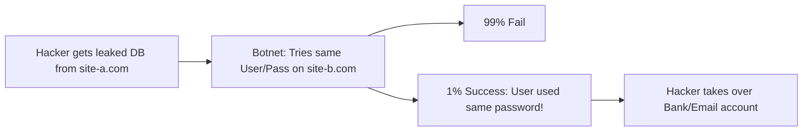

# Authentication Fundamentals: Who Are You?

## 1. Beginner-friendly Hinglish Explanation 🇮🇳
Bhai, **Authentication (AuthN)** ka simple matlab hai: "Aap kaun hain?" 

Socho tum ek VIP party mein gaye. Security guard tumse tumhari ID card mangta hai. Agar tumhare paas valid ID hai, toh tum "Authenticated" ho. Lekin party ke andar tum "Bar" par ja sakte ho ya "VIP Lounge" mein, woh "Authorization" (AuthZ) ka kaam hai. Authentication security ka pehla kadam hai. Agar tumhara AuthN system kamzor hai (jaise "123456" password allow karna), toh baki saari security (firewalls, encryption) kisi kaam ki nahi hai.

---

## 2. Deep Technical Explanation
Authentication is the process of verifying the identity of a user, device, or system. It typically relies on one or more of these factors:
- **Knowledge Factor**: Something you *know* (Password, PIN, Secret question).
- **Possession Factor**: Something you *have* (Phone, Hardware key/YubiKey, Smart card).
- **Inherence Factor**: Something you *are* (Fingerprint, Face ID, Iris scan).

Modern AuthN patterns:
- **Passwordless**: Using Magic Links or Passkeys.
- **SSO (Single Sign-On)**: Log in once, access 100 apps (e.g., Log in with Google).
- **Federated Identity**: Trusting an external provider (IDP) like Okta or Azure AD.

---

## 3. Attack Flow Diagrams
**Credential Stuffing Attack:**

---

## 4. Real-world Attack Examples
- **RockYou Leak (2009)**: 32 million passwords stored in plain text were leaked. This list is still used today for "Dictionary Attacks."
- **MFA Fatigue Attack (Uber 2022)**: A hacker sent 100s of MFA "Push" notifications to an employee's phone at 3 AM. Out of frustration, the employee finally clicked "Approve," letting the hacker in.

---

## 5. Defensive Mitigation Strategies
- **Multi-Factor Authentication (MFA)**: Mandatory. Never allow sensitive access with just a password.
- **Account Lockout / Throttling**: If someone enters the wrong password 5 times, lock the account for 30 minutes.
- **Salted Hashing**: Never store passwords in plain text. Use algorithms like **Argon2** or **bcrypt** with a unique "Salt" for each user.

---

## 6. Failure Cases
- **Generic Error Messages**: Saying "Invalid Username" vs "Invalid Password." If you say "Invalid Password," you are telling the hacker that the "Username" is correct, helping them.
- **Broken Password Reset**: A reset link that doesn't expire or is predictable (like `site.com/reset?user=alice`).

---

## 7. Debugging and Investigation Guide
- **Auth Logs**: Monitoring for `failed_login` events across many accounts from the same IP.
- **JWT Debugging**: Checking if a token has expired but the server is still accepting it.

---

## 8. Tradeoffs
| Method | Security | User Experience |
|---|---|---|
| Long Password | High | Annoying |
| Passkeys | Ultra-High | Needs modern device |
| Magic Links | Medium | Dependency on Email |

---

## 9. Security Best Practices
- **Password Complexity**: Enforce length (12+ chars) over complexity symbols.
- **NIST Guidelines**: Don't force users to change passwords every 90 days unless there's a breach. It leads to weak passwords like `Summer2026!`.

---

## 10. Production Hardening Techniques
- **Secure SRP (Secure Remote Password)**: A protocol that allows the server to verify your password without you ever actually sending the password over the network.
- **Hardware Security Modules (HSM)**: Storing the "Keys" that encrypt passwords in a physical piece of hardware that cannot be hacked.

---

## 11. Monitoring and Logging Considerations
- **Impossibly Travel Alerts**: If a user logs in from New York and 5 minutes later from Tokyo, it's a compromised account.
- **Log Source IP and User Agent**: To identify botnets.

---

## 12. Common Mistakes
- **Rolling your own Auth**: "I'll write my own login logic." DON'T. Use a proven library (Passport, Auth0, Clerk).
- **Storing passwords in reversible encryption**: If you can "Decrypt" a password, so can a hacker. Always use one-way Hashing.

---

## 13. Compliance Implications
- **SOC2 / HIPAA**: Requires proof of MFA for all administrative access and documented password policies.

---

## 14. Interview Questions
1. What are the 3 factors of authentication?
2. Why is "Salting" a password important?
3. How would you prevent a "Credential Stuffing" attack?

---

## 15. Latest 2026 Security Patterns and Threats
- **Passkeys (FIDO2)**: The final move away from passwords to public-key cryptography stored on your phone's secure enclave.
- **Continuous Authentication**: Instead of a one-time login, the system monitors your "Behavioral Biometrics" (how you type, move the mouse) to ensure it's still you.
- **Deepfake Voice Auth Bypassing**: Attackers using AI to clone a user's voice to bypass voice-based MFA systems.
    
    
    
    
    
    
    
    
    
    
    
    
