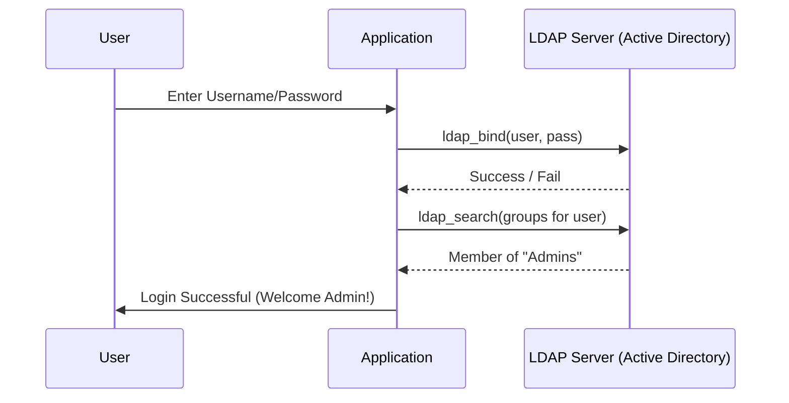

# Directory Services and LDAP: The Phonebook of the Enterprise

## 1. Beginner-friendly Hinglish Explanation 🇮🇳
Bhai, **Directory Services** ka matlab hai company ki "Digital Directory" ya "Phonebook." 

Socho ek badi company mein 5,000 employees hain. Har ek ka apna PC hai, email hai, aur 50 alag-alag apps hain. Agar har app ka password alag hoga, toh log pagal ho jayenge. Isliye hum **Active Directory (AD)** ya **LDAP** use karte hain. Yeh ek central database hota hai jismein sabki details (Name, Role, Email, Manager) aur passwords hote hain. Jab aap office ke laptop par login karte ho, toh woh AD se poochta hai ki "Kya yeh password sahi hai?" Isse "Centralized Management" asaan ho jati hai.

---

## 2. Deep Technical Explanation
- **Directory Service**: A software system that stores, organizes, and provides access to information in a computer network's resources.
- **LDAP (Lightweight Directory Access Protocol)**: The "Language" used to talk to the directory. It runs on Port 389 (Plain) or 636 (Secure/LDAPS).
- **Active Directory (AD)**: Microsoft's implementation of a directory service. It includes LDAP, Kerberos (for auth), and DNS.
- **Structure**:
    - **Objects**: Users, Computers, Printers.
    - **OU (Organizational Unit)**: Folders to group objects (e.g., "Sales Dept").
    - **Forest/Domain**: The highest levels of hierarchy.

---

## 3. Attack Flow Diagrams
**LDAP Authentication Flow:**

---

## 4. Real-world Attack Examples
- **LDAP Injection**: Just like SQL Injection, a hacker can manipulate an LDAP query to bypass authentication or extract the entire employee list.
- **Kerberoasting**: A popular attack in Active Directory where a hacker steals "Service Tickets" from memory and cracks them offline to get service account passwords.

---

## 5. Defensive Mitigation Strategies
- **LDAPS (LDAP over SSL)**: Never use plain LDAP. If you do, a hacker on the network can see everyone's password in plaintext.
- **Account Lockout Policies**: After 5 wrong attempts, lock the account for 30 minutes to prevent brute-force attacks.
- **Monitor Privileged Groups**: Alerting whenever someone is added to the "Domain Admins" group.

---

## 6. Failure Cases
- **Anonymous Binds**: Configuring the LDAP server so that anyone can search the directory without logging in. This is an information leak goldmine for hackers.
- **AD Sync Failures**: When the cloud (Azure/Okta) and local AD go out of sync, leading to "Ghost" accounts that should have been deleted.

---

## 7. Debugging and Investigation Guide
- **`ldapsearch`**: A powerful command-line tool to query any LDAP server.
- **AD Explorer**: A tool from Sysinternals to view the entire Active Directory tree.
- **LDP.exe**: The built-in Windows tool for testing LDAP connections.

---

## 8. Tradeoffs
| Feature | Active Directory (AD) | Cloud Directory (Azure/Okta) |
|---|---|---|
| Control | Total | Managed |
| Cost | High (Server/License) | Monthly Subscription |
| Remote Work| Hard (Needs VPN) | Native Support |

---

## 9. Security Best Practices
- **Tiered Administrative Model**: "Domain Admins" should NEVER log in to a regular employee's laptop. If they do, their password can be stolen from that laptop's memory.
- **Regular Cleanup**: Use scripts to find and disable accounts for employees who haven't logged in for 90 days.

---

## 10. Production Hardening Techniques
- **Group Policy Objects (GPOs)**: Using AD to automatically "Push" security settings to every computer in the company (e.g., "Turn on Firewall," "Disable USB ports").
- **Read-Only Domain Controllers (RODC)**: Placing a limited AD server in a risky branch office so that if it's stolen, the hacker doesn't get the whole company's secrets.

---

## 11. Monitoring and Logging Considerations
- **Event ID 4720**: User account was created.
- **Event ID 4728**: A member was added to a security-enabled global group.
- **Unusual Search Patterns**: Flagging if a single user account tries to "Read" the entire directory at once.

---

## 12. Common Mistakes
- **Flat AD Structure**: Putting everyone in the same bucket without OUs, making it impossible to apply different security policies.
- **Leaving the 'Description' field full of secrets**: Many IT admins put temporary passwords or server details in the user's description field.

---

## 13. Compliance Implications
- **SOX (Sarbanes-Oxley)**: Requires strict auditing of who has access to financial systems. Since AD manages this access, AD logs are critical for SOX audits.

---

## 14. Interview Questions
1. What is the difference between LDAP and Active Directory?
2. Why should you always use LDAPS instead of LDAP?
3. How does Kerberos authentication work in an AD environment?

---

## 15. Latest 2026 Security Patterns and Threats
- **Cloud-Only Identity**: Many new startups are skipping local AD entirely and using **Azure AD (Entra ID)** or **Okta** for everything.
- **Graph API Attacks**: Hackers moving away from LDAP to using "Graph APIs" to steal data from Microsoft 365 environments.
- **Identity Orchestration**: Using tools that can "Translate" identities between different clouds (AWS, GCP, Azure) automatically.
