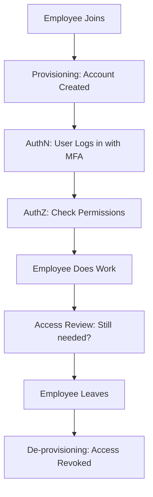

# IAM Fundamentals: Who Are You and What Can You Do?

## 1. Beginner-friendly Hinglish Explanation 🇮🇳
Bhai, **IAM (Identity and Access Management)** ka matlab hai "Ghar ki chabiyan sahi logon ko dena." 

Security mein do bade sawaal hote hain: 
1. **Authentication (AuthN)**: "Tum kaun ho?" (Identity prove karna, jaise login karna).
2. **Authorization (AuthZ)**: "Tumhe kya karne ki ijazat hai?" (Permissions check karna, jaise admin ho ya normal user).
IAM woh poora framework hai jo yeh manage karta hai ki kis user ko, kis resource ka, kitna access milna chahiye. Iska main mantra hai: **"Least Privilege"**—yani kisi ko bhi zarurat se zyada access mat do.

---

## 2. Deep Technical Explanation
IAM covers the entire lifecycle of an identity:
- **Provisioning**: Creating a new user account.
- **Authentication**: Verifying identity via Passwords, Biometrics, or Tokens.
- **Authorization**: Granting permissions (RBAC/ABAC).
- **Audit/Review**: Checking if the user still needs that access.
- **De-provisioning**: Deleting the account when the employee leaves.

Key Concepts:
- **Identification**: Claiming an identity (Username).
- **Verification**: Proving the identity (Password/MFA).
- **Entitlements**: The specific rights a user has (Read/Write/Delete).

---

## 3. Attack Flow Diagrams
**The IAM Lifecycle:**

---

## 4. Real-world Attack Examples
- **Zombie Accounts**: An employee leaves the company, but their account isn't deleted. A hacker finds the password and uses the "Zombie" account to enter the network undetected.
- **Over-privileged Users**: A junior developer has "Full Admin" access to the production database. They accidentally run `DROP TABLE` instead of `SELECT`, causing a massive outage.

---

## 5. Defensive Mitigation Strategies
- **Principle of Least Privilege (PoLP)**: Users should only have the minimum access necessary to perform their job.
- **Segregation of Duties (SoD)**: The person who *requests* a payment shouldn't be the same person who *approves* it.
- **Just-in-Time (JIT) Access**: Don't give permanent admin rights. Give them for 2 hours only when a ticket is opened.

---

## 6. Failure Cases
- **Manual Provisioning**: If a person has to manually create accounts, they will make mistakes, forget to delete accounts, or give wrong permissions. (Always use automation).
- **Broken Access Control**: The app checks "Who" you are, but forgets to check "What" you are allowed to do (e.g., a user changing their own ID in the URL to see someone else's profile).

---

## 7. Debugging and Investigation Guide
- **Access Logs**: Searching for "Access Denied" errors to see if someone is trying to probe the system.
- **IAM Simulators**: Cloud providers (like AWS) have "IAM Policy Simulators" to test if a specific policy will allow or block an action.

---

## 8. Tradeoffs
| Strategy | Security | User Experience |
|---|---|---|
| Strict IAM | Very High | Slower (More hurdles) |
| Loose IAM | Low | Faster (Frictionless) |
| SSO/MFA | High | Balanced |

---

## 9. Security Best Practices
- **Never Share Accounts**: Every person must have their own unique ID. "Admin/Admin" is a sin.
- **Centralized Identity**: Use one source of truth (like Active Directory or Okta) for all applications.

---

## 10. Production Hardening Techniques
- **Conditional Access**: "You can only log in if you are on a company laptop AND in the home country AND have MFA enabled."
- **Immutable Identities**: Once a username is created, it can never be changed or reused by someone else.

---

## 11. Monitoring and Logging Considerations
- **Orphaned Account Detection**: Automatically flagging accounts that haven't been used in 30 days.
- **Privilege Escalation Alerts**: Monitoring for users who suddenly get "Admin" rights without a corresponding HR/Ticket change.

---

## 12. Common Mistakes
- **Confusing AuthN and AuthZ**: Just because someone logged in doesn't mean they can see everything.
- **Hardcoded API Keys**: Treating a "System Identity" differently than a "Human Identity." Both need to be managed and rotated.

---

## 13. Compliance Implications
- **SOC2 / SOX**: Requires strict "Access Reviews" (usually every 90 days) where managers must sign off that their team members still need their current access.

---

## 14. Interview Questions
1. What is the difference between Authentication and Authorization?
2. Explain the "Principle of Least Privilege."
3. What is an "Orphaned Account" and why is it dangerous?

---

## 15. Latest 2026 Security Patterns and Threats
- **Identity-First Security**: The network is no longer the perimeter; the **Identity** is the new perimeter.
- **Passkeys (FIDO2)**: Moving to a "Passwordless" world where biometrics and hardware keys replace text passwords.
- **Machine Identity Management**: Managing the billions of "Identities" used by bots, microservices, and IoT devices.
