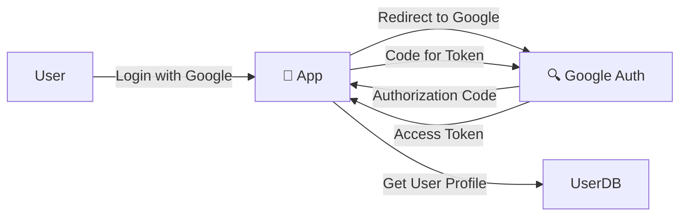

# 👤 IAM: Identity & Access Management (Security Guide)
> **Level:** Beginner → Expert | **Goal:** Master RBAC, ABAC, Single Sign-On, and Multi-Factor Auth
## 🧭 Core Concepts (Concept-First)
+- IAM Fundamentals: Authentication vs authorization, identity lifecycle management
+- Access Control Models: RBAC, ABAC, and other authorization frameworks
+- Authentication Methods: Passwords, biometrics, tokens, certificates, and multi-factor
+- Session Management: Creation, maintenance, expiration, and secure handling
+- Privileged Access: Just-in-time access, elevation, and monitoring of privileged accounts
+- Practical IAM Implementation: Role engineering, policy enforcement, and audit trails
---

## 📋 Is Guide Se Kya Seekhoge

| Topic | Importance |
|-------|------------|
| 1. Authentication vs Authorization | 401 vs 403 HTTP errors |
| 2. RBAC (Role Based Access Control) | Grouping permissions |
| 3. ABAC (Attribute Based Access Control) | Contextual permissions |
| 4. Single Sign-On (SSO) | Google/Facebook login logic |
| 5. MFA (Multi-Factor Auth) | Protecting account breach |
| 6. OAuth 2.0 & OpenID Connect | Cross-app trust |

---

## 🏗️ 1. Authentication (AuthN) vs Authorization (AuthZ)

Hamesha confusion hota hai in do words mein.
- **Authentication:** Who are you? (Login, Password, Face ID).
- **Authorization:** What can you do? (Can you delete a file? Can you access admin panel?).

---

## 🎭 2. RBAC: Role Based Access Control

Permissions ko Roles mein group karna.

- **Admin:** (Read, Write, Delete).
- **Editor:** (Read, Write).
- **Viewer:** (Read).

```python
# RBAC logical check
def check_permission(user_role, action):
    roles = {
        "admin": ["read", "write", "delete"],
        "viewer": ["read"]
    }
    return action in roles.get(user_role, [])
```

---

## 🛡️ 3. ABAC: Attribute Based Access Control (Advanced)

RBAC hamesha kaafi nahi hota. Example: User "A" sirf subah 9-5 office subnet se file dekh sake. 
Permissions check karte waqt hum attributes (IP, Time, Dept, Security Clear) dekhte hain.

---

## 🔑 4. Single Sign-On (SSO) & OAuth 2.0

User har website pe naya account nahi banata. **OAuth 2.0** use karke user apni "Identity" share karta hai.

- **Client:** Aapki app.
- **Resource Owner:** User.
- **Auth Server:** Google/Github.



---

## 🛡️ 5. Multi-Factor Authentication (MFA)

Password leakage normal hai (Phishing/Data breach). **MFA** protect karta hai login by adding layers:
- **Something you know:** Password.
- **Something you have:** Phone (OTP/Authenticator App).
- **Something you are:** Fingerprint/FaceID.

**Logic:** SMS OTP unsafe hai (SIM swapping). **Authenticator Apps (TOTP)** best solution hain.

---

## 📂 6. Zero Trust Architecture

"Don't trust anybody inside or outside the network." Har request ko verify karo, hamesha authenticate aur authorize karo code level pe (Least Privilege principle).

---

## 🧪 Exercises — IAM Scenario Challenges!

### Challenge 1: Permission Management! ⭐⭐
**Scenario:** Aapke paas `CEO` role hai. `CEO` ko hamesha poore system ka access chahiye. 
Question: Kya `CEO` ko direct `Admin` role dena secure hai?
<details><summary>Answer</summary>
Nahi! **Principle of Least Privilege** ke hisaab se use sirf apne reports dekhne ka access do. `Admin` access sirf system maintenance ke liye use hona chahiye "Technical admin accounts" se.
</details>

---

## 🔗 Resources
- [Microsoft Entra ID (Formerly Azure AD)](https://learn.microsoft.com/en-us/entra/)
- [Auth0 University (Free Auth Tutorials)](https://auth0.com/docs/)
- [OAuth 2.0 Simplified (Aaron Parecki)](https://aaronparecki.com/oauth-2-simplified/)
