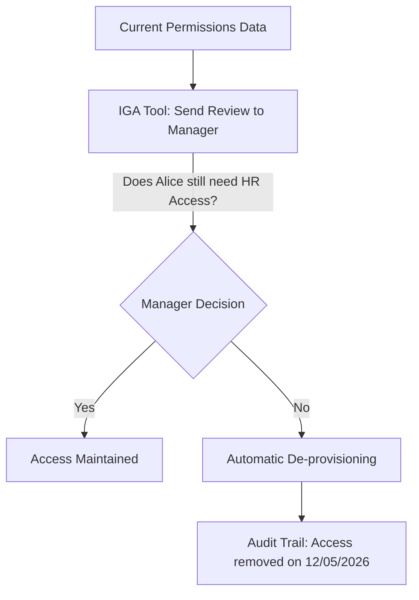

# Identity Governance and Administration (IGA): Managing the Identity Lifecycle

## 1. Beginner-friendly Hinglish Explanation 🇮🇳
Bhai, **IGA (Identity Governance and Administration)** ka matlab hai "Auditing aur Checklist." 

IAM sikhata hai ki access *kaise* dena hai, lekin IGA sikhata hai ki access *kyun* diya gaya aur kya use *hatana* chahiye? Socho ek employee Sales se Marketing mein chala gaya. Uske paas abhi bhi Sales ke sensitive records ka access hai—yeh ek security risk hai. IGA system har thode din mein manager ko poochta hai: "Bhai, kya is bande ko abhi bhi is folder ka access chahiye?" Agar manager "No" kehta hai, toh access apne aap khatam. IGA compliance ke liye sabse zaruri hai.

---

## 2. Deep Technical Explanation
IGA combines Identity Administration and Identity Governance.
- **Administration (How)**:
    - User provisioning/de-provisioning.
    - Password management.
    - Profile management.
- **Governance (Why & Audit)**:
    - **Access Certifications**: Periodic reviews of user rights.
    - **Policy Management**: Defining rules (e.g., "Contractors cannot have access to the Finance DB").
    - **Role Mining**: Using data to discover which permissions should be grouped into a "Role."
    - **SOD (Segregation of Duties)**: Ensuring no single person has too much power (e.g., creating a vendor and paying a vendor).

---

## 3. Attack Flow Diagrams
**The Access Review Cycle:**

---

## 4. Real-world Attack Examples
- **Internal Fraud**: An employee in the accounting department noticed they had access to both "Enter Invoice" and "Approve Payment" because their old access was never revoked. They created a fake company and paid themselves $1M before being caught.
- **The 'Over-privileged' Contractor**: A third-party contractor was given full admin access for a weekend project. 2 years later, they were still logged in, and their credentials were leaked, giving hackers a direct path into the company.

---

## 5. Defensive Mitigation Strategies
- **Automated Lifecycle Management**: Connect your HR system (like Workday) directly to your IGA system. When HR marks someone as "Terminated," all their access should be killed automatically within seconds.
- **Birthright Provisioning**: Automatically giving a new employee the basic things they need (Email, Slack) based on their department, so admins don't have to do it manually.

---

## 6. Failure Cases
- **Rubber-Stamping**: When managers have to review 500 people, they just click "Approve All" without looking. This makes the whole IGA process useless.
- **Stale Roles**: Creating a "Super-Developer" role that has 50 permissions, but only 5 are actually used.

---

## 7. Debugging and Investigation Guide
- **SailPoint / Saviynt**: The heavy hitters in the IGA space.
- **Audit Reports**: Generating a "Who has access to X?" report to find anomalies.

---

## 8. Tradeoffs
| Metric | Manual Review | IGA Automation |
|---|---|---|
| Speed | Slow | Instant |
| Accuracy | Low (Human error) | High |
| Initial Setup | Easy | Very Difficult |

---

## 9. Security Best Practices
- **Recertify High-Risk Access more often**: Review "Domain Admins" every month, but "Regular Users" only once a year.
- **Define clear "Owners" for every app**: Someone must be responsible for deciding who gets in.

---

## 10. Production Hardening Techniques
- **Self-Service Access Requests**: Let users request access via a portal. The IGA system then routes the request to the right manager for approval, creating a paper trail.
- **Dynamic Group Membership**: Using rules like `if (department == 'Sales') add to 'Sales_Folder'`. If the department changes, they are removed automatically.

---

## 11. Monitoring and Logging Considerations
- **Orphaned Account Reports**: Accounts with no matching record in the HR system.
- **Inconsistent Access**: A user who has "Manager" rights but is listed as a "Junior" in HR.

---

## 12. Common Mistakes
- **Treating IGA as an IT problem**: It's a business problem. IT doesn't know who *should* have access; the managers do.
- **Poor Data Quality**: If the names in HR don't match the names in Active Directory, the IGA system will fail.

---

## 13. Compliance Implications
- **SOX Section 404**: Requires companies to prove they have "Internal Controls" over financial reporting. IGA is the primary tool used to prove these controls.

---

## 14. Interview Questions
1. What is "Segregation of Duties" (SoD)?
2. How does IGA help with the "Mover" process (when an employee changes roles)?
3. What is "Rubber-stamping" and how do you prevent it?

---

## 15. Latest 2026 Security Patterns and Threats
- **AI-Guided Certification**: AI analyzes user behavior and suggests to the manager: "Alice hasn't used this app in 6 months, you should probably revoke her access."
- **Identity Data Lakes**: Consolidating every single identity event from across the company into one massive database for advanced analytics.
- **Decentralized Identity Governance**: Letting teams manage their own access policies within a global "Governance Guardrail."
