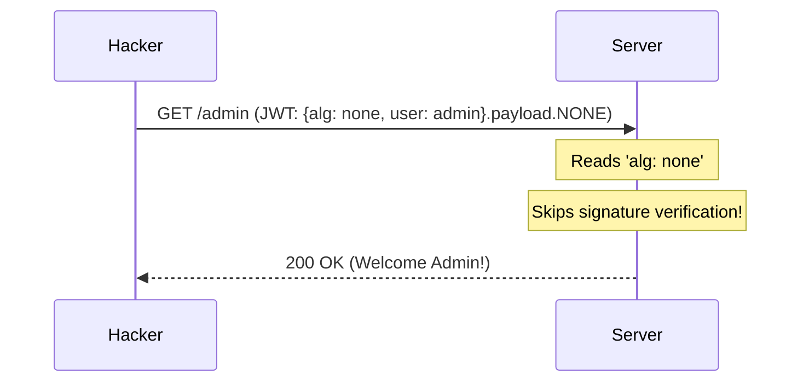

# JWT & Session Security: The Token War

## 1. Beginner-friendly Hinglish Explanation 🇮🇳
Bhai, jab tum login karte ho, toh server tumhe ek "Parchi" (Token) deta hai. 
1. **Sessions**: Server apne register (Database) mein likhta hai ki "Token #123 Alice ka hai." 
2. **JWT (JSON Web Tokens)**: Parchi par hi likha hota hai "Yeh Alice hai" aur server ne uspar apne "Sign" (Digital Signature) kiye hote hain. 

JWT ka fayda yeh hai ki server ko database check nahi karna padta. Lekin nuksan yeh hai ki agar parchi chori ho gayi, toh use "Cancel" (Revoke) karna bohot mushkil hai. Is module mein hum seekhenge ki kaise in parchiyon ko lock karein taaki hacker unka galat fayda na utha sake.

---

## 2. Deep Technical Explanation
- **Sessions (Stateful)**:
    - Server stores session data in memory/Redis.
    - Client gets a `SessionID` in an `HttpOnly` cookie.
    - Security: Immediate revocation (just delete the session from Redis).
- **JWT (Stateless)**:
    - Data (Claims) is base64 encoded and signed with a secret (HMAC) or private key (RSA/ECDSA).
    - Client stores it in `localStorage` or `Cookie`.
    - Security: Impossible to revoke without a blacklist or short expiry times.
- **Structure of JWT**: `Header.Payload.Signature`

---

## 3. Attack Flow Diagrams
**JWT 'None' Algorithm Exploit:**

---

## 4. Real-world Attack Examples
- **JWT Signature Bypassing**: Many early JWT libraries had a bug where they would trust the "alg" header from the attacker. If the attacker set it to `none`, the server would skip checking the signature entirely.
- **Logitech Token Leak**: Hardcoded JWT secrets in an app allowed anyone to create their own admin tokens and control thousands of smart home devices.

---

## 5. Defensive Mitigation Strategies
- **Never use 'alg: none'**: Explicitly whitelist the algorithms you support (e.g., `HS256` or `RS256`).
- **Short-lived Access Tokens**: Set JWTs to expire in 15 minutes. Use a "Refresh Token" to get a new one.
- **Refresh Token Rotation**: Every time a refresh token is used, delete it and issue a new one. If a hacker steals a refresh token and uses it, the real user's token becomes invalid, alerting the system to the theft.

---

## 6. Failure Cases
- **Storing JWT in LocalStorage**: This makes the token vulnerable to XSS. If a hacker runs a script on your site, they can do `localStorage.getItem('token')`.
- **Large JWT Payloads**: Putting too much data in a JWT makes every HTTP request slow and can hit header size limits.

---

## 7. Debugging and Investigation Guide
- **jwt.io**: To inspect the contents of a token.
- **Checking Signature**: Trying to change a character in the payload and seeing if the server correctly rejects it with a `401`.

---

## 8. Tradeoffs
| Metric | Sessions | JWT |
|---|---|---|
| Scalability | Low (Needs shared DB) | High (Stateless) |
| Revocation | Instant | Hard |
| Security | Higher (HttpOnly) | Lower (often in LocalStorage) |

---

## 9. Security Best Practices
- **Use `HttpOnly` Cookies for JWTs**: This is the best of both worlds. You get a stateless token but protect it from XSS.
- **Validate `aud` (Audience) and `iss` (Issuer)**: Ensure the token was meant for *your* app and issued by *your* server.

---

## 10. Production Hardening Techniques
- **Asymmetric Signing (RS256)**: The Auth server signs with a Private Key, and the Microservices verify with a Public Key. Even if a microservice is hacked, the hacker can't "Create" new tokens.
- **JWT Blacklisting**: Storing the IDs of "Logged out" JWTs in Redis until they expire.

---

## 11. Monitoring and Logging Considerations
- **Monitor Token Expiry Spikes**: If suddenly thousands of tokens are being refreshed at once, it might be a session-stealing botnet.
- **Log the `jti` (JWT ID)**: To track a single token's journey across multiple microservices.

---

## 12. Common Mistakes
- **Using a weak HMAC Secret**: If your secret is `password`, a hacker can brute-force it in seconds using `hashcat`.
- **Sensitive data in Payload**: Never put a user's SSN or password hash in a JWT.

---

## 13. Compliance Implications
- **GDPR**: Revocation is a right. If a user asks to "Forget me," you MUST be able to invalidate all their active JWTs immediately.

---

## 14. Interview Questions
1. Why is a JWT considered "Stateless"?
2. What are the risks of storing a JWT in `localStorage`?
3. How does "Refresh Token Rotation" work?

---

## 15. Latest 2026 Security Patterns and Threats
- **DPoP (Demonstrating Proof-of-Possession)**: A new standard that "Binds" a JWT to a specific browser's private key. Even if the JWT is stolen, it's useless on another computer.
- **JWT Shrinking**: Using binary formats like **CBOR** (CBOR Web Tokens - CWT) for IoT devices where every byte counts.
- **OIDC Front-channel Logout**: Solving the revocation problem by having the browser notify all apps to clear their local JWTs.
    
    
    
    
    
    
    
    
    
    
    
    
    
    
