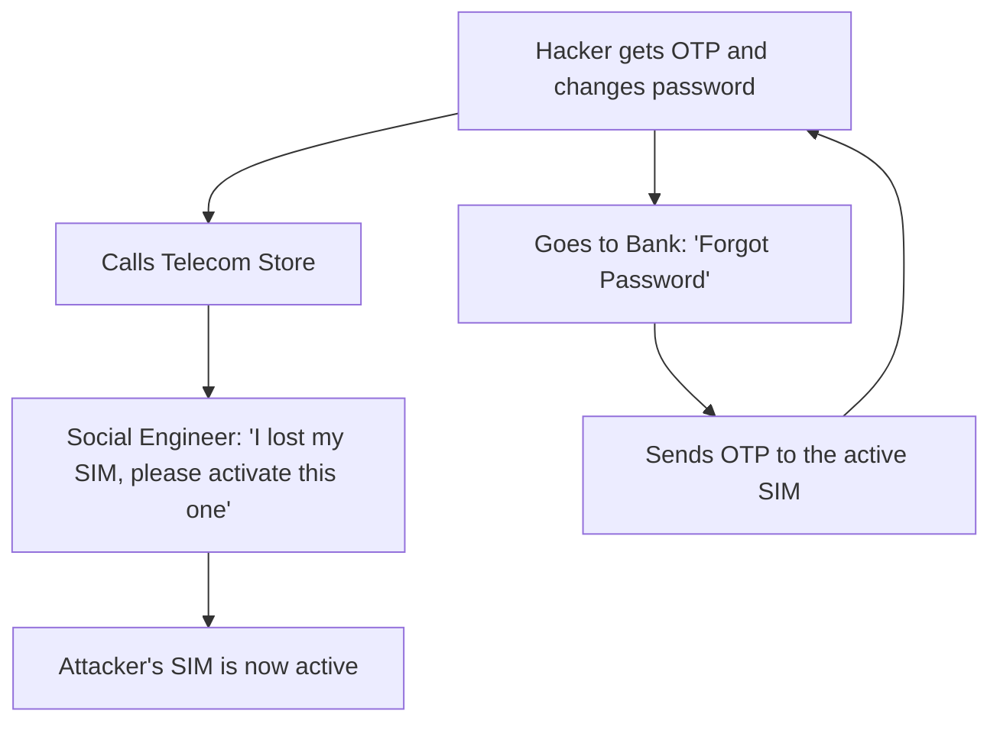

# Multi-Factor Authentication (MFA): The Double Lock

## 1. Beginner-friendly Hinglish Explanation 🇮🇳
Bhai, **MFA** ka matlab hai "Ek chabi se kaam nahi chalega." 

Socho tumne apne ghar par do taale (locks) lagaye hain. Ek ki chabi tumhare paas hai (Password), aur dusre ka code tumhare phone par aata hai (OTP). Agar chor tumhari chabi chura bhi le, toh woh dusre lock ke bina ghar mein nahi ghus sakta. 2026 mein, bina MFA ke internet par rehna aisa hai jaise bina darwaze ke ghar mein sona. Is module mein hum seekhenge ki kaunsa MFA sabse "Pakka" (Secure) hai aur kaunse MFA (jaise SMS OTP) ko hackers asani se tod sakte hain.

---

## 2. Deep Technical Explanation
MFA requires at least two of the three factors of authentication: Knowledge, Possession, and Inherence.
- **SMS/Voice OTP**: The weakest form. Vulnerable to **SIM Swapping** and SS7 intercept.
- **TOTP (Time-based One-Time Password)**: Uses a secret key and the current time to generate a code (e.g., Google Authenticator). Vulnerable to **Phishing** (the hacker asks you for the code).
- **Push-based MFA**: The app sends a "Yes/No" prompt to your phone. Vulnerable to **MFA Fatigue** (spamming the user until they click Yes).
- **FIDO2 / WebAuthn (Passkeys/YubiKey)**: The strongest form. Uses public-key cryptography and is "Phishing-resistant" because the key is bound to the domain.

---

## 3. Attack Flow Diagrams
**SIM Swapping Attack (Bypassing SMS MFA):**

---

## 4. Real-world Attack Examples
- **Reddit Breach (2018)**: Hackers intercepted SMS-based MFA to gain access to internal systems. Reddit later advised everyone to move to TOTP or hardware keys.
- **Lapsus$ Group Attacks**: This hacker group used "MFA Fatigue" to breach tech giants like Microsoft and Okta. They just kept spamming the employees' phones with prompts until someone clicked "Approve" by mistake.

---

## 5. Defensive Mitigation Strategies
- **Ban SMS MFA**: Only allow TOTP or FIDO2 for sensitive accounts.
- **Number Matching**: When a push prompt appears, the user must type a 2-digit number shown on the screen. This stops "MFA Fatigue" as the user must actually look at the login screen.
- **Passkeys (WebAuthn)**: Moving the "Credential" into the device hardware (TPM/Secure Enclave) so it cannot be phished or stolen.

---

## 6. Failure Cases
- **MFA Bypass via Session Theft**: If a hacker steals your "Session Cookie" via XSS, they don't need MFA. MFA only happens during *Login*.
- **Weak Recovery Codes**: If the "Emergency Backup Codes" are stored in a plain text file on the user's desktop, the hacker will find them.

---

## 7. Debugging and Investigation Guide
- **Auth logs**: Looking for multiple successful logins followed by a single "MFA Failure" (sign of a password thief struggling with the second factor).
- **Checking FIDO2 Attestation**: Ensuring that the hardware key being used is a genuine one (e.g., a real YubiKey and not a cheap clone).

---

## 8. Tradeoffs
| Method | Security | User Friction | Cost |
|---|---|---|---|
| SMS OTP | Low | Low | Low |
| TOTP (App) | Medium | Medium | Free |
| Hardware Key | Ultra-High | High (Physical) | High ($50+) |

---

## 9. Security Best Practices
- **Never allow "Skip MFA"**: Some apps allow skipping MFA for 30 days. On public computers, this is a massive risk.
- **Encourage Passkeys**: They are easier *and* more secure than passwords.

---

## 10. Production Hardening Techniques
- **Step-up Authentication**: Only ask for MFA when the user does something dangerous (e.g., adding a new bank account or changing their email).
- **Location-based MFA**: If the login is from a "New Device" AND "New Country," require an extra factor.

---

## 11. Monitoring and Logging Considerations
- **MFA Failure Rate**: Sudden increase in MFA failures usually means a password leak has occurred and hackers are trying to brute-force the second factor.
- **New Device Enrollment**: Send an email/SMS alert every time a new MFA device is added to an account.

---

## 12. Common Mistakes
- **Assuming MFA is a Magic Shield**: Phishing sites can "Proxy" the MFA prompt in real-time. Only FIDO2/WebAuthn prevents this.
- **Hardcoded Backup Codes**: Developers using the same "Master Backup Code" for testing.

---

## 13. Compliance Implications
- **PCI-DSS / SOC2**: Requires "Administrative users" (Devs, IT) to have MFA enabled for all system access.

---

## 14. Interview Questions
1. Why is SMS MFA considered "Insecure" in 2026?
2. How does TOTP (Time-based One-Time Password) stay in sync with the server?
3. What is "MFA Fatigue" and how can you prevent it?

---

## 15. Latest 2026 Security Patterns and Threats
- **AI-Based Phishing Proxies**: Modern phishing kits that use AI to automatically grab your password, trigger an MFA prompt, and steal the code in 200ms.
- **Biometric Bypass (Deepfakes)**: Using high-quality AI video to bypass "Face ID" or "Liveness" checks on mobile phones.
- **Conditional Access**: "If (User is in Office) THEN MFA=OFF; IF (User is at Home) THEN MFA=ON; IF (User is at Starbucks) THEN MFA=DENIED."
    
    
    
    
    
    
    
    
    
    
    
    
    
    
    
    
    
    
    
    
    
    
    
    
