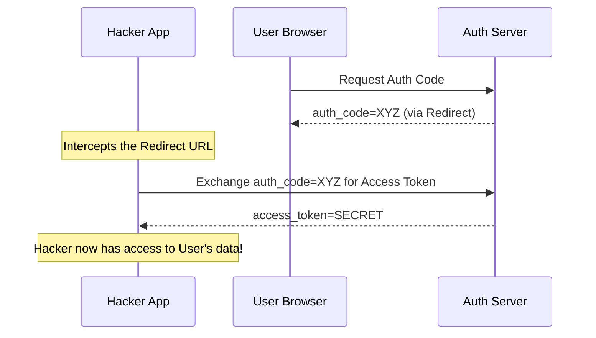

# OAuth 2.0 & OpenID Connect: The Trust Web

## 1. Beginner-friendly Hinglish Explanation 🇮🇳
Bhai, **OAuth** ka matlab hai "Chabi (Key) nahi, permission dena." 

Socho tumne ek "Photo Editing App" download ki aur woh tumhare "Google Photos" access karna chahti hai. Kya tum use apna Google password doge? Bilkul nahi! Tum use ek "Token" doge jo sirf Google Photos read karne ki permission deta hai. OAuth wahi system hai. 
- **OAuth 2.0**: Yeh "Authorization" ke liye hai (Permission dena).
- **OIDC (OpenID Connect)**: Yeh "Authentication" ke liye hai (Login with Google).
Is module mein hum seekhenge ki kaise duniya ki badi apps ek dusre par bharosa karti hain bina passwords share kiye.

---

## 2. Deep Technical Explanation
OAuth 2.0 is an authorization framework. OIDC is an identity layer on top of it.
- **Roles**:
    - **Resource Owner**: The User.
    - **Client**: The App (e.g., Spotify).
    - **Authorization Server**: Google/Okta.
    - **Resource Server**: The API (e.g., Google Drive).
- **Grant Types (Flows)**:
    - **Authorization Code Flow**: The most secure (for Web Apps).
    - **PKCE (Proof Key for Code Exchange)**: Mandatory for Mobile/SPAs (prevents code interception).
    - **Client Credentials**: For Server-to-Server communication.
- **Tokens**:
    - **Access Token**: Short-lived, used to call APIs.
    - **Refresh Token**: Long-lived, used to get new Access Tokens.
    - **ID Token (OIDC only)**: Contains user profile info.

---

## 3. Attack Flow Diagrams
**Authorization Code Interception Attack (without PKCE):**

---

## 4. Real-world Attack Examples
- **Redirect URI Hijacking**: A hacker misconfigures their app to use a Redirect URI like `https://attacker.com/callback`. If the OAuth provider doesn't strictly validate the URI, the token is sent directly to the hacker.
- **Microsoft OAuth Misconfig (2020)**: A bug allowed attackers to log into internal Microsoft accounts because the OAuth implementation didn't check the "App ID" correctly.

---

## 5. Defensive Mitigation Strategies
- **Use PKCE for ALL flows**: Even server-side ones. It adds a layer of security that prevents code theft.
- **Strict Redirect URI Whitelisting**: Never allow wildcards like `*.mysite.com`. Use exact URLs.
- **State Parameter**: Always use a random `state` string to prevent CSRF attacks on the OAuth callback.

---

## 6. Failure Cases
- **Leaking tokens in Referer Headers**: If your callback page has an external image or link, the access token in the URL might be sent to that external site.
- **Open Redirectors**: Using the OAuth redirect to send users to a malicious site after login.

---

## 7. Debugging and Investigation Guide
- **OAuth Debugger**: Using tools like `oauthdebugger.com` to visualize each step of the flow.
- **Inspecting the ID Token**: Decoding the JWT at `jwt.io` to see if it contains the correct `sub` (subject) and `iss` (issuer).

---

## 8. Tradeoffs
| Flow | Security | Use Case |
|---|---|---|
| Auth Code + PKCE | Maximum | Web, Mobile, SPA |
| Client Credentials | High | Microservices |
| Implicit Flow | Deprecated (Low) | Don't use in 2026! |

---

## 9. Security Best Practices
- **Short Token Expiry**: Access tokens should last 5-10 minutes.
- **One-time use Auth Codes**: Once a code is exchanged for a token, it must be invalidated instantly.

---

## 10. Production Hardening Techniques
- **mTLS for Client Authentication**: Requiring the Client app to present a digital certificate when talking to the Auth server.
- **Financial-grade API (FAPI)**: A set of strict OAuth profiles for high-security environments like banking.

---

## 11. Monitoring and Logging Considerations
- **Log the `client_id` and `scope`**: To see which apps are requesting which permissions.
- **Token Exchange Failures**: High rates of failed code exchanges suggest an interception attempt.

---

## 12. Common Mistakes
- **Confusing OAuth with AuthN**: OAuth is for *access*. OIDC is for *identity*. Using an Access Token to "Log a user in" is a common security flaw.
- **Over-scoping**: Asking for "Read/Write all files" when you only need to read one file.

---

## 13. Compliance Implications
- **GDPR**: You must show users a "Consent Screen" detailing exactly what data you are sharing with the 3rd party app.

---

## 14. Interview Questions
1. What is the difference between OAuth 2.0 and OIDC?
2. Why is PKCE necessary for Mobile apps?
3. What happens if a Refresh Token is stolen?

---

## 15. Latest 2026 Security Patterns and Threats
- **CBA (Certificate Based Authentication) in OAuth**: Moving away from "Client Secrets" to "Client Certificates."
- **Shared Signals Framework (SSF)**: If Google detects a user's account is hacked, it can send a "Signal" to Spotify to kill that user's session instantly.
- **VCI (Verifiable Credentials)**: The future of identity where you can prove you are "Over 18" without sharing your actual birthdate or name.
    
    
    
    
    
    
    
    
    
    
    
    
    
    
    
    
