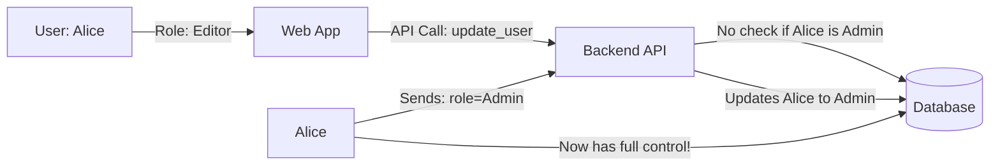

# RBAC & ABAC: The Art of Permission

## 1. Beginner-friendly Hinglish Explanation 🇮🇳
Bhai, **Authentication** ne bata diya "Aap kaun hain", lekin **Authorization** batata hai ki "Aap kya kar sakte hain." 

1. **RBAC (Role-Based Access Control)**: Yeh simple hai. Tumhe ek "Role" de diya jata hai—jaise "Admin", "Manager", ya "Employee". Jo Manager kar sakta hai, woh tum sab kar sakte ho. 
2. **ABAC (Attribute-Based Access Control)**: Yeh thoda complex aur smart hai. Yeh sirf tumhara role nahi dekhta, balki "Conditions" dekhta hai. Jaise: "Tum Manager ho (Role), lekin tum sirf 'Office Wi-Fi' se aur 'Subah 9 se 5' ke beech hi data dekh sakte ho (Attributes)." 
Bina sahi authorization ke, koi bhi "Peon" office ke account se paise nikal sakta hai.

---

## 2. Deep Technical Explanation
- **RBAC**:
    - **Structure**: Users -> Roles -> Permissions -> Objects.
    - **Pros**: Easy to understand and implement. Great for simple org structures.
    - **Cons**: "Role Explosion" (e.g., needing `Editor`, `Editor-India`, `Editor-Finance`, etc.).
- **ABAC**:
    - **Structure**: (Subject Attributes, Resource Attributes, Environment Attributes) -> Policy -> Decision.
    - **Pros**: Extremely granular. Handles complex compliance rules easily.
    - **Cons**: High performance overhead (complex logic) and hard to debug.

---

## 3. Attack Flow Diagrams
**Privilege Escalation via Insecure RBAC:**

---

## 4. Real-world Attack Examples
- **Broken Object Level Authorization (BOLA)**: A customer on an e-commerce site changes their `order_id` in the URL from `100` to `101` and sees someone else's address and credit card info because the app only checked "Is this user logged in?" and not "Does this user own order 101?".
- **GitLab RBAC Bypass**: A vulnerability allowed users with "Developer" access to read files they weren't supposed to by exploiting a flaw in how nested group permissions were calculated.

---

## 5. Defensive Mitigation Strategies
- **Always Verify Ownership**: Every API call should check `if (resource.owner_id == current_user.id)`.
- **Policy as Code (OPA)**: Use the Open Policy Agent to centralize authorization logic. Instead of 100 `if` statements in your code, you send the request to OPA, which returns "Allow" or "Deny" based on a central policy file.
- **Fail Closed**: If the authorization check fails or crashes, the default answer must be "Deny Access."

---

## 6. Failure Cases
- **Nested Group Logic**: In complex systems, a user might belong to 10 groups. Calculating the final "Net Permission" can be buggy, leading to accidentally granting too much access.
- **Caching Permissions**: Storing a user's role in a local variable for 24 hours. If their role is revoked, they still have access until the cache expires.

---

## 7. Debugging and Investigation Guide
- **Access Logs**: Searching for "Access Denied" errors to see if a user is trying to "Probe" different endpoints.
- **Impersonation Testing**: Admins "Logging in as" a regular user to see exactly what they can and cannot see.

---

## 8. Tradeoffs
| Metric | RBAC | ABAC |
|---|---|---|
| Scalability | High (for simple apps) | High (for complex rules) |
| Performance | Fast | Slower |
| Auditability | Easy | Hard (Logic is complex) |

---

## 9. Security Best Practices
- **Never trust the Client-side**: Just because the "Delete" button is hidden in the React app doesn't mean the API is safe. Always re-check permissions on the server.
- **Principle of Least Privilege**: Give users the absolute minimum access they need to do their job.

---

## 10. Production Hardening Techniques
- **Hierarchical RBAC**: Roles that "Inherit" permissions (e.g., `Admin` inherits from `Manager`, which inherits from `Employee`).
- **Contextual ABAC**: Using real-time data like "IP Reputation" or "Device Health" as attributes for access decisions.

---

## 11. Monitoring and Logging Considerations
- **Log the Decision**: Don't just log "Accessed file." Log "Allowed access to file X for user Y because of Role Z."
- **Alert on BOLA attempts**: If a user tries to access 10 different `order_id`s in 1 minute, block them.

---

## 12. Common Mistakes
- **Hardcoding Roles**: Writing `if (user.role == 'admin')`. What if you want to add a `SuperAdmin` tomorrow? Use `if (user.hasPermission('delete_user'))`.
- **Ignoring "Default" Permissions**: Leaving a new feature open to everyone by default.

---

## 13. Compliance Implications
- **SOC2 / GDPR**: Requires "Access Reviews" every 6 months to ensure that people don't have permissions they no longer need.

---

## 14. Interview Questions
1. What is the difference between RBAC and ABAC?
2. How would you prevent a BOLA (Broken Object Level Authorization) vulnerability?
3. What is "Role Explosion" and how do you fix it?

---

## 15. Latest 2026 Security Patterns and Threats
- **ZGA (Zero-Trust Governance and Authorization)**: Dynamically changing permissions based on the current "Threat Level" of the company.
- **ReBAC (Relationship-Based Access Control)**: Managing permissions based on relationships (e.g., "Allow Alice to see this file because she is the 'Lead' of the 'Project' that owns the file").
- **AI-Managed Permissions**: Using ML to find users who have "Too many" permissions compared to their peers and suggesting they be revoked.
    
    
    
    
    
    
    
    
    
    
    
    
    
    
    
    
    
    
