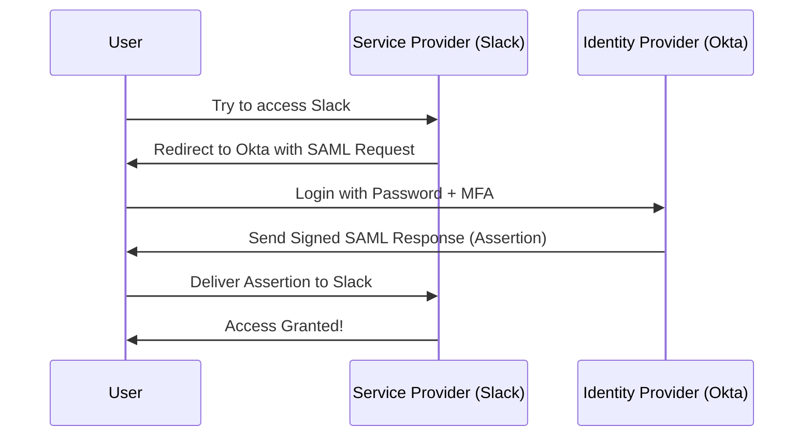

# Single Sign-On (SSO): One Key to Rule Them All

## 1. Beginner-friendly Hinglish Explanation 🇮🇳
Bhai, **SSO (Single Sign-On)** ka matlab hai "Ek baar login karo, aur saari apps ka access pao."

Socho tumhare office mein 20 apps hain (Slack, Gmail, Jira, HR Portal, etc.). Agar har app ka alag password hoga, toh tum use bhool jaoge ya phir har jagah same "Weak" password rakhoge. SSO iska solution hai. Tum sirf ek "Identity Provider" (jaise Okta ya Google) par login karte ho, aur woh baki saari apps ko ek "Thappa" (Token) bhej deta hai ki "Haan, yeh Sameer hi hai, ise andar aane do." Isse security badhti hai aur logo ka sar-dard kam hota hai.

---

## 2. Deep Technical Explanation
SSO allows a user to authenticate once and gain access to multiple independent software systems.
- **Key Protocols**:
    - **SAML (Security Assertion Markup Language)**: An XML-based standard for exchanging authentication and authorization data between an **IdP** and an **SP**.
    - **OIDC (OpenID Connect)**: A modern, JSON-based layer on top of OAuth 2.0 used for identity.
- **Key Players**:
    - **Identity Provider (IdP)**: The system that holds the user database (e.g., Okta, Azure AD, Auth0).
    - **Service Provider (SP)**: The application the user wants to access (e.g., Salesforce, Slack).

---

## 3. Attack Flow Diagrams
**The SAML Flow:**

---

## 4. Real-world Attack Examples
- **Golden SAML Attack**: If a hacker steals the "Private Signing Key" from your IdP (e.g., ADFS), they can create their own "Fake" SAML responses and log in as ANY user to ANY app without ever knowing a password. (This was used in the SolarWinds breach).
- **SAML Response Hijacking**: If the connection isn't HTTPS, a hacker can steal the SAML token and use it on their own machine to impersonate the user.

---

## 5. Defensive Mitigation Strategies
- **Mandatory MFA on IdP**: Since the IdP is the "Master Key," it *must* have the strongest protection.
- **Signature Verification**: The Service Provider (SP) must always check the digital signature of the SAML/OIDC token to ensure it came from the real IdP.
- **Short Token Lifespan**: SSO tokens should expire quickly (e.g., 1 hour) so they can't be reused for long if stolen.

---

## 6. Failure Cases
- **Single Point of Failure**: If your SSO provider (like Okta) goes down, NOBODY in the company can log in to ANY app.
- **Circular Dependency**: Your VPN needs SSO to log in, but your SSO needs the VPN to reach the server. (Avoid this!).

---

## 7. Debugging and Investigation Guide
- **SAML Tracer**: A browser extension that lets you see the XML "Assertion" moving between the IdP and SP.
- **jwt.io**: A tool to decode and inspect OIDC (JWT) tokens.

---

## 8. Tradeoffs
| Feature | Traditional Login | SSO (SAML/OIDC) |
|---|---|---|
| User Experience | Bad (Many passwords) | Excellent (One login) |
| Management | Hard | Easy (One-click disable) |
| Risk Profile | Fragmented | Concentrated |

---

## 9. Security Best Practices
- **Just-in-Time (JIT) Provisioning**: The first time a user logs in via SSO, the app automatically creates their account using info from the IdP.
- **SCIM (System for Cross-domain Identity Management)**: A protocol that automatically syncs user changes (like a name change or deletion) from the IdP to all apps instantly.

---

## 10. Production Hardening Techniques
- **IP Whitelisting at IdP**: "Users can only log in to the SSO if they are coming from the company's Office IP or the VPN."
- **Certificate Rotation**: Regularly changing the certificates used to sign SAML assertions.

---

## 11. Monitoring and Logging Considerations
- **Brute force on IdP**: Monitoring the IdP logs for thousands of failed logins across many accounts.
- **Impossible Travel**: Alerting if a user signs in to Slack from India and then logs in to Gmail from Russia 5 minutes later.

---

## 12. Common Mistakes
- **Not Revoking Access**: When an employee leaves, the admin disables them in AD but forgets that the employee still has a "Active Session" in Slack that lasts for 30 days.
- **Weak Signing Algorithms**: Using SHA-1 for signing SAML assertions.

---

## 13. Compliance Implications
- **ISO 27001**: Heavily favors SSO because it makes "Access Revocation" (deleting users) much more reliable and auditable.

---

## 14. Interview Questions
1. What is the difference between SAML and OIDC?
2. Explain the "Golden SAML" attack.
3. What is an "Identity Provider" (IdP) and a "Service Provider" (SP)?

---

## 15. Latest 2026 Security Patterns and Threats
- **Passwordless SSO**: Using Biometrics (Apple FaceID/Windows Hello) to log in to the SSO, so the user never even has a password to lose.
- **Continuous Access Evaluation (CAE)**: Instead of waiting for a token to expire, the IdP can "Kill" a session instantly across all apps if it detects suspicious activity.
- **Workload Identity Federation**: Letting your "Servers" in AWS talk to "Servers" in Azure using OIDC tokens instead of long-lived secrets.
