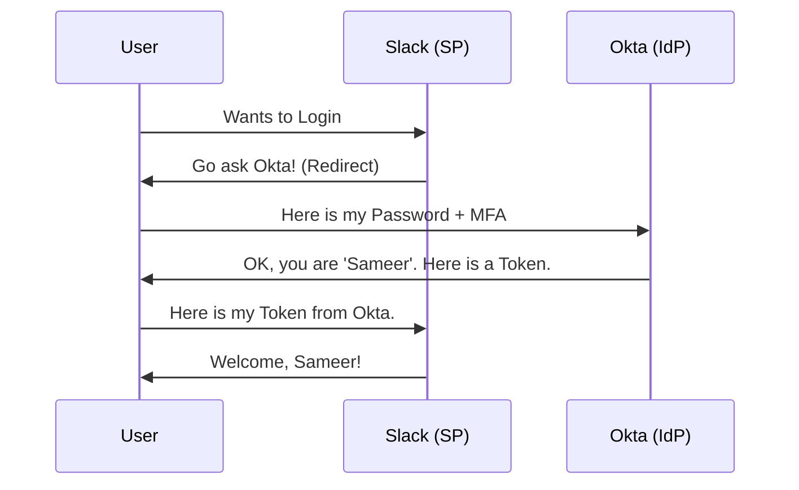

# Single Sign-On (SSO) and Federation: One Key for All

## 1. Beginner-friendly Hinglish Explanation 🇮🇳
Bhai, **SSO (Single Sign-On)** ka matlab hai "Ek Login, Har Jagah Access." 

Socho aap ek company mein kaam karte ho jahan 50 alag-alag tools hain (Gmail, Slack, Jira, Zoom). Kya aap 50 alag-alag passwords yaad rakhoge? Nahi! SSO mein aap sirf ek baar "Central" system (jaise Okta ya Google) mein login karte ho, aur phir aap har tool mein bina password dale ghus sakte ho. **Federation** ka matlab hai ki do alag-alag companies (jaise Microsoft aur Google) ek doosre par bharosa karti hain ki "Agar isne wahan login kiya hai, toh mere yahan bhi allowed hai."

---

## 2. Deep Technical Explanation
- **Core Concepts**:
    - **Identity Provider (IdP)**: The system that verifies who you are (e.g., Okta, Azure AD).
    - **Service Provider (SP)**: The app you want to use (e.g., Slack, AWS).
- **Protocols**:
    - **SAML 2.0 (XML based)**: The old industry standard. Used for corporate web apps.
    - **OIDC (JSON/OpenID Connect)**: The modern standard. Built on top of OAuth 2.0. Used for mobile apps and modern websites.
- **Tokens**: Small pieces of data (like a JWT) that prove you are logged in.

---

## 3. Attack Flow Diagrams
**The SSO 'Trust' Handshake:**

---

## 4. Real-world Attack Examples
- **Golden SAML Attack (SolarWinds)**: Hackers stole the "Private Key" of a company's IdP. This allowed them to create "Fake Tokens" for ANY user. They were able to log into any app as any person without a password.
- **Token Theft**: If a hacker steals your browser's "Session Cookie" or "SSO Token," they can "Become you" until that token expires, even without knowing your password.

---

## 5. Defensive Mitigation Strategies
- **Short Token Expiry**: Make tokens last for only 1 hour. If one is stolen, it's useless quickly.
- **Revoke Sessions**: If an employee loses their laptop, the admin should be able to click "Logout everywhere" to cancel all active SSO tokens.
- **Rotate Signing Keys**: Change the private keys used by your IdP every 6-12 months.

---

## 6. Failure Cases
- **IdP Outage**: If Okta or Azure AD goes down, the whole company cannot log into ANY tool. (Everything stops!).
- **Incorrect Mapping**: A bug where "Sameer (User)" accidentally gets logged in as "Sameer (Admin)" because of a name match.

---

## 7. Debugging and Investigation Guide
- **SAML Tracer**: A browser extension that lets you see the XML messages being sent between apps.
- **JWT.io**: A website to "Decode" and read the contents of an OIDC token.
- **Okta System Logs**: Searching for "Suspicious login from unknown device" alerts.

---

| Feature | SAML 2.0 | OIDC (OpenID Connect) |
|---|---|---|
| Format | XML (Heavy) | JSON (Lightweight) |
| Best For | Corporate / Legacy Web | Mobile / Modern Apps |
| Complexity | High | Medium |

---

## 9. Security Best Practices
- **Standardize on OIDC**: It's more secure and easier to manage than the old SAML XML.
- **Limit 'Scope'**: Only give the app the info it needs (e.g., don't give Slack your "Full Date of Birth" if it only needs your "Email").

---

## 10. Production Hardening Techniques
- **SCIM (System for Cross-domain Identity Management)**: A protocol that automatically "Deletes" a user's Slack/Jira account the moment they are deleted from Okta.
- **Identity Orchestration**: Building a "Workflow" (e.g., "If Sameer is in the HR group, automatically give him access to the Payroll app").

---

## 11. Monitoring and Logging Considerations
- **'Token Reuse' Detection**: Alerting if the same SSO token is used from two different IP addresses at the same time.
- **Manual Token Issuance**: Alerting if an admin manually creates a token without a user logging in.

---

## 12. Common Mistakes
- **No MFA on the IdP**: If your main Okta/Google account doesn't have MFA, the hacker gets into ALL 50 apps at once. This is the "Single Point of Failure."
- **Sharing Keys**: Using the same signing key for 100 different apps.

---

## 13. Compliance Implications
- **GDPR**: Requires that personal data (like names/emails) only be shared with 3rd-party apps (Service Providers) when strictly necessary.

---

## 14. Interview Questions
1. What is the difference between an 'IdP' and an 'SP'?
2. Why is OIDC preferred over SAML for modern apps?
3. What happens if the IdP's 'Signing Key' is stolen?

---

## 15. Latest 2026 Security Patterns and Threats
- **Decentralized SSO**: Using "Blockchain Wallets" to log into websites, so no single company (like Google) owns your identity.
- **Continuous Access Evaluation (CAE)**: If you are fired, Microsoft/Google can kill your session in 5 seconds instead of waiting for the 1-hour token to expire.
- **AI-Native Identity Fabric**: Systems that automatically connect all your apps securely without you having to manually configure SAML/OIDC.
	
