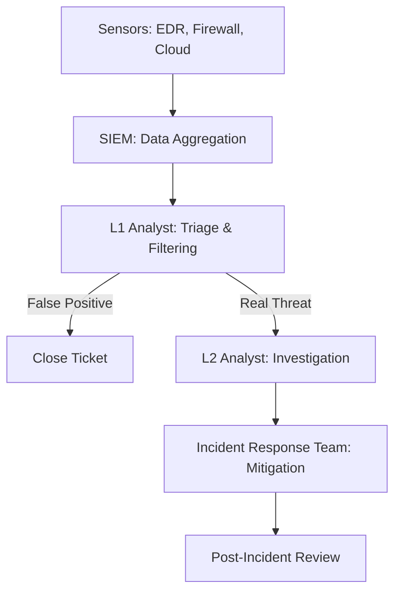

# Building a SOC: The War Room of Cybersecurity

## 1. Beginner-friendly Hinglish Explanation 🇮🇳
Bhai, **SOC (Security Operations Center)** ka matlab hai company ka "Control Room." 

Jaise army ka ek headquarters hota hai jahan bade screens par saari activity dikhti hai, waise hi SOC mein security analysts baithte hain. Unka kaam hai 24/7 company ke network, servers aur cloud par nazar rakhna. Agar kahin bhi koi "Red Flag" (Attack) dikhta hai, toh SOC team turant action leti hai. Ek achha SOC "People," "Process," aur "Technology" ka perfect mix hota hai.

---

## 2. Deep Technical Explanation
A SOC is a centralized unit that deals with security issues on an organizational and technical level.
- **The Golden Triangle**:
    1. **People**: Analysts (L1, L2, L3), Incident Responders, and Threat Hunters.
    2. **Process**: Standard Operating Procedures (SOPs), Playbooks, and SLAs.
    3. **Technology**: SIEM, EDR, SOAR, Vulnerability Scanners, and Firewalls.
- **Maturity Levels**: From "Reactive" (only fixing things when they break) to "Proactive" (hunting for threats before they act).

---

## 3. Attack Flow Diagrams
**SOC Incident Handling:**

---

## 4. Real-world Attack Examples
- **Target Breach (2013)**: As mentioned before, the SOC *failed* here. They had the technology, but their "Process" was weak—they ignored the alerts.
- **Successful Defense**: A well-run SOC at a major bank detected a "Password Spray" attack in 30 seconds and automatically blocked the attacker's IP range before they could guess a single correct password.

---

## 5. Defensive Mitigation Strategies
- **Playbooks**: Pre-written "Scripts" for every alert. "If alert X happens, do Y and Z." This reduces human error during a crisis.
- **24/7 Coverage**: Hackers don't sleep. A SOC needs to be active at 3 AM on Christmas Day. (Can be done via a "Follow-the-Sun" model or an MSSP).

---

## 6. Failure Cases
- **Alert Fatigue**: The biggest enemy of a SOC. If there are too many alerts, humans get tired and make mistakes.
- **Lack of Authority**: A SOC that finds an attack but isn't allowed to "Shut down" the server without 5 manager approvals. By the time they get approval, the data is gone.

---

## 7. Debugging and Investigation Guide
- **KPIs (Key Performance Indicators)**:
    - **MTTD (Mean Time to Detect)**: How long did it take to find the hacker?
    - **MTTR (Mean Time to Respond)**: How long did it take to kick them out?
- **Ticketing Systems**: Using tools like **TheHive** or **ServiceNow** to track every incident.

---

## 8. Tradeoffs
| Feature | Internal SOC | Outsourced SOC (MSSP) |
|---|---|---|
| Cost | Very High | Medium |
| Knowledge | Deep (Knows the company) | Surface Level |
| Control | Total | Limited |

---

## 9. Security Best Practices
- **Threat Hunting**: Once a week, an analyst should spend 4 hours *searching* for threats that the SIEM missed, instead of just waiting for alerts.
- **Rotation**: Rotate analysts between L1, L2, and Threat Hunting to prevent burnout.

---

## 10. Production Hardening Techniques
- **SOAR Automation**: Automating 90% of the "Boring" tasks (e.g., checking if an IP is malicious on VirusTotal) so humans can focus on the hard 10%.
- **Deception Technology**: Deploying "Honeytokens" (fake credentials) throughout the company. If the SOC sees these being used, they know with 100% certainty there is a hacker.

---

## 11. Monitoring and Logging Considerations
- **Log Source Health**: Monitoring if the SIEM is actually receiving logs from all the "Critical" servers.
- **EPS (Events Per Second)**: Tracking the speed of data coming into the SOC.

---

## 12. Common Mistakes
- **Hiring Only 'Tool' Experts**: People who know how to use Splunk but don't understand how a network works.
- **Not testing the SOC**: Never running a "Red Team" exercise to see if the SOC can actually catch a real hacker.

---

## 13. Compliance Implications
- **SOC2 Type II**: A report that proves a company's SOC and security controls are working effectively over a long period (usually 6-12 months).

---

## 14. Interview Questions
1. What is "Alert Fatigue" and how do you solve it?
2. Explain the difference between L1 and L2 security analysts.
3. What is a "Playbook" in the context of a SOC?

---

## 15. Latest 2026 Security Patterns and Threats
- **Virtual SOC (vSOC)**: Entirely remote teams using cloud-native tools to monitor global infrastructure.
- **AI-Copilot for Analysts**: Using AI to automatically suggest "Next Steps" for an analyst during an investigation.
- **Autonomous SOC**: A future vision where 99% of incidents are detected and remediated by AI without human intervention.
