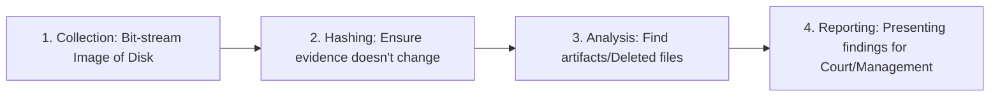

# Digital Forensics Techniques: Finding the Smoking Gun

## 1. Beginner-friendly Hinglish Explanation 🇮🇳
Bhai, **Digital Forensics** ka matlab hai "Computer ki CID." 

Jab koi crime hota hai, toh police fingerprints aur DNA dhundti hai. Digital forensics mein hum "Digital Evidence" dhundte hain—jaise delete ki hui files, browser history, ya hidden chat logs. Iska sabse bada rule hai: **"Pehle saboot bachao (Preserve), phir check karo (Analyze)."** Kyunki agar aapne computer ko normally on kiya ya file kholi, toh "Metadata" (timestamps) badal jayenge aur court mein woh saboot bekar ho jayega.

---

## 2. Deep Technical Explanation
Digital Forensics involves the recovery and investigation of material found in digital devices.
- **Disk Forensics**: Analyzing hard drives, SSDs, and USBs. This includes recovering deleted files from unallocated space.
- **Memory (RAM) Forensics**: Capturing and analyzing the RAM. This is critical because some malware only lives in memory and disappears when the computer is turned off.
- **Network Forensics**: Analyzing packet captures and logs to see where data was sent.
- **Order of Volatility**: You must collect evidence from the most "fragile" to the least "fragile":
    1. RAM / Cache.
    2. Network Connections.
    3. Disk / Files.
    4. Backups / Logs.

---

## 3. Attack Flow Diagrams
**Forensic Investigation Process:**

---

## 4. Real-world Attack Examples
- **The Silk Road (Ross Ulbricht)**: The FBI used digital forensics to link Ulbricht to the pseudonym "Dread Pirate Roberts" by finding chat logs and Bitcoin keys on his laptop that he hadn't fully deleted.
- **Corporate Espionage**: An employee tries to steal trade secrets by copying them to a USB drive and then deleting the files. Forensics can prove exactly *when* the USB was plugged in and *which* files were copied.

---

## 5. Defensive Mitigation Strategies
- **Anti-Forensics Awareness**: Knowing that hackers will try to use "Wipers" or "Timestomping" (changing file dates) to hide their tracks.
- **Host-based Logs**: Enabling "File System Auditing" so the OS keeps a record of who opened or deleted what file.

---

## 6. Failure Cases
- **Footprinting the Evidence**: A detective plugs an evidence drive into a Windows PC without a "Write Blocker." Windows automatically creates "System Volume Information" folders, changing the drive's hash and ruining the evidence.
- **Cold Boot Attack**: If you don't capture RAM quickly, the data starts to "Fade" as the RAM chips cool down.

---

## 7. Debugging and Investigation Guide
- **Autopsy / Sleuth Kit**: The most popular open-source GUI for disk forensics.
- **Volatility Framework**: The industry standard for analyzing RAM dumps.
- **FTK Imager**: Used to create a "Perfect Copy" (Image) of a hard drive or RAM.

---

## 8. Tradeoffs
| Feature | Dead Forensics (Disk) | Live Forensics (RAM/Network) |
|---|---|---|
| Reliability | Very High | Medium (Data changes constantly) |
| Complexity | Medium | Very High |
| Scope | Historical Data | Current Activity |

---

## 9. Security Best Practices
- **Chain of Custody**: A document that records everyone who touched the evidence from the moment it was found until it gets to court.
- **Write Blockers**: ALWAYS use a physical or software write blocker when connecting evidence drives.

---

## 10. Production Hardening Techniques
- **Honeypot Artifacts**: Leaving "Fake" sensitive files like `passwords.txt` that, if opened, trigger an alert and record the IP of the person who opened it.
- **EDR Forensics**: Modern EDRs like **CrowdStrike** can perform "Remote Forensics," allowing you to capture the RAM of a laptop in London from your office in Delhi.

---

## 11. Monitoring and Logging Considerations
- **Log Archiving**: Ensuring logs are moved to a "WORM" (Write Once Read Many) storage so a hacker can't delete the evidence.

---

## 12. Common Mistakes
- **Restarting the computer**: As soon as you restart, the RAM (and the hacker's active connection) is gone forever.
- **Working on the 'Original' drive**: You should always make a copy and work on the copy.

---

## 13. Compliance Implications
- **Legal Admissibility**: For evidence to be used in court (e.g., in a lawsuit), it must be collected following strict forensic standards.

---

## 14. Interview Questions
1. What is the "Order of Volatility"?
2. Why is hashing important in digital forensics?
3. What information can you find in a RAM dump that you can't find on a hard drive?

---

## 15. Latest 2026 Security Patterns and Threats
- **Cloud Forensics**: How do you do forensics on a server that only existed for 10 minutes in AWS? (Answer: Log-based reconstruction).
- **Encrypted Disk Forensics**: Using specialized tools to find "Encryption Keys" in the RAM so you can unlock the hard drive.
- **AI-Assisted Evidence Discovery**: Using AI to scan through 1TB of images or documents to find the "One" relevant piece of evidence.
