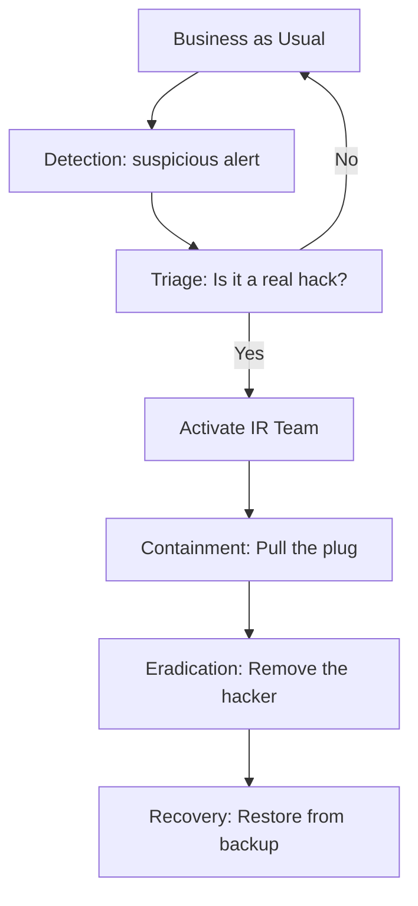

# Incident Response Fundamentals: Winning the War After the Breach

## 1. Beginner-friendly Hinglish Explanation 🇮🇳
Bhai, **Incident Response (IR)** ka matlab hai "Aag lagne ke baad ki planning." 

Security mein yeh kaha jata hai: "It's not IF you get hacked, but WHEN." Jab koi hacker andar aa jaye, toh darna nahi hai, balki apne "Battle Plan" ko execute karna hai. IR humein sikhata hai ki kaise attack ko jaldi se detect karein, kaise use "Quarantine" karein (jaise virus ko alag rakhte hain), aur kaise system ko wapas normal karein bina data khoe. Yeh "Cool Head" aur "Clear Process" ka khel hai.

---

## 2. Deep Technical Explanation
Incident Response is the organized approach to managing and addressing the aftermath of a security breach or cyberattack.
- **Goal**: Limit damage and reduce recovery time/costs.
- **Key Roles**:
    - **Incident Commander**: The leader who makes the final decisions.
    - **Technical Lead**: The person analyzing the logs and evidence.
    - **Communications**: Talking to the board, legal, and customers.
- **The Golden Hour**: The first hour after a breach is discovered is critical for preserving evidence and stopping data exfiltration.

---

## 3. Attack Flow Diagrams
**Incident Response vs. Business As Usual:**

---

## 4. Real-world Attack Examples
- **Norsk Hydro Ransomware (2019)**: When this massive aluminum company was hit by ransomware, their IR team immediately shut down the entire global network. They went back to "Pen and Paper" for weeks to prevent the virus from spreading, saving the company from total collapse.
- **Maersk (NotPetya)**: An IR team had to fly a hard drive from Ghana to the UK because it was the only server in the world that hadn't been wiped—their IR plan saved a multi-billion dollar company.

---

## 5. Defensive Mitigation Strategies
- **Incident Response Plan (IRP)**: A written document that says EXACTLY who to call and what to do at 2 AM on a Sunday.
- **Tabletop Exercises**: "War games" where the team sits in a room and simulates a hack to see if the plan actually works.
- **Out-of-Band Communication**: Having a backup way to talk (like Signal or a separate Slack) because the hacker might be reading your official company email.

---

## 6. Failure Cases
- **Panic**: Deleting the compromised server before taking a "Memory Dump." This destroys all the evidence of who the hacker was.
- **Slow Response**: Waiting 48 hours to report a breach, which gives the hacker time to sell your data on the dark web.

---

## 7. Debugging and Investigation Guide
- **The "IR Toolkit"**: A USB drive or VM pre-loaded with tools like Wireshark, Volatility, and Autopsy.
- **SANS Incident Handler's Handbook**: The industry-standard guide for IR professionals.

---

## 8. Tradeoffs
| Metric | Rapid Containment | Thorough Investigation |
|---|---|---|
| Speed | Very Fast | Slow |
| Evidence Preservation | Low (Might lose data) | High |
| Business Impact | High (Services go down) | Low |

---

## 9. Security Best Practices
- **Isolation First**: If a laptop is infected, disconnect it from Wi-Fi immediately. Don't shut it down (shutting down wipes the RAM evidence).
- **Document Everything**: Keep a "Log Book" of every action taken during the response for legal reasons.

---

## 10. Production Hardening Techniques
- **Automated Playbooks (SOAR)**: Using tools like **Palo Alto Cortex** to automatically block an IP if it's seen performing a known attack pattern.
- **Snapshotting**: Taking a VM snapshot before attempting to clean a virus, so you can go back if you break the system.

---

## 11. Monitoring and Logging Considerations
- **Centralized Log Server**: Ensure logs are sent to a separate server so the hacker can't delete them after they break in.
- **Integrity Checks on Logs**: Using "Append-only" logs that cannot be modified.

---

## 12. Common Mistakes
- **Hiding the breach**: Trying to fix it quietly without telling anyone. This usually leads to bigger legal fines later.
- **Reinstalling on the 'Same' OS**: If you don't find the root cause, the hacker will just use the same hole to come back tomorrow.

---

## 13. Compliance Implications
- **GDPR Article 33**: Requires companies to report a personal data breach to the authorities within **72 hours**.

---

## 14. Interview Questions
1. What are the six phases of the SANS/NIST Incident Response cycle?
2. Why should you avoid shutting down a compromised computer immediately?
3. What is a "Tabletop Exercise"?

---

## 15. Latest 2026 Security Patterns and Threats
- **AI-Driven IR**: Using LLMs to summarize 10,000 logs into a single paragraph: "The hacker entered via a Phishing email and is currently in the HR folder."
- **Ransomware 3.0**: Hackers no longer just encrypt data; they threaten to leak it AND contact your customers directly.
- **Supply Chain IR**: How do you respond when the breach isn't in *your* code, but in a library you use? (e.g., Log4j).
