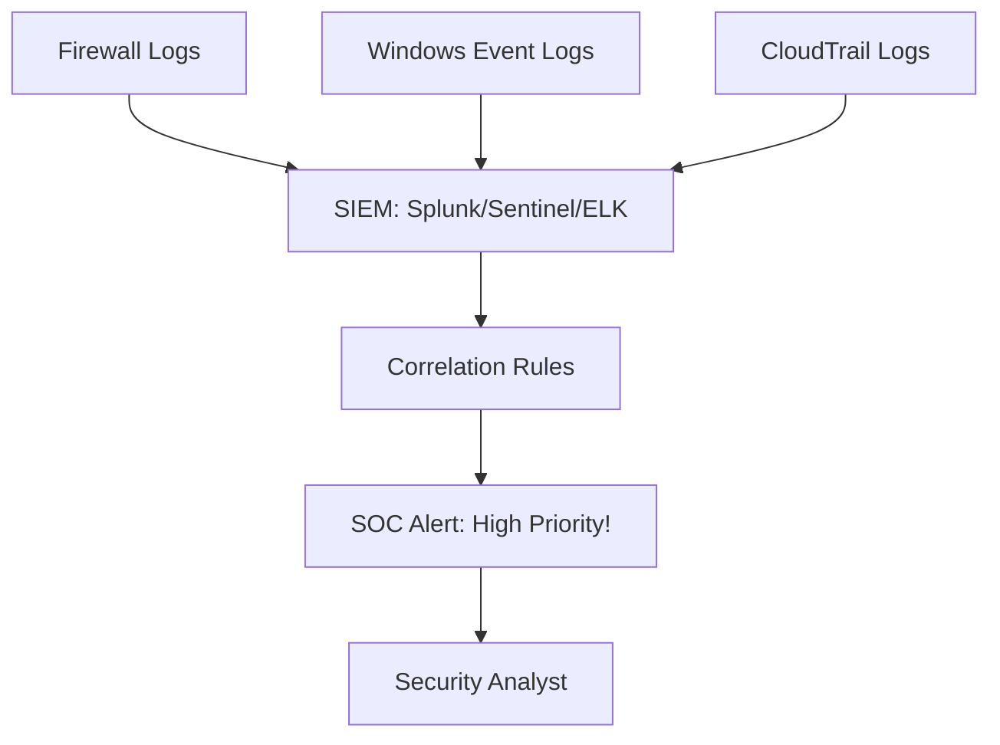

# Log Analysis and SIEM: Connecting the Dots

## 1. Beginner-friendly Hinglish Explanation 🇮🇳
Bhai, **Log Analysis** ka matlab hai "Computer ki diary padhna." 

Har computer program, server, aur firewall ek diary likhta hai (jise hum **Log** kehte hain)—"Maine yeh kiya, usne login kiya, yeh error aaya." **SIEM (Security Information and Event Management)** ek "Master Mind" software hai jo in saari diaries ko ek saath padhta hai. 

Socho ek hacker ne Server A par login kiya aur Server B se data churaya. Agar aap sirf Server A dekhoge, toh kuch samajh nahi aayega. SIEM dono servers ke logs ko jorta hai (Correlate) aur aapko batata hai: "Bhai, dekho! Same IP ne pehle wahan login kiya aur phir yahan se data nikala."

---

## 2. Deep Technical Explanation
- **Logging**: The act of recording an event. Common formats: Syslog (Linux), Event Logs (Windows), JSON.
- **Aggregation**: Gathering logs from 1000s of sources into one place.
- **Normalization**: Making different log formats look the same (e.g., converting "User: admin" and "u=admin" into a standard "username" field).
- **Correlation**: The "Magic" of SIEM. Using rules to find patterns (e.g., "If 5 failed logins + 1 successful login from the same IP within 1 minute, trigger a Brute Force alert").
- **Retention**: How long you keep the logs (usually 90 days to 1 year).

---

## 3. Attack Flow Diagrams
**The SIEM Workflow:**

---

## 4. Real-world Attack Examples
- **APT Stealth**: Advanced hackers often try to "Muffle" the logs by turning off logging services. A good SIEM will alert you the moment a logging service *stops* sending data.
- **Insiders**: A SIEM can detect an employee who suddenly starts downloading 100x more files than their daily average—a sign of data theft.

---

## 5. Defensive Mitigation Strategies
- **Centralized Logging**: Never store logs *only* on the local server. If the server is hacked, the hacker will delete the logs.
- **Time Sync (NTP)**: If the time on your servers is wrong, the SIEM cannot correlate events correctly.

---

## 6. Failure Cases
- **Alert Fatigue**: Getting 10,000 alerts a day. Analysts start ignoring them, and the real attack gets missed.
- **Log Injection**: A hacker sends a malicious string inside a log message to try and exploit the SIEM software itself.

---

## 7. Debugging and Investigation Guide
- **Grep/AWK**: Basic Linux tools for searching through text logs.
- **Splunk SPL**: The powerful query language used to search through billions of logs in seconds.
- **Kibana**: The visualization tool for the ELK stack.

---

## 8. Tradeoffs
| Feature | Local Logging | SIEM (Cloud/On-Prem) |
|---|---|---|
| Cost | Free | Very High |
| Search Speed | Slow | Instant |
| Security | Low (Easy to delete) | High (Tamper-proof) |

---

## 9. Security Best Practices
- **Log Everything? No**: Log what matters. Logging every "Successful Page Load" on a busy website will just waste storage and money.
- **Enrichment**: Adding context to logs (e.g., adding the geographical location to an IP address).

---

## 10. Production Hardening Techniques
- **Agentless vs Agent-based**: Using lightweight "Agents" (like Beats or Splunk Universal Forwarder) to send logs securely to the SIEM.
- **WORM Storage**: Storing logs on hardware that literally cannot be erased, making them perfect for legal evidence.

---

## 11. Monitoring and Logging Considerations
- **Log Volume Spikes**: A sudden 500% increase in log volume could mean a DDoS attack or an app crashing.
- **Silent Sources**: Alerting if a critical server hasn't sent a log in the last 10 minutes.

---

## 12. Common Mistakes
- **Not logging 'Denied' attempts**: Only logging successful actions. You need to see the failures to see the attacks.
- **Ignoring Application Logs**: Only looking at the OS and Firewall, and missing the SQL injection happening inside the app.

---

## 13. Compliance Implications
- **PCI-DSS / SOC2 / HIPAA**: All require that logs are kept for at least 1 year and reviewed regularly.

---

## 14. Interview Questions
1. What is "Log Normalization" and why is it needed?
2. How do you prevent a hacker from deleting their traces in the logs?
3. What is the difference between a "Vulnerability" and an "Event"?

---

## 15. Latest 2026 Security Patterns and Threats
- **SOAR (Security Orchestration, Automation, and Response)**: The SIEM doesn't just alert a human; it automatically runs a script to block the attacker.
- **UEBA (User and Entity Behavior Analytics)**: Using AI to build a "Profile" of every user and alerting if their behavior changes.
- **Serverless SIEM**: Using "Functions" (like AWS Lambda) to process and analyze logs in real-time without managing servers.
