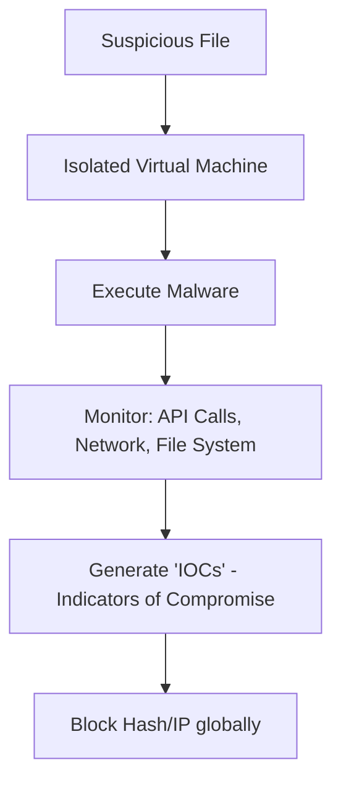

# Malware Analysis Basics: Dissecting the Digital Virus

## 1. Beginner-friendly Hinglish Explanation 🇮🇳
Bhai, **Malware Analysis** ka matlab hai "Virus ki surgery karna." 

Jab humein koi suspicious file milti hai (jaise `invoice.pdf.exe`), toh hum use directly open nahi karte. Hum use ek "Band Kamre" (Sandbox) mein le jate hain aur dekhte hain ki woh kya karne ki koshish kar rahi hai. "Kya yeh internet se kuch download kar rahi hai? Kya yeh meri files ko encrypt kar rahi hai?" Is module mein hum seekhenge ki kaise virus ko reverse-engineer karein aur unke patterns ko pehchanein.

---

## 2. Deep Technical Explanation
Malware analysis is the process of determining the functionality, origin, and potential impact of a given malware sample.
- **Static Analysis**: Examining the file without actually running it. 
    - Tools: `strings`, `binwalk`, `PEStudio`.
    - Focus: Metadata, imported functions, hardcoded IP addresses.
- **Dynamic Analysis**: Running the malware in a controlled, isolated environment (Sandbox) and watching what it does.
    - Tools: `Process Hacker`, `Wireshark`, `Regshot`.
    - Focus: Created files, changed registry keys, network connections.
- **Reverse Engineering (Advanced)**: Using a disassembler/debugger to read the assembly code of the malware.
    - Tools: `Ghidra`, `IDA Pro`, `x64dbg`.

---

## 3. Attack Flow Diagrams
**Basic Malware Sandbox Workflow:**

---

## 4. Real-world Attack Examples
- **WannaCry**: Analyzing WannaCry's code revealed a "Kill Switch" domain. When researchers registered that domain, the global ransomware attack stopped immediately.
- **Emotet**: A complex "Banker Trojan" that constantly changes its code to avoid detection. Analyzing it requires "Advanced Dynamic Analysis" because it detects if it's being run in a sandbox.

---

## 5. Defensive Mitigation Strategies
- **Sandboxing**: Using automated services like **Any.Run** or **Hybrid Analysis** to check files before they reach users.
- **Endpoint Protection (EDR)**: Using tools that block "Behavior" (e.g., "Why is Word trying to run PowerShell?") rather than just file hashes.

---

## 6. Failure Cases
- **Sandbox Evasion**: Modern malware can detect if it's in a VM (Virtual Machine). If it detects a VM, it stays "Quiet" and doesn't do anything malicious.
- **Staging**: The first file is "Clean," but after 10 minutes, it downloads the real virus from the internet.

---

## 7. Debugging and Investigation Guide
- **VirusTotal**: A free web service that scans any file with 70+ different Antivirus engines.
- **Cuckoo Sandbox**: An open-source automated malware analysis system.

---

## 8. Tradeoffs
| Metric | Static Analysis | Dynamic Analysis |
|---|---|---|
| Speed | Very Fast | Slower |
| Risk | Low | High (Need isolation) |
| Depth | Surface Level | Deep Behavioral |

---

## 9. Security Best Practices
- **NEVER analyze malware on your main PC**: Always use a dedicated, isolated Virtual Machine with no internet access (or restricted access).
- **Snapshot your Lab**: Always go back to a clean state after every analysis.

---

## 10. Production Hardening Techniques
- **Application Whitelisting**: Only allowing "Approved" apps to run on company PCs. This stops 99% of malware.
- **Disabling Macros**: Microsoft Office macros are the #1 way malware enters companies. Disable them by default.

---

## 11. Monitoring and Logging Considerations
- **Indicator of Compromise (IOC)**: Saving the "File Hash" (MD5/SHA256) and "C2 IPs" (Command and Control) into your SIEM to find other infected machines.

---

## 12. Common Mistakes
- **Running malware with 'Admin' rights**: This might allow the malware to "Escape" the VM and infect your host PC.
- **Assuming 'No Virus found' means it's safe**: A new (Zero-day) virus won't be caught by any scanner.

---

## 13. Compliance Implications
- **Cyber Insurance**: Many insurance policies require you to have professional malware analysis capabilities to investigate a breach.

---

## 14. Interview Questions
1. What is the difference between Static and Dynamic analysis?
2. How does malware detect it is being run in a Virtual Machine?
3. What is an "IOC" (Indicator of Compromise)?

---

## 15. Latest 2026 Security Patterns and Threats
- **AI-Powered Malware**: Malware that uses AI to "Rewrite" its own code every hour so its hash is always different.
- **Fileless Malware**: Malware that lives only in the "Registry" or "WMI," never creating a file on the disk (making it very hard to find).
- **Supply Chain Poisoning**: Injecting malicious code into popular open-source libraries (like `npm` or `pip`).
