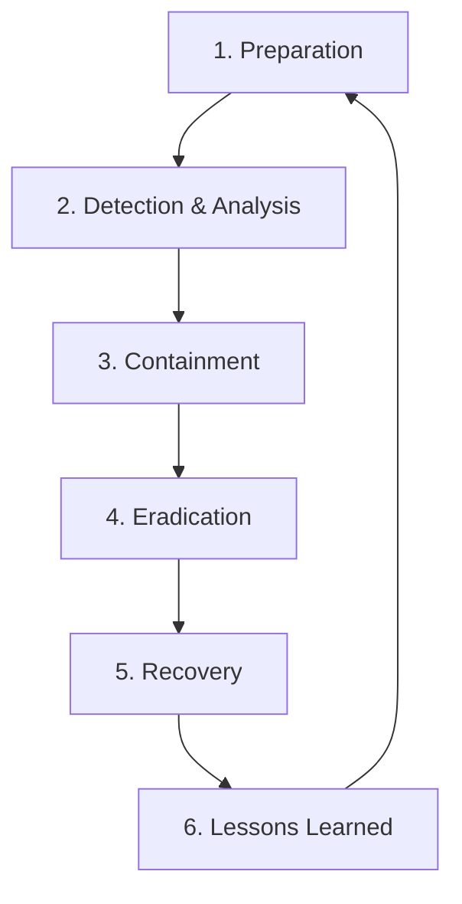

# The Incident Response Lifecycle: Step-by-Step Defense

## 1. Beginner-friendly Hinglish Explanation 🇮🇳
Bhai, **IR Lifecycle** woh "SOP" (Standard Operating Procedure) hai jo har security team follow karti hai jab "Kand" (Security Breach) ho jata hai.

Iske bina, log ghabra kar galat kaam kar dete hain—jaise server format kar dena ya bina soche network band kar dena. Is lifecycle mein 6 bade steps hote hain: Taiyari (Preparation), Pehchan (Identification), Rok-thaam (Containment), Safaya (Eradication), Wapsi (Recovery), aur Seekh (Lessons Learned). Yeh ek loop hai—har hack humein agle hack ke liye aur zyada taiyar karta hai.

---

## 2. Deep Technical Explanation
The NIST SP 800-61 framework defines the Incident Response Lifecycle:
1. **Preparation**: Creating the team, the plan, and the tools *before* anything happens.
2. **Detection & Analysis (Identification)**: spotting a potential incident and confirming it's a real attack.
3. **Containment**: 
    - **Short-term**: Blocking an IP or a port.
    - **Long-term**: Isolating a whole network segment or taking a server offline.
4. **Eradication**: Removing the cause of the incident (deleting malware, closing the vulnerability).
5. **Recovery**: Restoring systems from backups and monitoring for re-infection.
6. **Post-Incident Activity (Lessons Learned)**: Meeting to discuss "What happened?" and "How can we stop it next time?"

---

## 3. Attack Flow Diagrams
**The NIST IR Loop:**

---

## 4. Real-world Attack Examples
- **Mandiant vs. APT1**: The famous report on Chinese state-sponsored hacking showed how Mandiant's IR team followed this lifecycle to track hackers across hundreds of servers for months before finally "Eradicating" them in one synchronized move.
- **Ransomware Recovery**: A company that has good "Preparation" (Offline Backups) can finish the "Recovery" phase in 2 hours. A company with bad prep might take 2 months.

---

## 5. Defensive Mitigation Strategies
- **Checklists**: Having a physical or digital checklist for each type of attack (e.g., "Ransomware Checklist," "DDoS Checklist").
- **Evidence Preservation**: Always take a forensic image of the disk and a dump of the RAM *before* you start cleaning.

---

## 6. Failure Cases
- **Skipping 'Lessons Learned'**: If you don't fix the underlying hole, the hacker will be back within 48 hours.
- **Premature Containment**: Cutting off the hacker's connection too early might alert them, causing them to start deleting everything in panic.

---

## 7. Debugging and Investigation Guide
- **The 'Whose' and 'When'**: Using timestamps from logs to build a "Master Timeline."
- **SIEM Dashboards**: Using pre-built dashboards to visualize the attack path during the "Analysis" phase.

---

## 8. Tradeoffs
| Phase | Focus | Main Risk |
|---|---|---|
| Containment | Stopping the bleed | Deleting evidence |
| Analysis | Finding the source | Taking too long |
| Recovery | Getting back to work | Re-infection |

---

## 9. Security Best Practices
- **Legal Involvement**: Always involve the legal department during the "Detection" phase of a major breach.
- **Immutable Backups**: Backups that cannot be deleted or encrypted even by an Admin account.

---

## 10. Production Hardening Techniques
- **Infrastructure as Code (IaC) Recovery**: Instead of "Fixing" a hacked server, just delete it and let the CI/CD pipeline spin up a fresh, clean version automatically.

---

## 11. Monitoring and Logging Considerations
- **Log Integrity**: Hackers often try to "Clear Logs" (e.g., `wevtutil cl system`). Your monitoring system should alert you the moment a log is cleared.

---

## 12. Common Mistakes
- **Treating 'Recovery' as the last step**: The "Lessons Learned" phase is actually the most important for long-term security.
- **Not communicating with stakeholders**: Keeping customers and the board in the dark.

---

## 13. Compliance Implications
- **PCI-DSS Requirement 12.10**: Companies must implement an incident response plan and be prepared to respond immediately to a system breach.

---

## 14. Interview Questions
1. Walk me through the 6 phases of the Incident Response lifecycle.
2. What is the difference between "Containment" and "Eradication"?
3. Why is the "Post-Incident" phase often ignored, and why is that bad?

---

## 15. Latest 2026 Security Patterns and Threats
- **Automated Containment**: Using "Security orchestration" to automatically isolate a laptop if the Antivirus finds a high-risk malware.
- **Cloud-Native IR**: Using "Cloud Snapshots" to instantly save the state of a hacked server for later forensics while spinning up a replacement.
- **AI-Generated Reports**: Using AI to write the final incident report based on the collected logs and chat history of the IR team.
