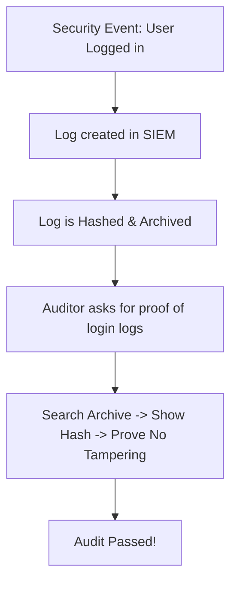

# Auditing and Reporting: Proving the Defense

## 1. Beginner-friendly Hinglish Explanation 🇮🇳
Bhai, **Auditing and Reporting** ka matlab hai "Apna homework check karwana." 

Auditing woh process hai jahan koi bahar ka banda (ya internal team) aakar check karti hai ki kya aapne woh saari security cheezein ki hain jo aapne "Policy" mein likhi thi. **Reporting** us auditing ka result hai. Yeh management ko batata hai ki "Bhai, hum safe hain" ya phir "Bhai, humara killa (Fort) kamzor hai, ise theek karo." Bina report ke, CEO ko kabhi pata nahi chalega ki security team kya kar rahi hai.

---

## 2. Deep Technical Explanation
- **Internal Audit**: Performed by the company's own staff to find gaps before they become problems.
- **External Audit**: Performed by a 3rd party (e.g., KPMG, PwC) to provide independent verification for clients or regulators.
- **Audit Process**:
    1. **Planning**: Defining the scope.
    2. **Fieldwork**: Collecting evidence (Logs, screenshots, configs).
    3. **Analysis**: Comparing evidence against the standard.
    4. **Reporting**: Documenting findings (Deficiencies).
    5. **Follow-up**: Ensuring findings are fixed.

---

## 3. Attack Flow Diagrams
**The Audit Evidence Trail:**

---

## 4. Real-world Attack Examples
- **Wells Fargo Scandal**: While not a cyber hack, it was an "Audit Failure." The internal audits failed to catch employees creating millions of fake accounts because the auditors weren't looking at the right data.
- **Financial Reporting Fraud**: Hackers often try to modify "Audit Logs" to hide their tracks. If an auditor finds "Gaps" in the logs, it's a huge red flag.

---

## 5. Defensive Mitigation Strategies
- **Immutable Audit Logs**: Using technology (like Blockchain or WORM drives) to ensure that once a log is written, it can never be changed, even by the Admin.
- **Continuous Monitoring**: Instead of a "One-time" audit, use tools that audit your security 24/7.

---

## 6. Failure Cases
- **Scope Limitation**: When an auditor is told "Don't look at that server," it usually means that's where the problems are.
- **Falsifying Evidence**: Creating fake screenshots or logs. This is illegal and leads to immediate loss of trust and legal action.

---

## 7. Debugging and Investigation Guide
- **Audit Tooling**: Using tools like **Auditd** (Linux) or **Windows Event Viewer** to track system changes.
- **Reporting Dashboards**: Using **Kibana** or **Grafana** to create "Executive Reports" that show the security health of the company in one glance.

---

## 8. Tradeoffs
| Metric | Deep Audit | Quick Audit |
|---|---|---|
| Duration | Months | Days |
| Cost | High | Low |
| Security Value | Maximum | Minimal |

---

## 9. Security Best Practices
- **Self-Assessments**: Run a mini-audit on your own team every quarter.
- **Root Cause Analysis (RCA)**: If an auditor finds a bug, don't just fix that bug; find out WHY it happened and fix the process.

---

## 10. Production Hardening Techniques
- **Technical Control Automation**: Instead of a policy saying "Change passwords," use a system that *forces* password changes every 90 days. The system itself becomes the "Evidence" for the audit.

---

## 11. Monitoring and Logging Considerations
- **Auditor Access**: Giving the auditor "Read-only" access to your systems so they can see for themselves, rather than you sending them screenshots.

---

## 12. Common Mistakes
- **Hiding findings**: Not telling the auditor about a problem you found. It's always better to say "We found this and we are fixing it" than to let them find it.
- **Poor Documentation**: "We do security" is not enough. You must have a document that says "How" you do it.

---

## 13. Compliance Implications
- **Sarbanes-Oxley (SOX)**: Requires public companies to have an annual external audit of their financial and IT controls.

---

## 14. Interview Questions
1. What is the difference between an Internal and External audit?
2. What would you do if an auditor found a critical security gap in your system?
3. How do you ensure that audit logs have not been tampered with?

---

## 15. Latest 2026 Security Patterns and Threats
- **AI-Driven Auditing**: Using AI to scan through millions of lines of configuration and automatically finding things that don't match the policy.
- **Evidence-as-Code**: Developers writing code that automatically generates audit evidence every time they deploy a new feature.
- **Remote Auditing**: Using virtual reality and secure screen-sharing to perform full audits without the auditor ever visiting the office.
