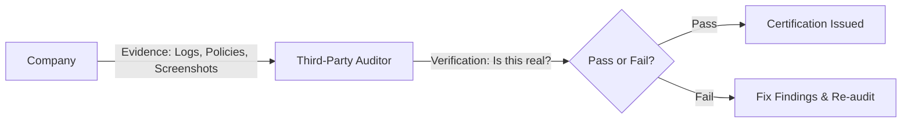

# Compliance Standards: The Global Rulebook (PCI, SOC2, HIPAA)

## 1. Beginner-friendly Hinglish Explanation 🇮🇳
Bhai, **Compliance Standards** woh "Certification" hain jo duniya ko batate hain ki aap "Saaf-Suthre" (Secure) ho. 

Jaise har school ka apna board hota hai (CBSE/ICSE), waise hi har industry ke apne security standards hote hain. Agar aap credit card handle karte ho, toh aapko **PCI-DSS** follow karna padega. Agar aap America mein hospital ka data handle karte ho, toh **HIPAA**. Aur agar aap ek software company ho jo dusre companies ko service deti hai, toh **SOC2**. In standards ko follow na karne par bhari fine lag sakta hai aur aapka business band ho sakta hai.

---

## 2. Deep Technical Explanation
- **PCI-DSS (Payment Card Industry Data Security Standard)**: Focuses on protecting credit card data. Requires firewalls, encryption, and regular testing.
- **SOC2 (Service Organization Control 2)**: Focuses on 5 "Trust Service Criteria": Security, Availability, Processing Integrity, Confidentiality, and Privacy.
    - **Type I**: Audit of security at a specific point in time.
    - **Type II**: Audit of security over a period (usually 6-12 months).
- **HIPAA (Health Insurance Portability and Accountability Act)**: US law protecting medical data (PHI - Protected Health Information).
- **GDPR (General Data Protection Regulation)**: EU law focusing on user privacy and the "Right to be Forgotten."

---

## 3. Attack Flow Diagrams
**The Audit Process:**

---

## 4. Real-world Attack Examples
- **Home Depot Breach (2014)**: They were "PCI-DSS Compliant" on paper, but hackers used a third-party vendor's credentials to steal 56 million credit card numbers. This shows that compliance is a "Floor," not a "Ceiling."
- **Anthem Hack (2015)**: A massive HIPAA violation where hackers stole 80 million health records. The company had to pay $115 million in settlements.

---

## 5. Defensive Mitigation Strategies
- **Continuous Compliance**: Using automation to ensure you are compliant every day, not just the day before the audit.
- **Data Discovery**: Finding where all the "Sensitive Data" is located so you can protect it according to the standard.

---

## 6. Failure Cases
- **Scope Creep**: Not knowing exactly which servers are part of the "Compliance Zone." If you miss one server and it gets hacked, you lose your certification.
- **Stale Evidence**: Providing logs from 2023 for a 2025 audit.

---

## 7. Debugging and Investigation Guide
- **Vanta / Drata**: Popular automation platforms that connect to your AWS/GitHub/Slack to collect evidence for SOC2 automatically.
- **Compliance Scanners**: Built-in tools in AWS/Azure that tell you: "You are currently 80% compliant with PCI-DSS."

---

## 8. Tradeoffs
| Standard | Strictness | Target Audience |
|---|---|---|
| PCI-DSS | High (Prescriptive) | Banks/Merchants |
| SOC2 | Medium (Outcome-based)| B2B SaaS |
| GDPR | High (Legal) | Any company with EU data |

---

## 9. Security Best Practices
- **Map Once, Comply Many**: Find the common requirements between SOC2 and PCI-DSS so you only have to do the work once.
- **Encryption by Default**: Most standards require encryption; if you encrypt everything, you satisfy many requirements automatically.

---

## 10. Production Hardening Techniques
- **Isolated Compliance Environments**: Keeping the servers that handle credit cards in a completely separate "VPC" with no connection to the rest of the company.

---

## 11. Monitoring and Logging Considerations
- **Audit Trails**: Recording WHO accessed WHAT sensitive data and WHEN. This is a mandatory requirement for almost every standard.

---

## 12. Common Mistakes
- **Waiting until the last minute**: Trying to "Fix" everything 2 weeks before the auditor arrives.
- **Lying to the auditor**: If they find out you faked evidence, you could face criminal charges.

---

## 13. Compliance Implications
- **Loss of Business**: Many large companies (like Google or Microsoft) will NOT work with you unless you have a SOC2 Type II report.

---

## 14. Interview Questions
1. What is the difference between SOC2 Type I and Type II?
2. What kind of data does HIPAA protect?
3. If a company is 'Compliant', are they also 'Secure'? Why or why not?

---

## 15. Latest 2026 Security Patterns and Threats
- **AI Act Compliance**: New EU regulations specifically for AI transparency and safety.
- **Real-time Auditing**: Move away from "Annual Audits" to "Live Dashboards" that the auditor can check anytime.
- **Cross-Border Data Sovereignty**: Rules about where data can be stored (e.g., "Indian data must stay in India").
