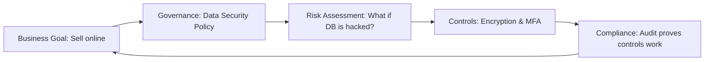

# GRC Fundamentals: The Business of Security

## 1. Beginner-friendly Hinglish Explanation 🇮🇳
Bhai, **GRC (Governance, Risk, and Compliance)** security ka woh part hai jo "Papers" aur "Rules" se deal karta hai. 

Bahut se logon ko lagta hai ki security matlab sirf hacking aur firewalls. Lekin real world mein, company ko yeh prove karna padta hai ki woh "Rules follow kar rahi hai" (Compliance), "Kahan galti ho sakti hai" (Risk), aur "Pura system kaise chalega" (Governance). Bina GRC ke, ek company ke paas duniya ke best hackers ho sakte hain, lekin phir bhi woh legal lawsuits ya fines ki wajah se band ho sakti hai.

---

## 2. Deep Technical Explanation
GRC is an integrated strategy to manage an organization's overall governance, enterprise risk management, and compliance with regulations.
- **Governance**: The set of rules, policies, and processes that ensure IT activities are aligned with business goals. It's about "Leadership and Oversight."
- **Risk Management**: Identifying, assessing, and controlling threats to an organization's capital and earnings.
- **Compliance**: Ensuring the organization meets the requirements of laws, regulations, and industry standards (e.g., GDPR, PCI-DSS).

---

## 3. Attack Flow Diagrams
**The GRC Feedback Loop:**

---

## 4. Real-world Attack Examples
- **Equifax Data Breach (2017)**: While it was a technical failure (unpatched Apache Struts), it was also a "Governance Failure." The risk management team didn't ensure that critical patches were being applied on time across the whole company.
- **GDPR Fines**: Companies like British Airways have been fined hundreds of millions of dollars not just because they were hacked, but because they failed to meet "Compliance" standards for protecting user data.

---

## 5. Defensive Mitigation Strategies
- **Risk Register**: A master list of everything that could go wrong, how likely it is, and what you are doing to stop it.
- **Internal Audits**: Checking your own systems every month to find holes before the "Official Auditor" finds them.
- **Policy Enforcement**: Using technology to make sure policies are followed (e.g., "The policy says no USBs, so we disable the USB ports in the OS").

---

## 6. Failure Cases
- **Check-the-box Compliance**: Doing just enough to pass an audit, but not actually being secure. A hacker doesn't care about your "SOC2 Certificate" if your password is `123456`.
- **Ignoring the 'Culture'**: Having great policies on paper, but employees ignoring them because they are too hard to follow.

---

## 7. Debugging and Investigation Guide
- **GRC Platforms**: Tools like **OneTrust**, **ServiceNow GRC**, or **LogicGate** that help track risks and audits.
- **Control Mapping**: Showing how one security control (e.g., MFA) satisfies multiple regulations (PCI, SOC2, and HIPAA).

---

## 8. Tradeoffs
| Feature | Technical Security | GRC Security |
|---|---|---|
| Focus | Bits & Bytes | Rules & Risks |
| Target | Hackers | Regulators/Lawyers |
| Output | Patched Servers | Audit Reports |

---

## 9. Security Best Practices
- **Risk-Based Approach**: Don't spend $1 million to protect $1,000 worth of data. Focus your money where the risk is highest.
- **Tone at the Top**: Security must be supported by the CEO, not just the IT guy.

---

## 10. Production Hardening Techniques
- **Evidence Automation**: Instead of taking screenshots for auditors, use scripts to automatically prove that "All our S3 buckets are private."
- **Continuous Compliance**: Using tools like **AWS Config** or **Azure Policy** to alert you the second a server becomes "Non-compliant."

---

## 11. Monitoring and Logging Considerations
- **Exception Logging**: Keeping track of every time a manager says "Ignore this security rule for now." These "Exceptions" are where hacks happen.

---

## 12. Common Mistakes
- **Confusing 'Secure' with 'Compliant'**: You can be compliant but not secure. You can also be secure but fail an audit because you didn't "Document" your security.
- **Writing 100-page policies that nobody reads**: Keep policies short, actionable, and easy to find.

---

## 13. Compliance Implications
- **Fines & Sanctions**: Non-compliance can lead to massive fines (4% of global revenue for GDPR) and even jail time for executives in some cases.

---

## 14. Interview Questions
1. What is the difference between a 'Risk' and a 'Vulnerability'?
2. How does GRC support the overall security posture of a company?
3. What is 'Segregation of Duties' in the context of compliance?

---

## 15. Latest 2026 Security Patterns and Threats
- **AI Governance**: New rules on how companies can use AI and how they must protect the data used to train AI.
- **Supply Chain Transparency**: New laws requiring companies to know the "Security Score" of every vendor they use.
- **ESG + Security**: Linking security performance to the company's "Environmental, Social, and Governance" (ESG) rating.
