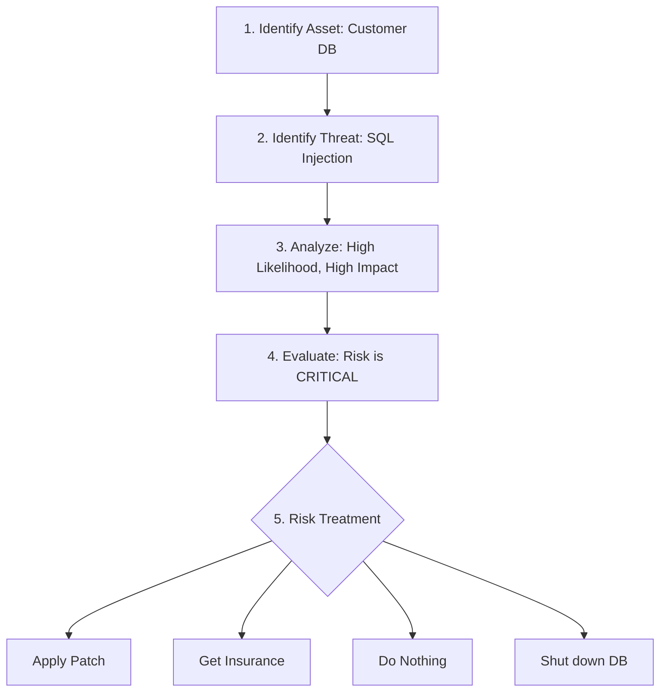

# Risk Management Frameworks: Measuring the Danger

## 1. Beginner-friendly Hinglish Explanation 🇮🇳
Bhai, **Risk Management Frameworks** ka matlab hai "Khatre ko napne ka paimana (Scale)." 

Aap sab kuch ek saath secure nahi kar sakte. Aapke paas limited budget aur limited time hai. Toh aap kaise decide karoge ki pehle kya theek karna hai? Risk Management humein ek formula deta hai: **Risk = Likelihood (Kitne chance hain hone ke) x Impact (Kitna nuksan hoga).** Frameworks jaise NIST ya ISO humein step-by-step batate hain ki khatron ko kaise pehchanein, kaise unhe rank karein, aur kaise unhe handle karein.

---

## 2. Deep Technical Explanation
Risk Management is the process of identifying, evaluating, and prioritizing risks.
- **NIST RMF (Risk Management Framework)**: A 7-step process: Prepare, Categorize, Select, Implement, Assess, Authorize, and Monitor. Popular in the US government and large enterprises.
- **ISO 27005**: The international standard for information security risk management.
- **FAIR (Factor Analysis of Information Risk)**: A quantitative model that tries to put a "Dollar Value" on risk (e.g., "This risk will cost us $500k").
- **Quantitative vs Qualitative Risk**:
    - **Qualitative**: "High, Medium, Low" (Based on opinion).
    - **Quantitative**: "80% chance of losing $1,000,000" (Based on data).

---

## 3. Attack Flow Diagrams
**The Risk Assessment Process:**

---

## 4. Real-world Attack Examples
- **Log4j Vulnerability (2021)**: Companies with a good Risk Framework immediately "Categorized" this as a **Critical Risk** because the impact was huge (RCE) and the likelihood was high (everyone uses Log4j). They patched it in 24 hours. Companies without a framework didn't even know they were at risk until months later.

---

## 5. Defensive Mitigation Strategies
- **Risk Treatment Options**:
    - **Mitigation**: Reducing the risk (e.g., installing a firewall).
    - **Transference**: Giving the risk to someone else (e.g., buying Cyber Insurance).
    - **Avoidance**: Stopping the activity that causes the risk (e.g., stopping the use of a dangerous software).
    - **Acceptance**: Deciding that the risk is small enough that we can live with it.

---

## 6. Failure Cases
- **Optimism Bias**: Thinking "It won't happen to us" and ranking every risk as "Low."
- **Data silos**: The IT team knows about a risk, but the Risk Management team doesn't, so the budget for a fix never gets approved.

---

## 7. Debugging and Investigation Guide
- **Risk Heat Map**: A visual chart (Red/Yellow/Green) showing which risks need the most attention.
- **CVE to Risk Mapping**: Taking a technical vulnerability (CVE-2024-XXXX) and translating it into a business risk.

---

## 8. Tradeoffs
| Metric | Qualitative (High/Low) | Quantitative ($ Value) |
|---|---|---|
| Speed | Fast | Slow |
| Accuracy | Subjective | Objective |
| Best for | Daily tasks | Board presentations |

---

## 9. Security Best Practices
- **Continuous Assessment**: Risk isn't a one-time thing. A new exploit or a new law can change your risk level overnight.
- **Involve the Business**: The CEO should decide what risks the company is willing to take, not the IT department.

---

## 10. Production Hardening Techniques
- **Automated Risk Scoring**: Using tools that calculate a "Risk Score" for every server based on its open ports, unpatched bugs, and the data it holds.

---

## 11. Monitoring and Logging Considerations
- **KRI (Key Risk Indicators)**: Metrics that tell you if a risk is increasing (e.g., "The number of failed admin logins has doubled this week").

---

## 12. Common Mistakes
- **Focusing only on 'External' threats**: Forgetting that an unhappy employee (Insider Threat) is often a bigger risk than a random hacker.
- **Ignoring 'Shadow IT'**: You can't manage the risk of a server you don't know exists.

---

## 13. Compliance Implications
- **ISO 27001**: You cannot get certified unless you prove you have a formal "Risk Management Process" in place.

---

## 14. Interview Questions
1. What are the four ways to treat a risk?
2. Explain the difference between Quantitative and Qualitative risk assessment.
3. How would you handle a situation where a manager wants to "Accept" a critical risk?

---

## 15. Latest 2026 Security Patterns and Threats
- **AI-Risk Management**: New frameworks for managing the risk of AI "Hallucinations" and "Prompt Injection."
- **Dynamic Risk Adjustment**: Security systems that automatically tighten firewall rules when the global "Threat Level" increases.
- **Climate Risk vs Cyber Risk**: Looking at how natural disasters (Climate) can lead to data center outages (Cyber).
