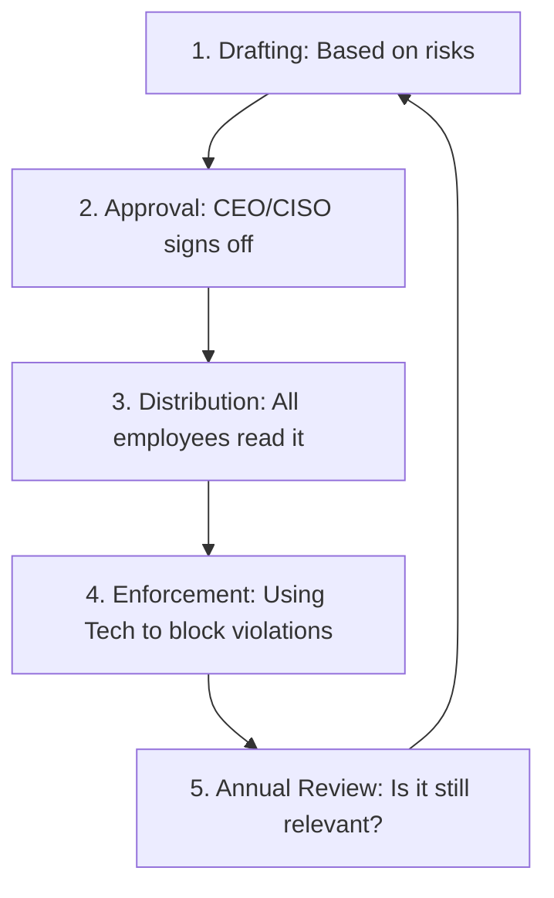

# Security Policies and Standards: The Law of the Land

## 1. Beginner-friendly Hinglish Explanation 🇮🇳
Bhai, **Security Policies** company ke "Kanoon" (Laws) hain. 

Bina kanoon ke koi bhi kuch bhi karega—koi simple password rakhega, koi office ke laptop par torrent chalayega. **Policy** ek document hota hai jo officially batata hai ki "Kya Allowed hai aur kya Prohibited." **Standards** woh details hain jo batati hain ki policy ko follow kaise karna hai (jaise: "Password kam se kam 12 characters ka hona chahiye"). Yeh sab milkar ek "Security Culture" banate hain.

---

## 2. Deep Technical Explanation
The hierarchy of security documentation:
1. **Policies (High Level)**: Broad statements of intent (e.g., "All data must be encrypted"). Written by management.
2. **Standards (Specific)**: Mandatory requirements (e.g., "Use AES-256 for encryption").
3. **Guidelines (Optional)**: Suggestions and best practices (e.g., "We recommend using a password manager").
4. **Procedures (Step-by-Step)**: Detailed instructions (e.g., "1. Log into AWS console, 2. Click S3, 3. Check 'Enable Encryption'").

---

## 3. Attack Flow Diagrams
**The Policy Lifecycle:**

---

## 4. Real-world Attack Examples
- **Insider Threat (The Rogue Employee)**: An employee was fired but still had their access because the company didn't have a "Termination Policy" that required IT to revoke access within 1 hour.
- **Lost Laptop**: A company laptop was stolen, and because there was no "Encryption Policy," the laptop was in plaintext, leading to a massive data breach of 10,000 customers.

---

## 5. Defensive Mitigation Strategies
- **AUP (Acceptable Use Policy)**: A contract every employee signs saying they won't use company resources for illegal or dangerous activities.
- **Exception Management**: If a policy cannot be followed (e.g., an old legacy machine can't be patched), there must be a formal process to document and approve that exception.

---

## 6. Failure Cases
- **Shelfware Policies**: 200-page documents that are so boring and long that nobody reads them.
- **Unenforceable Policies**: Writing a policy that says "Don't use personal phones," but having no way to actually stop people from doing it.

---

## 7. Debugging and Investigation Guide
- **Policy Compliance Scanning**: Using tools like **Tenable** or **Nessus** to see if your servers actually match your "Hardening Standard" (e.g., "Are all guest accounts disabled?").

---

## 8. Tradeoffs
| Feature | Strict Policy | Flexible Policy |
|---|---|---|
| Security | High | Low |
| Productivity | Lower (Friction) | Higher |
| Employee Satisfaction | Low | High |

---

## 9. Security Best Practices
- **KISS (Keep It Simple, Stupid)**: Use clear language. Instead of "Utilize complex alphanumeric strings," say "Use a strong password."
- **Regular Updates**: Technology changes every year. Your policies should too (especially for Cloud and AI).

---

## 10. Production Hardening Techniques
- **Policy as Code (PaC)**: Using tools like **Open Policy Agent (OPA)** or **Sentinel** to automatically block any code that violates your security policy (e.g., blocking a developer from creating a public database).

---

## 11. Monitoring and Logging Considerations
- **Policy Violation Alerts**: Tagging logs that show someone trying to bypass security controls (e.g., trying to install forbidden software).

---

## 12. Common Mistakes
- **Copy-Pasting Policies**: Taking a policy from another company without realizing that every company's risks are different.
- **No Consequences**: If there is no punishment for breaking the policy, nobody will follow it.

---

## 13. Compliance Implications
- **ISO 27001 Clause 5.2**: Specifically requires the organization to establish a "Security Policy" that is documented and communicated.

---

## 14. Interview Questions
1. What is the difference between a Policy, a Standard, and a Guideline?
2. What should be included in an 'Acceptable Use Policy' (AUP)?
3. How do you handle a request to bypass a security policy for an 'Urgent' project?

---

## 15. Latest 2026 Security Patterns and Threats
- **AI Policy**: Policies specifically for "Generative AI"—what data can be sent to ChatGPT and what cannot.
- **Remote Work Policies**: Updating old office-centric rules for a world where people work from cafes and co-working spaces.
- **Automated Policy Enforcement**: Using AI to detect and block policy violations in real-time before they become a breach.
