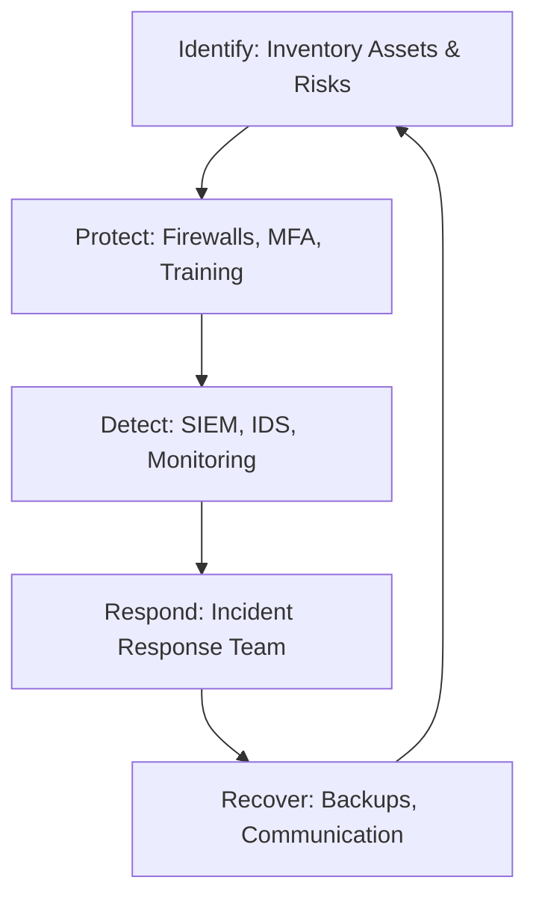

# Building a Security Program: From Zero to Hero

## 1. Beginner-friendly Hinglish Explanation 🇮🇳
Bhai, **Security Program** ka matlab hai "Security ko ek system banana." 

Sirf ek firewall khareed lena ya antivirus install kar lena security nahi hai. Security ek "Continuous Process" hai. Ek achha program woh hota hai jismein "Log" (People) ko pata ho kya karna hai, "Raste" (Processes) clear hon, aur "Hatiyar" (Tools) sahi se kaam karein. Is module mein hum seekhenge ki kaise ek nayi company mein zero se security start karein aur use "World-class" banayein.

---

## 2. Deep Technical Explanation
A security program is a comprehensive set of policies, procedures, and technical controls designed to protect an organization's assets.
- **Frameworks to follow**:
    - **NIST Cybersecurity Framework (CSF)**: Identify, Protect, Detect, Respond, Recover.
    - **ISO 27001**: An international standard for building an ISMS (Information Security Management System).
    - **CIS Critical Security Controls**: A prioritized list of 18 actions to stop the most common cyber attacks.
- **Phases of Building**:
    1. **Assessment**: Where are we today? (Gap Analysis).
    2. **Planning**: What are our priorities? (Roadmap).
    3. **Implementation**: Deploying tools and writing policies.
    4. **Operation**: Running the SOC and managing vulnerabilities.
    5. **Optimization**: Continuous improvement via audits and feedback.

---

## 3. Attack Flow Diagrams
**The NIST CSF Lifecycle:**

---

## 4. Real-world Attack Examples
- **Startups vs. Enterprise**: A startup might only focus on "Protection" (Firewalls). If they are hacked, they have no way to "Detect" it. A mature security program would have alerted them within minutes.
- **The 'Hero' Culture**: In some companies, security depends on one "Genius" guy. If he leaves, the security program collapses. A real program is built on **Processes**, not people.

---

## 5. Defensive Mitigation Strategies
- **Asset Inventory**: You cannot protect what you don't know you have. The first step of any program is making a list of every server, laptop, and database.
- **Defense in Depth**: Layering security so that if one thing fails (e.g., the firewall), another thing (e.g., encryption) still protects the data.

---

## 6. Failure Cases
- **Over-tooling**: Buying 50 different security tools but having no staff to manage them. This leads to "Shelfware"—tools that sit on the shelf doing nothing.
- **Ignoring the Developers**: Building a program that makes it impossible for developers to do their jobs. They will eventually find ways to bypass your security.

---

## 7. Debugging and Investigation Guide
- **Gap Analysis**: Using a spreadsheet to map your current controls against a standard like ISO 27001 to see where you are "Missing" something.
- **Maturity Models (CMMI)**: Grading your program from Level 1 (Initial) to Level 5 (Optimized).

---

## 8. Tradeoffs
| Feature | DIY Security | Framework-based Security |
|---|---|---|
| Speed | Fast to start | Slower to start |
| Reliability | Low | Very High |
| Cost | Low | High |

---

## 9. Security Best Practices
- **Prioritization**: Use the **80/20 Rule**. Focus on the 20% of controls that will stop 80% of the attacks.
- **Communication**: Regularly update the rest of the company on why security matters.

---

## 10. Production Hardening Techniques
- **Security Champions**: Appointing one developer in every team to be the "Security Expert" for that team. This scales security without needing a massive security department.

---

## 11. Monitoring and Logging Considerations
- **Program Metrics**: Tracking "How many people finished the security training?" or "How many servers are missing patches?"

---

## 12. Common Mistakes
- **Focusing on 'Compliance' only**: Thinking that passing an audit means you are secure. It doesn't.
- **Building in a Silo**: The security team should work WITH the IT and Engineering teams, not against them.

---

## 13. Compliance Implications
- **ISO 27001 Certification**: This is the "Gold Medal" for a security program. It proves to customers that you have a formal, working system in place.

---

## 14. Interview Questions
1. If you joined a company as the first security hire, what would be your first 3 steps?
2. Explain the NIST Cybersecurity Framework.
3. What is 'Defense in Depth'?

---

## 15. Latest 2026 Security Patterns and Threats
- **Zero Trust by Default**: Building a program where NO user or device is trusted, even inside the office.
- **Cloud-Native Security Programs**: Focusing on "Identity" and "Data" rather than "Networks" and "Firewalls."
- **AI-Managed Programs**: Using AI to automatically update policies and respond to minor risks without human intervention.
