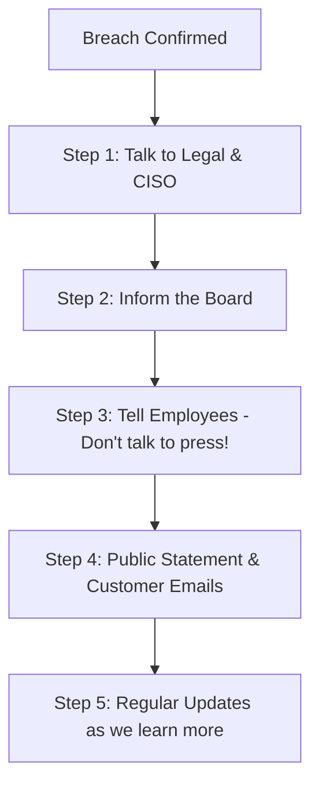

# Incident Communication and PR: Managing the Message

## 1. Beginner-friendly Hinglish Explanation 🇮🇳
Bhai, **Incident Communication** ka matlab hai "Duniya ko sach batana bina darr ke." 

Jab koi bada hack hota hai, toh media, customers, aur sarkaar sab aapse sawaal puchte hain. Agar aap chup rahoge, toh log sochenge ki aap kuch chhupa rahe ho. Agar aap jhoot bologe, toh legal trouble badh jayegi. Ek achhi communication strategy ka matlab hai: sahi waqt par, sahi logon ko, sahi jaankari dena. Yaad rakho, "Hack hona bura hai, lekin hack ko chhupana usse bhi bura hai."

---

## 2. Deep Technical Explanation
Incident communication is the strategic process of notifying internal and external stakeholders about a security breach.
- **Internal Communication**: Keeping the employees, management, and board informed (to prevent rumors).
- **External Communication**: 
    - **Customers**: How it affects them and what they should do (e.g., "Change your password").
    - **Regulators**: Fulfilling legal requirements (e.g., GDPR 72-hour rule).
    - **Media/PR**: Managing the company's reputation.
- **Dark Web Monitoring**: Checking what the hackers are saying about you in public while you are drafting your message.

---

## 3. Attack Flow Diagrams
**The Communication Timeline:**

---

## 4. Real-world Attack Examples
- **Uber (2016)**: Paid the hackers to keep quiet and didn't tell anyone. When it was discovered 1 year later, the CEO was fired and the reputation was destroyed.
- **Cloudflare (2023/24)**: When they were hacked, they published an incredibly detailed blog post explaining EXACTLY what happened, how they caught it, and how they fixed it. This actually *increased* user trust because of the transparency.

---

## 5. Defensive Mitigation Strategies
- **Pre-written Templates**: Have "Blank" emails and press releases ready for different scenarios (Ransomware, Data Leak, DDoS) so you don't have to write them while you are panicking.
- **Single Point of Contact**: Only ONE person (usually the C-level or a PR pro) should be allowed to speak to the media.

---

## 6. Failure Cases
- **Over-promising**: Saying "No data was stolen" only to realize 2 days later that millions of records *were* stolen. (Always say: "Our investigation is ongoing").
- **Technical Jargon**: Sending an email to customers that says "An unauthorized actor exploited a deserialization vulnerability in our Redis cluster." (Customers won't understand. Say: "We found a security hole and we closed it").

---

## 7. Debugging and Investigation Guide
- **Crisis Communication Playbook**: A physical or digital book that lists the phone numbers of the PR agency, outside legal counsel, and the government regulators.

---

## 8. Tradeoffs
| Metric | Full Transparency | Limited Disclosure |
|---|---|---|
| User Trust | High | Low |
| Legal Risk | High (Admission of guilt) | Low (Wait and see) |
| Speed | Fast | Slow |

---

## 9. Security Best Practices
- **Empathy First**: Start every customer email with "We are sorry" and "We take your privacy seriously."
- **Provide Actionable Steps**: Tell users EXACTLY what to do (e.g., "Turn on 2FA," "Check your bank statement").

---

## 10. Production Hardening Techniques
- **Status Pages**: Having a separate "Status.yourcompany.com" page hosted on a different network so you can communicate even if your main website is down.

---

## 11. Monitoring and Logging Considerations
- **Social Media Monitoring**: Watching Twitter/X and Reddit to see if customers are complaining about "Strange activity" before your internal tools even find it.

---

## 12. Common Mistakes
- **Being Defensive**: Blaming the hackers or a vendor. It's your data, so it's your responsibility.
- **Silent treatment**: Not saying anything for 2 weeks. The internet will fill the silence with the worst possible rumors.

---

## 13. Compliance Implications
- **GDPR / CCPA / DPDP**: These laws have specific "Timelines" for when you MUST tell the public. Failure to follow these timelines leads to the biggest fines.

---

## 14. Interview Questions
1. How do you handle a situation where the CEO wants to keep a breach secret?
2. What are the key elements of a good customer breach notification?
3. Why is 'Transparency' considered a better strategy than 'Secrecy' in modern security?

---

## 15. Latest 2026 Security Patterns and Threats
- **AI-Driven Misinformation**: Hackers using "Deepfake" videos of your CEO to spread fake news during a breach.
- **Regulatory Harmonization**: New tools that automatically generate a single report that satisfies multiple laws (EU, India, USA) at once.
- **Customer Identity Protection**: Companies now providing free "Identity Theft Monitoring" for 2 years as a standard way to apologize after a breach.
