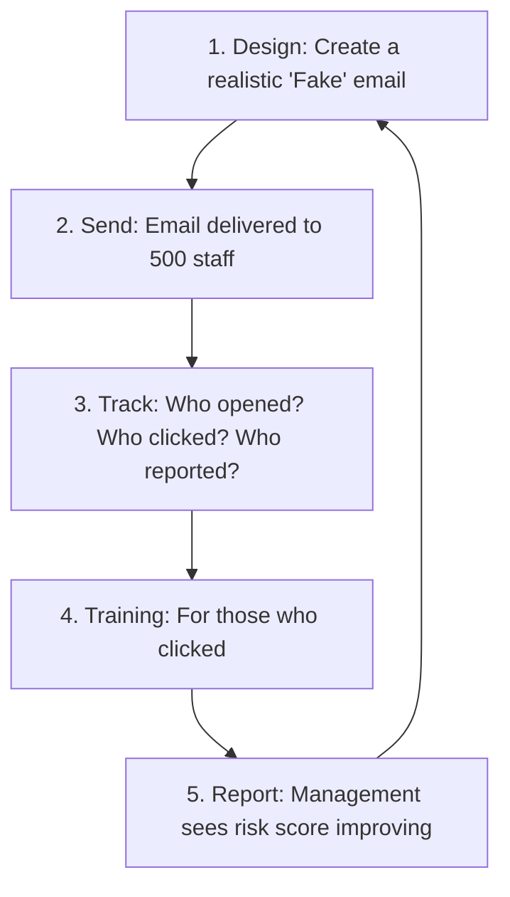

# Security Awareness Training: Patching the Human OS

## 1. Beginner-friendly Hinglish Explanation 🇮🇳
Bhai, **Security Awareness Training** ka matlab hai "Employees ko hoshiyar banana." 

Duniya ki sabse mehngi firewall bhi fail ho jayegi agar ek employee ne "Fake" email par click karke apna password hacker ko de diya. Insaan hi security ki sabse kamzor kadi (Weakest Link) hote hain. Is module mein hum seekhenge ki kaise logon ko train karein ki woh Phishing, Social Engineering, aur galat links ko pehchan sakein. Yaad rakho: "Software ko patch karna asaan hai, lekin insaan ki aadaton ko badalna mushkil."

---

## 2. Deep Technical Explanation
Security Awareness is the process of educating employees about the security risks they face and the best practices they should follow.
- **Phishing Simulations**: Sending "Fake" malicious emails to employees to see who clicks. If they click, they get immediate "Just-in-Time" training.
- **Social Engineering Defense**: Training people to say "No" to strange phone calls or someone trying to "Tailgate" (follow them) into the office.
- **Data Handling**: Teaching how to classify data (Public, Internal, Secret) and how to share it securely.
- **Reporting Culture**: Ensuring every employee knows EXACTLY how to report a suspicious email to the security team.

---

## 3. Attack Flow Diagrams
**The Phishing Simulation Cycle:**

---

## 4. Real-world Attack Examples
- **Twitter Admin Hack (2020)**: A teenager hacked the internal admin panel of Twitter (accessing accounts like Obama and Elon Musk) simply by calling a Twitter employee and pretending to be from the "Internal IT Helpdesk." This was a failure of "Social Engineering Training."
- **Business Email Compromise (BEC)**: Employees in finance departments are often tricked into sending millions of dollars to a "Fake Vendor" because they received an email that looked like it was from their CEO.

---

## 5. Defensive Mitigation Strategies
- **Continuous Learning**: Don't just do one 1-hour video per year. Send 2-minute "Security Tips" every month.
- **Gamification**: Giving badges or rewards to employees who report the most phishing emails.
- **In-App Prompts**: Showing a warning message when an employee tries to upload a "Secret" file to a public website.

---

## 6. Failure Cases
- **Boring Content**: Videos that are so boring that employees play them in the background while doing other work.
- **Shaming Employees**: If you make fun of an employee who clicks on a phishing link, they will never report a *real* hack to you because they are afraid.

---

## 7. Debugging and Investigation Guide
- **KnowBe4 / Infosec IQ / Proofpoint**: The top platforms for managing security training and phishing simulations.
- **Security Culture Survey**: Using surveys to measure if employees actually *care* about security or if they just do it because they are forced.

---

## 8. Tradeoffs
| Metric | Generic Training | Targeted Training |
|---|---|---|
| Efficiency | High (One size fits all) | Low (Needs manual work) |
| Effectiveness | Low | Very High |
| Cost | Low | High |

---

## 9. Security Best Practices
- **Train Everyone**: From the Janitor to the CEO. Hackers often target the "Assistant" or the "HR" person because they have access to everyone's calendars.
- **Positive Reinforcement**: Thanking people who report suspicious activity, even if it turns out to be a "False Alarm."

---

## 10. Production Hardening Techniques
- **The 'Phish' Button**: Installing a button in Outlook/Gmail that lets employees report an email in one click. This feeds directly into the SOC.

---

## 11. Monitoring and Logging Considerations
- **Click-Rate**: The percentage of people who fail the phishing test.
- **Reporting-Rate**: The percentage of people who report the phishing test. (This is more important than the click-rate!).

---

## 12. Common Mistakes
- **Assuming 'IT people' are safe**: Some of the biggest hacks started with a developer or an IT admin clicking a link.
- **Not testing 'Phone' or 'Physical' security**: Only focusing on email and forgetting about "vishing" (voice phishing) or "piggybacking" through doors.

---

## 13. Compliance Implications
- **SOC2 / HIPAA / PCI**: All require "Documented proof" that every employee has finished their annual security awareness training.

---

## 14. Interview Questions
1. How do you measure the success of a security awareness program?
2. What would you do if a high-level executive kept failing phishing simulations?
3. How do you build a 'Security Culture' in a remote-first company?

---

## 15. Latest 2026 Security Patterns and Threats
- **Deepfake Awareness**: Training employees to recognize AI-generated voices and videos. "If the CEO calls you asking for money, ask for a 'Secret Code Word'."
- **QR Code Phishing (Quishing)**: Training people not to scan random QR codes they find in the street or in "Urgent" letters.
- **Personal Device Security**: Training for people who work from their own laptops and phones (BYOD).
