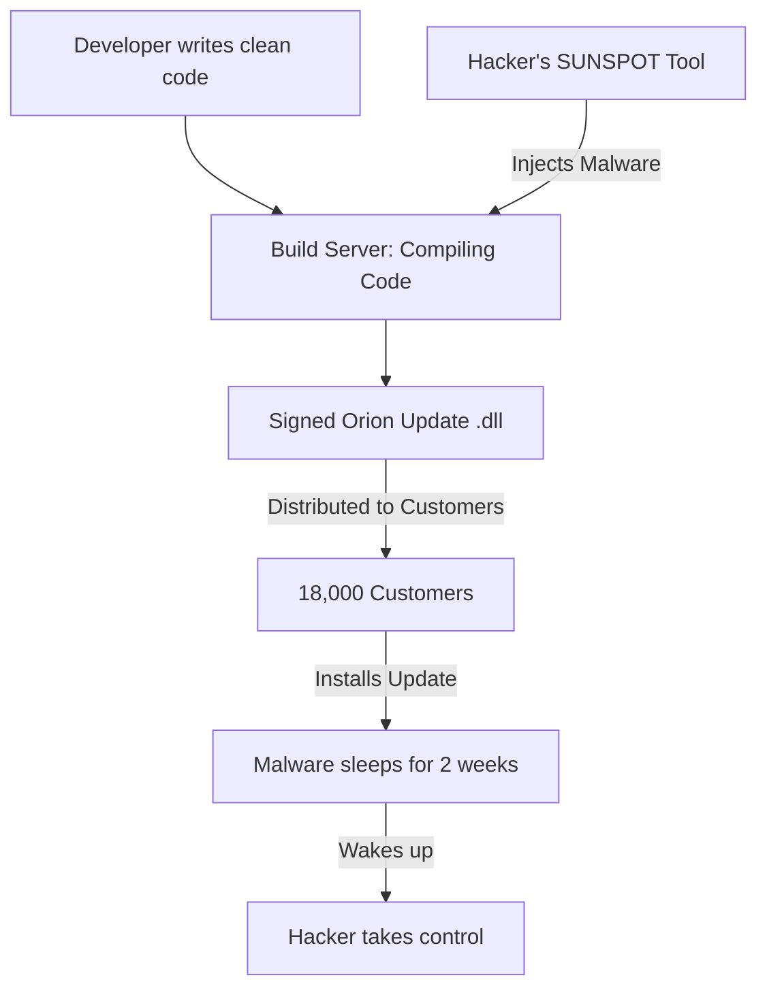

# The SolarWinds Supply Chain Attack: A Masterclass in Stealth

## 1. Beginner-friendly Hinglish Explanation 🇮🇳
Bhai, **SolarWinds Attack** security ki duniya ka sabse bada "Cheat Code" attack tha. 

Socho aapne apne ghar mein "Best Security Guard" (SolarWinds software) rakha hai. Lekin choron ne guard ke "Ghar" (Factory) mein ghus kar guard ki "Training" (Code) hi badal di. Ab guard choron ke liye darwaza khulne laga. SolarWinds ek aisa software hai jo badi-badi companies aur sarkari offices use karte hain. Hackers ne iske update mein ek "Backdoor" daal diya, aur 18,000 customers ne khud hi woh "Hacked Update" download kar liya. Isse kehte hain **Supply Chain Attack**.

---

## 2. Deep Technical Explanation
- **The Target**: SolarWinds **Orion**, an IT monitoring and management platform.
- **The Malware**: **SUNBURST** (Backdoor) and **SUNSPOT** (The tool that injected the backdoor into the build process).
- **The Technique**: 
    1. Hackers compromised the internal development environment of SolarWinds.
    2. They added a malicious file to the source code during the "Build" process (compilation).
    3. The final DLL file was digitally signed by SolarWinds, making it look "Trusted."
- **Execution**: The malware waited for 12-14 days before "Waking up" to avoid detection. It communicated via DNS to a Command & Control (C2) server.

---

## 3. Attack Flow Diagrams
**The Orion Build Injection:**

---

## 4. Real-world Impact
- **Affected Organizations**: US Treasury, US State Department, Microsoft, Intel, FireEye, and many others.
- **Goal**: Espionage (Spanning over a year without being caught).
- **Discovery**: FireEye (a security company) discovered they were hacked when they noticed a "New Device" registered for MFA for one of their employees.

---

## 5. Defensive Mitigation Strategies
- **Build Integrity Checks**: Comparing the source code with the final compiled binary to see if anything was added.
- **Network Segmentation**: Even if your monitoring tool is hacked, it shouldn't be allowed to "Talk" to the outside internet.
- **EDR (Endpoint Detection and Response)**: Monitoring for "Strange" behavior (like a monitoring tool suddenly running PowerShell scripts).

---

## 6. Failure Cases
- **Assuming 'Signed' = 'Safe'**: Just because a file has a valid digital signature from a famous company doesn't mean it's not malicious.
- **Delayed Discovery**: The hack started in March 2020 but was only found in December 2020. By then, the hackers had 9 months of total access.

---

## 7. Debugging and Investigation Guide
- **IOCs (Indicators of Compromise)**: Looking for specific file hashes or C2 domain names (e.g., `avsvmcloud.com`).
- **Log Analysis**: Checking for unusual DNS queries from internal servers.

---

## 8. Tradeoffs
| Feature | Traditional Security | Supply Chain Security |
|---|---|---|
| Focus | Perimeter / Firewall | Internal Build Process |
| Difficulty | Low | Very High |
| Trust Model | Trust the Vendor | Verify the Vendor |

---

## 9. Security Best Practices
- **Least Privilege for Tools**: Management tools like Orion should only have the permissions they need, not "Domain Admin" rights.
- **SBOM (Software Bill of Materials)**: Knowing exactly what libraries and code are inside the software you buy.

---

## 10. Production Hardening Techniques
- **Reproducible Builds**: Building the code on two different servers and checking if the output is 100% identical. If one server is hacked, the outputs won't match.

---

## 11. Monitoring and Logging Considerations
- **Baseline Behavior**: Knowing what your servers "Normally" do. If a server that never talks to the internet suddenly sends 5MB of data, it's an alert.

---

## 12. Common Mistakes
- **Ignoring 'Internal' traffic**: Assuming that because the traffic is "Inside" the network, it must be safe.
- **Slow Patching**: Ironically, the "Patch" was the problem here, but usually, not patching is the risk.

---

## 13. Compliance Implications
- **NIST SP 800-161**: Specifically updated after SolarWinds to give better guidance on Supply Chain Risk Management.

---

## 14. Interview Questions
1. How was the SolarWinds attack different from a normal hack?
2. What is 'SUNBURST'?
3. Why did the malware wait for 14 days before activating?

---

## 15. Latest 2026 Security Patterns and Threats
- **AI-Native Supply Chain Attacks**: Hackers using AI to find the "Weakest Vendor" in a chain of 1,000 companies.
- **GitHub Action Poisoning**: Hacking the "CI/CD" pipeline of open-source projects to inject malware into thousands of apps at once.
- **Hardware Supply Chain Interdiction**: Intercepting servers during delivery (as discussed in Module 17).
