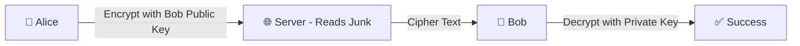

# 🔐 Encryption, Hashing & E2EE (Deep Dive Guide)
> **Level:** Beginner → Expert | **Goal:** Master End-to-End Encryption, Signatures, and Hashing in Production

---

## 📋 Is Guide Se Kya Seekhoge

| Topic | Importance |
|-------|------------|
| 1. Hashing vs Encryption | 1-way vs 2-way storage |
| 2. Symmetric vs Asymmetric | Secret Keys management |
| 3. Digital Signatures | Authenticity and Integrity |
| 4. SHA, AES, RSA Algorithms | The Math behind safety |
| 5. End-to-End Encryption (E2EE) | How Privacy works (WhatsApp/Signal) |
| 6. Attacker Protection | Man-in-the-Middle (MITM) defense |

---

## 1. 🏗️ Hashing: One-Way Protection

Hashing ek aisa process hai jo "Text" ko "Fixed length string" (Hash) mein badal deta hai. Ise wapis original text mein nahi dhal sakte.
- **SHA-256:** Industry standard for passwords and file integrity.
- **Salt:** Hash nikalne se pehle random string add karna (Rainbow table attacks bachane ke liye).

```python
import hashlib

# Hashing with Salt logic
password = "my_secret_pass"
salt = "random_string_123"
hashed = hashlib.sha256((password + salt).encode()).hexdigest()
# result: unique hash
```

---

## 🏗️ 2. Encryption: Two-Way Secret

### A. Symmetric (AES-256)
Same "Key" use hoti hai lock aur unlock karne ke liye. Fast hai, lekin "Key Share" karna risky hai. (Used for huge data storage).

### B. Asymmetric (RSA/ECC)
Do keys hoti hain: **Public Key** (Sab ko do encypt karne ke liye) aur **Private Key** (Sirf apne paas rakho decrypt karne ke liye). (Used for Secure Key exchange).

---

## ✒️ 3. Digital Signatures: Integrity Check

Digital signatures ensure karte hain ki **Data kisi ne raaste mein change toh nahi kiya?**

1. Sender file ka hash nikalta hai.
2. Hash ko apni **Private Key** se encrypt karta hai (Ye "Signature" ban gaya).
3. Receiver file ka hash nikalta hai aur signature ko sender ki **Public Key** se decrypt karta hai.
4. Agar dono match hote hain, toh file authentic hai!

---

## 🚀 4. End-to-End Encryption (E2EE): Deep Logic

E2EE ka matlab hai ki server ke paas bhi decrypt karne ki power nahi hai.

- **Alice sends to Bob:** Alice Bob ki "Public Key" use karke message encrypt karti hai.
- **Path:** Cipher text server par jata hai. Server use padh nahi sakta (No private key).
- **Bob receives:** Bob apni "Private Key" se use decrypt karta hai.



---

## 🏢 5. Production Attacker Protection

1. **Brute Force:** Passwords/Hashes hit mismatch try karna. (**Fix:** Rate limiting + BCrypt/Argon2 slow hashing).
2. **Man-in-the-Middle (MITM):** Bich mein baithkar traffic redirect karna. (**Fix:** SSL/TLS certificates + Certificate Pinning).
3. **Rainbow Table:** Pehle se pre-computed hashes list. (**Fix:** Salt complexity).

---

## 🧪 Exercises — Cryptography Challenges!

### Challenge 1: Encryption Type! ⭐⭐
**Scenario:** Aapko 10GB ki database file backup karni hai. Aap RSA (Asymmetric) use karenge ya AES (Symmetric)?
<details><summary>Answer</summary>
**AES (Symmetric)**. RSA bade files ke liye bahut slow hai aur data handle nahi kar sakta. AES efficient hai hardware level par (AES-NI). RSA se sirf AES ki key share ki jati hai.
</details>

---

## 🔗 Resources
- [How HTTPS works exact (Comic)](https://howhttps.works/)
- [Hashing algorithms comparison](https://www.cryptopp.com/wiki/Hash_functions)
- [Signal Protocol (E2EE) Deep Dive](https://signal.org/docs/)
