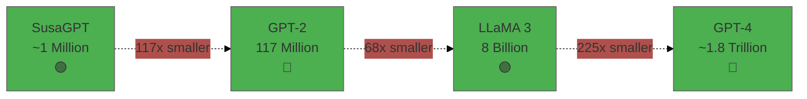
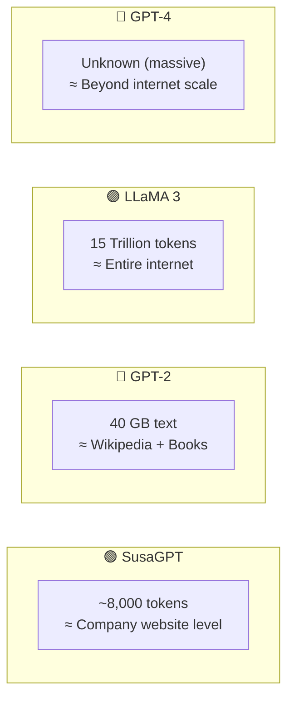
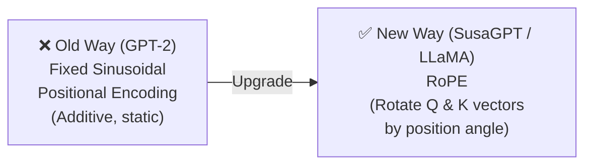
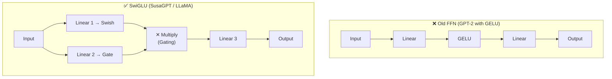
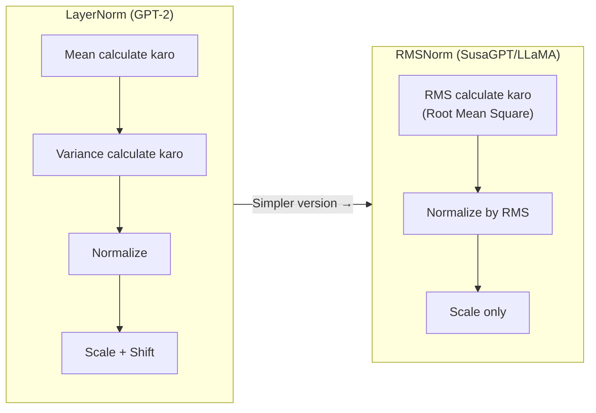
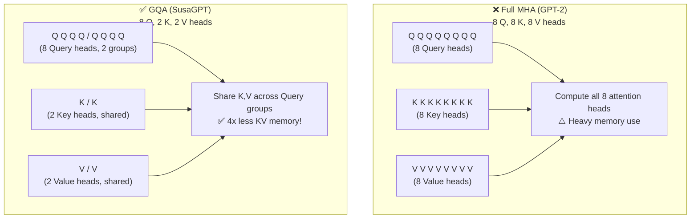
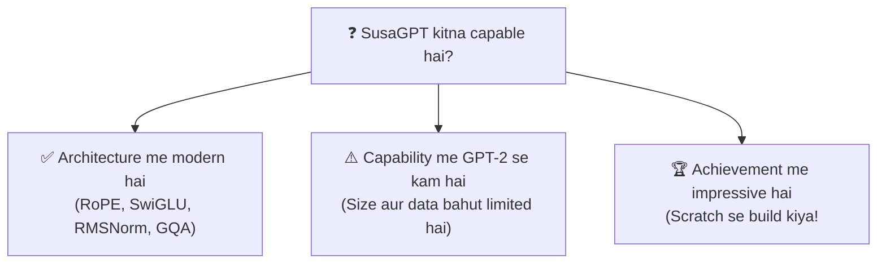
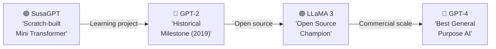
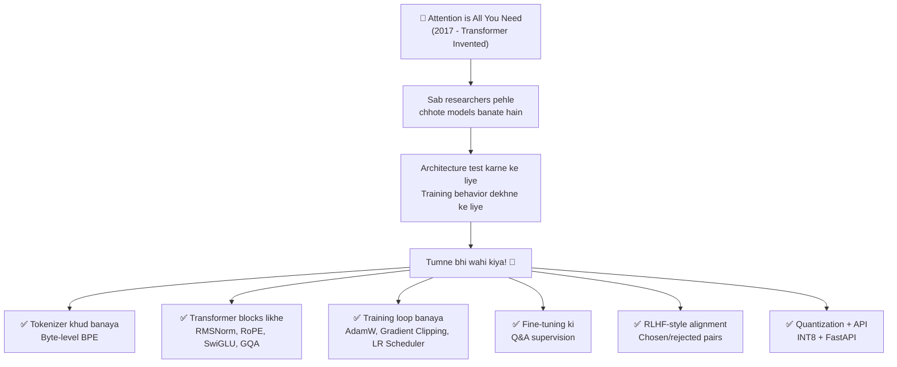

# 🏛️ SusaGPT Architecture Guide
> **Ye file SusaGPT ko GPT-2, LLaMA 3 aur GPT-4 ke context me compare karti hai — honest aur detailed tarike se**

---

## 🗺️ Quick Overview

| Feature | SusaGPT | GPT-2 | LLaMA 3 | GPT-4 |
|---------|---------|-------|---------|-------|
| Year | 2026 | 2019 | 2024 | 2023 |
| Parameters | ~1M | 117M | 8B | ~1.8T (est.) |
| Training Data | ~8K tokens | 40GB | 15T tokens | Unknown (massive) |
| Positional | **RoPE** ✅ | Fixed | **RoPE** ✅ | RoPE |
| Activation | **SwiGLU** ✅ | GELU | **SwiGLU** ✅ | SwiGLU |
| Normalization | **RMSNorm** ✅ | LayerNorm | **RMSNorm** ✅ | RMSNorm |
| Attention | **GQA** ✅ | Full MHA | **GQA** ✅ | MQA/GQA |
| KV Cache | ✅ | ❌ | ✅ | ✅ |
| RLHF Stage | ✅ | ❌ | ✅ | ✅ |
| Tokenizer | Byte-level BPE | Word-level | Byte-level BPE | Byte-level BPE |

---

## 📊 Visual Comparison


---

## 1. 📐 Size Ka Fark — Parameters



| Model | Parameters | Comparison |
|-------|-----------|-----------|
| 🟢 SusaGPT | 1,000,000 | ← Reference |
| 🔵 GPT-2 | 117,000,000 | 117x larger |
| 🟣 LLaMA 3 | 8,000,000,000 | 8,000x larger |
| 🔴 GPT-4 | ~1,800,000,000,000 | 1.8 Million x larger |

> 💡 **Simple Samjho:**
> Parameters = model ki memory capacity
> - Zyada parameters = zyada patterns store kar sakta hai
> - Kam parameters = focused lekin limited

---

## 2. 🗄️ Training Data Ka Fark



**Iska matlab:**
- GPT-4 duniya ke topics jaanta hai
- LLaMA 3 broad general knowledge rakhta hai
- GPT-2 internet-scale text se train hua
- SusaGPT mainly domain-specific cheezein jaanta hai

> 💡 **Key Insight:**
> `SusaGPT smart architecture rakhta hai, lekin limited data ki wajah se limited knowledge rakhta hai.`

---

## 3. ⚡ Architecture Components: Kya Modern Hai SusaGPT Me?

### 3.1 RoPE — Rotary Positional Embedding



**GPT-2 vs SusaGPT — Positional Encoding:**

```python
# GPT-2 Style: Simple addition
position_encoded = token_embedding + position_embedding
# ❌ Problem: Position sirf add hoti hai, relative position weak hota hai

# RoPE Style (SusaGPT): Rotation
def apply_rope(q, k, position):
    # Query aur Key vectors ko position angle se rotate karo
    cos_theta = cos(position * freq)
    sin_theta = sin(position * freq)
    q_rotated = q * cos_theta + rotate_half(q) * sin_theta
    k_rotated = k * cos_theta + rotate_half(k) * sin_theta
    return q_rotated, k_rotated
# ✅ Benefit: Relative position attention me directly encode hoti hai
```

**RoPE ka fayda:**
- Relative positions better samajh aati hain
- Long-range context handling improve hoti hai
- Modern transformers me bahut common hai

---

### 3.2 SwiGLU — Upgraded Feed Forward Network



**Real working comparison:**

```python
import torch
import torch.nn as nn
import torch.nn.functional as F

# GPT-2 Style FFN
class OldFFN(nn.Module):
    def __init__(self, dim):
        super().__init__()
        self.fc1 = nn.Linear(dim, dim * 4)
        self.fc2 = nn.Linear(dim * 4, dim)

    def forward(self, x):
        x = F.gelu(self.fc1(x))    # GELU activation
        x = self.fc2(x)
        return x

# SwiGLU Style FFN (SusaGPT)
class SwiGLU(nn.Module):
    def __init__(self, dim, hidden_dim):
        super().__init__()
        self.w1 = nn.Linear(dim, hidden_dim, bias=False)
        self.w2 = nn.Linear(hidden_dim, dim, bias=False)
        self.w3 = nn.Linear(dim, hidden_dim, bias=False)

    def forward(self, x):
        # Ek branch content, ek branch gate
        gate = F.silu(self.w1(x))   # Swish activation
        content = self.w3(x)
        # Gating: multiply! Model decide karta hai kya pass karna hai
        x = gate * content
        return self.w2(x)

# Quick demo
dim = 64
old_ffn = OldFFN(dim)
new_ffn = SwiGLU(dim, dim * 2)

test_input = torch.randn(1, 10, dim)  # (batch, seq_len, dim)
old_out = old_ffn(test_input)
new_out = new_ffn(test_input)

print(f"Input shape:   {test_input.shape}")
print(f"OldFFN output: {old_out.shape}  (parameters: {sum(p.numel() for p in old_ffn.parameters())})")
print(f"SwiGLU output: {new_out.shape}  (parameters: {sum(p.numel() for p in new_ffn.parameters())})")
# SwiGLU better information gating karta hai!
```

---

### 3.3 RMSNorm vs LayerNorm



**Why RMSNorm is better:**

```python
import torch

class LayerNorm(torch.nn.Module):
    """GPT-2 Style - Zyada computation"""
    def __init__(self, dim):
        super().__init__()
        self.weight = torch.nn.Parameter(torch.ones(dim))
        self.bias = torch.nn.Parameter(torch.zeros(dim))

    def forward(self, x):
        mean = x.mean(-1, keepdim=True)        # Mean calculate karo
        var = x.var(-1, keepdim=True)           # Variance calculate karo
        x = (x - mean) / (var + 1e-6).sqrt()  # Normalize
        return self.weight * x + self.bias      # Scale + Shift


class RMSNorm(torch.nn.Module):
    """SusaGPT Style - Simpler, faster!"""
    def __init__(self, dim, eps=1e-6):
        super().__init__()
        self.weight = torch.nn.Parameter(torch.ones(dim))
        self.eps = eps

    def forward(self, x):
        # Sirf RMS calculate karo — no mean subtraction!
        rms = x.pow(2).mean(-1, keepdim=True).add(self.eps).sqrt()
        return self.weight * (x / rms)

# RMSNorm = LayerNorm se fast, similar performance
# Modern LLMs me RMSNorm preferred hai!
```

---

### 3.4 GQA — Grouped Query Attention



**GQA ke fayde:**
- KV Cache 4x chhota hota hai
- Generation faster hoti hai
- Same quality, kam memory

---

## 4. 🔑 Kya Honestly Kaha Ja Sakta Hai



> **Sabse fair verdict:**
>
> `SusaGPT GPT-2 se zyada modern architecture pieces use karta hai,`
> `lekin GPT-2 se zyada capable model nahi hai,`
> `kyunki scale, data aur training budget bahut chhote hain.`

---

## 5. 🏆 Model Positioning



| Model | Best Use Case |
|-------|--------------|
| 🟢 SusaGPT | Learning, Architecture experiments, CPU inference |
| 🔵 GPT-2 | Understanding transformer history, baseline |
| 🟣 LLaMA 3 | Open-source production, fine-tuning |
| 🔴 GPT-4 | Best performance tasks, production AI |

---

## 6. 💪 Kyun Impressive Hai SusaGPT?



> 🏆 **Ye beginner-level copy-paste project nahi hai.**
> **Ye actual systems understanding dikhata hai.**

---

## 🧪 Exercises — Test Your Understanding!

### Exercise 1: Architecture Identify Karo ⭐

**Neeche diye features me se identify karo — GPT-2 wala hai ya SusaGPT wala?**

```
A) Fixed sinusoidal positional encoding
B) RMSNorm normalization layer
C) LayerNorm with bias
D) SwiGLU activation function
E) Standard multi-head attention (all Q, K, V heads equal)
F) Grouped Query Attention (GQA)
```

<details>
<summary>✅ Answers Dekho</summary>

```
A) Fixed sinusoidal → GPT-2 (Old style)
B) RMSNorm → SusaGPT / LLaMA style (Modern)
C) LayerNorm with bias → GPT-2
D) SwiGLU → SusaGPT / LLaMA (Modern)
E) Standard MHA → GPT-2
F) GQA → SusaGPT / LLaMA (Memory efficient)
```

</details>

---

### Exercise 2: Parameters aur Scale ⭐⭐

**Calculate karo:**

```
Q1: GPT-2 SusaGPT se kitne guna bada hai parameters me?
Q2: LLaMA 3 GPT-2 se kitne guna bada hai?
Q3: Agar SusaGPT ke training data ko GPT-2 se compare karo 
    (7764 tokens vs 40GB ≈ 20 billion tokens), 
    to GPT-2 ka data kitna zyada hai (approximate)?
```

<details>
<summary>✅ Calculations Dekho</summary>

```python
susagpt_params = 1_000_000
gpt2_params = 117_000_000
llama_params = 8_000_000_000

q1 = gpt2_params / susagpt_params
print(f"Q1: GPT-2 is {q1}x bigger than SusaGPT")
# Answer: 117x

q2 = llama_params / gpt2_params
print(f"Q2: LLaMA 3 is {q2:.0f}x bigger than GPT-2")
# Answer: ~68x

susagpt_tokens = 7764
gpt2_tokens = 20_000_000_000  # ~20B tokens in 40GB
q3 = gpt2_tokens / susagpt_tokens
print(f"Q3: GPT-2 has {q3:,.0f}x more training data")
# Answer: ~2.5 million times more!
```

</details>

---

### Exercise 3: SwiGLU Code Run Karo ⭐⭐⭐

**Task:** Upar diya gaya SwiGLU vs OldFFN code run karo aur parameters count compare karo. Kaunsa zyada parameters use karta hai aur kyu?

<details>
<summary>✅ Answer Dekho</summary>

```
dim = 64
OldFFN: fc1 (64×256) + fc2 (256×64) = 16384 + 16384 = 32,768 params
SwiGLU: w1 (64×128) + w2 (128×64) + w3 (64×128) = 8192+8192+8192 = 24,576 params

SwiGLU less parameters use karta hai (hidden_dim=dim*2 hai),
lekin gating mechanism ki wajah se better performance give karta hai.
Ye efficiency ka faida hai SwiGLU ka.
```

</details>

---

## 📝 Quick Test

**Q1:** RoPE kya improve karta hai GPT-2 ke fixed positional encoding se?

```
A) More parameters add karta hai
B) Position information ko Q aur K vectors me rotate karke better inject karta hai
C) Training fast karta hai
D) Vocabulary size badhata hai
```

<details><summary>Answer</summary>**B** ✅</details>

---

**Q2:** GQA ka main fayda kya hai?

```
A) More accurate attention computation
B) Larger vocabulary support
C) Reduced KV cache memory, faster generation
D) Better tokenization
```

<details><summary>Answer</summary>**C** ✅</details>

---

**Q3:** SusaGPT ke baare me kaunsa statement **sahi** hai?

```
A) SusaGPT GPT-2 se zyada capable hai
B) SusaGPT GPT-2 se zyada modern architecture use karta hai, lekin capability me chhota hai
C) SusaGPT aur GPT-2 same size hain
D) SusaGPT ki training data GPT-2 se zyada hai
```

<details><summary>Answer</summary>**B** ✅ — Architecture modern hai, lekin size/data bahut chhota hai</details>

---

## 📺 Video Resources (Hindi/Urdu)

| Topic | Link | Language |
|-------|------|----------|
| **Transformers Architecture** | [Watch on YouTube](https://www.youtube.com/watch?v=3bPhDUSAUYI) | Hindi |
| **Encoder vs Decoder Models** | [Watch on YouTube](https://www.youtube.com/watch?v=pAnuHkS0c00) | Hindi |
| **Build GPT from Scratch** | [Watch on YouTube](https://www.youtube.com/watch?v=kCc8FmEb1nY) | English |

---

## 🏆 One-Line Summary

> **SusaGPT overall power me GPT-2 ya LLaMA 3 jaisa nahi hai, lekin architecture ke andar kaafi modern ideas use karta hai — aur sabse badi baat ye hai ki tumne ise scratch se khud build kiya hai. 🎉**
