# 📊 SusaGPT Diagram Guide
> **Visual guide: SusaGPT ke har module ko diagrams + real examples ke saath samjho**

---

> 💡 **Note:** Agar aapke markdown viewer me Mermaid diagrams render hote hain to ye file aur achchhi dikhegi.
> Agar Mermaid render na ho to tension nahi — har diagram ke niche Hinglish explanation bhi hai!

---

## 🗺️ Quick Navigation

| Section | Topic |
|---------|-------|
| [Diagram 1](#1) | SusaGPT Ka Big Picture |
| [Diagram 2](#2) | Tokenizer Ka Flow |
| [Diagram 3](#3) | BPE Training |
| [Diagram 4](#4) | Model Architecture |
| [Diagram 5](#5) | Transformer Block Internals |
| [Diagram 6](#6) | Attention Mechanism |
| [Diagram 7](#7) | GQA |
| [Diagram 8](#8) | RoPE |
| [Diagram 9](#9) | RMSNorm |
| [Diagram 10](#10) | SwiGLU |
| [Diagram 11+](#11) | Training, Generation, Sampling... |

---

<a name="1"></a>
## 1. 🌐 SusaGPT Ka Big Picture

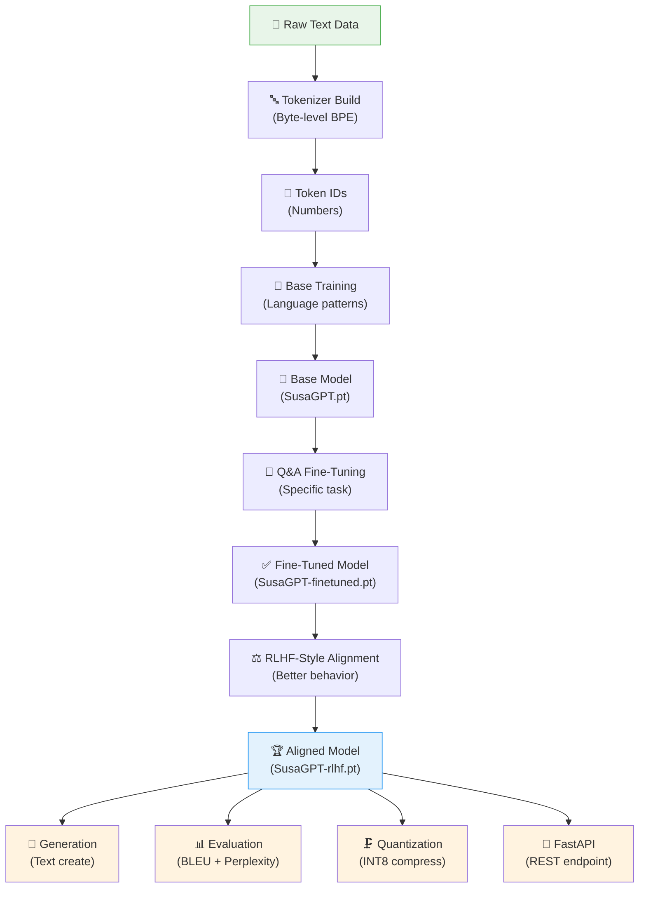

**Full pipeline ka matlab:**
1. 📄 Text data aata hai
2. 🔤 Tokenizer banta hai (text → numbers)
3. 🎯 Base model train hota hai (language patterns)
4. 🔧 Fine-tuning hoti hai (Q&A task)
5. ⚖️ RLHF alignment hoti hai (better behavior)
6. 🏆 Final model → generation, evaluation, quantization, API

---

<a name="2"></a>
## 2. 🔤 Tokenizer Ka Flow

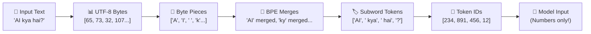

### Real Working Demo:

```python
# Tokenizer ka basic flow samjhne ke liye
text = "AI kya hai?"

# Step 1: UTF-8 bytes me convert
bytes_data = text.encode('utf-8')
print(f"Text: '{text}'")
print(f"Bytes: {list(bytes_data)}")

# Step 2: Har byte ko character me convert
chars = [chr(b) if b < 256 else f"<{b}>" for b in bytes_data]
print(f"Chars: {chars}")

# Step 3: BPE ke baad likely tokens (simplified)
# Real BPE merges ke baad ye tokens bante hain
hypothetical_tokens = ['AI', ' ky', 'a', ' ha', 'i', '?']
print(f"Tokens (BPE merged): {hypothetical_tokens}")

# Step 4: Token IDs assign karo
vocab = {token: i for i, token in enumerate(hypothetical_tokens + ['<pad>', '<unk>'])}
token_ids = [vocab.get(t, vocab['<unk>']) for t in hypothetical_tokens]
print(f"Token IDs: {token_ids}")

# Reverse: IDs → Text
id_to_token = {v: k for k, v in vocab.items()}
decoded = ''.join([id_to_token[i] for i in token_ids])
print(f"Decoded: '{decoded}'")
```

**Tokenizer ke fayde:**
- Unknown word problem nahi hota
- Hindi, Urdu, English, Code — sab tokenize hota hai
- Rare words bhi tootkar represent hote hain (`supercalifragilistic` → `super` + `cali` + ...)

---

<a name="3"></a>
## 3. 🔄 BPE Training Flow

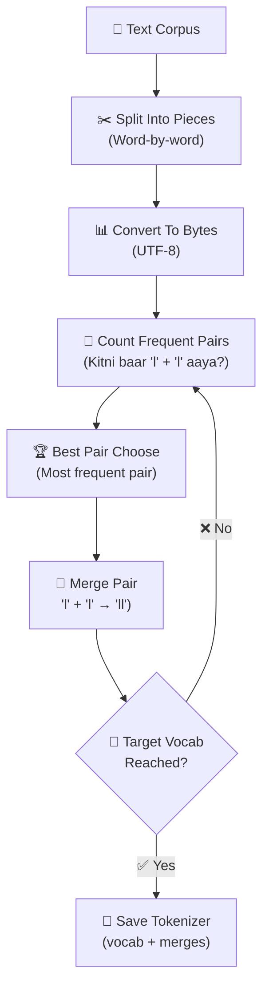

### BPE Ka Step-by-Step Example:

```python
# BPE algorithm ka simplified visualization

corpus = ["hello", "hell", "help", "helping"]
print("Initial corpus:", corpus)

# Iteration 1: Count pairs
from collections import Counter

def get_pairs(words):
    pairs = Counter()
    for word in words:
        chars = list(word)
        for i in range(len(chars) - 1):
            pairs[(chars[i], chars[i+1])] += 1
    return pairs

iteration = 0
words = [list(w) for w in corpus]  # Character-level start

for _ in range(3):  # 3 BPE merges
    iteration += 1
    char_corpus = [''.join(w) for w in words]
    pairs = get_pairs(char_corpus)

    if not pairs:
        break

    best_pair = pairs.most_common(1)[0]
    print(f"\nIteration {iteration}:")
    print(f"  All pairs: {dict(list(pairs.items())[:5])}")
    print(f"  Best pair: {best_pair[0]} (count: {best_pair[1]})")

    # Merge: 'h' + 'e' → 'he'
    new_token = ''.join(best_pair[0])
    print(f"  New token: '{new_token}'")

    # Apply merge to all words
    merged_words = []
    for word in char_corpus:
        merged = word.replace(''.join(best_pair[0]), new_token)
        merged_words.append(merged)
    print(f"  Words updated: {merged_words}")
    words = [list(w) for w in merged_words]
```

**Output (approximate):**
```
Initial corpus: ['hello', 'hell', 'help', 'helping']

Iteration 1:
  All pairs: {('h', 'e'): 4, ('e', 'l'): 4, ('l', 'l'): 2, ...}
  Best pair: ('h', 'e') (count: 4)
  New token: 'he'
  Words updated: ['hello', 'hell', 'help', 'helping']

Iteration 2:
  Best pair: ('he', 'l') (count: 4)
  New token: 'hel'
  ...
```

---

<a name="4"></a>
## 4. 🏗️ Model Architecture Ka Core Flow

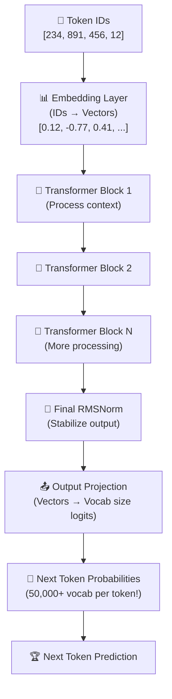

**High-level skeleton:**
- Token id → vector (embedding)
- Vector transformer blocks se pass hota hai
- Final hidden state se logits nikalte hain
- Logits batate hain next token ka chance

---

<a name="5"></a>
## 5. 🧩 Transformer Block Ke Andar Kya Hota Hai

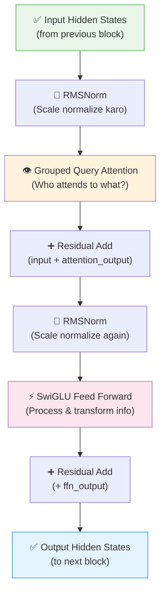

**2 Main Parts:**
1. **Attention** — kaunsa token kis doosre token par focus kare
2. **Feed-Forward** — information process aur transform karo

**Residual Add** = input + output jodna → gradient flow easy hota hai, training stable rehti hai

---

<a name="6"></a>
## 6. 👁️ Attention Kaise Kaam Karti Hai

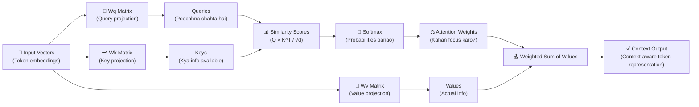

### Real Simple Example:

```python
import torch
import torch.nn.functional as F
import math

# Simple Attention (Conceptual)
def simple_attention(Q, K, V):
    """
    Q = Query: "Mujhe kya jaanna hai?"
    K = Key: "Main kya de sakta hoon?"
    V = Value: "Actual information"
    """
    d_k = Q.shape[-1]  # dimension

    # Step 1: Q aur K ka similarity score
    scores = torch.matmul(Q, K.transpose(-2, -1)) / math.sqrt(d_k)
    print(f"Attention scores shape: {scores.shape}")

    # Step 2: Softmax se probabilities
    attn_weights = F.softmax(scores, dim=-1)
    print(f"Attention weights (sum to 1): {attn_weights.sum(dim=-1)}")

    # Step 3: Values ka weighted sum
    output = torch.matmul(attn_weights, V)
    return output, attn_weights

# Example: 3 tokens, 4-dim embeddings
seq_len, d_model = 3, 4
Q = torch.randn(1, seq_len, d_model)  # (batch, seq, dim)
K = torch.randn(1, seq_len, d_model)
V = torch.randn(1, seq_len, d_model)

output, weights = simple_attention(Q, K, V)
print(f"Output shape: {output.shape}")
print(f"Attention weights:\n{weights[0].detach().numpy().round(3)}")
# Har row me weights hain: token i ne tokens 0,1,2 par kitna focus kiya

# Real world example:
sentence = ["AI", "kya", "hai"]
print(f"\nSentence: {sentence}")
print("Attention matrix (row = which token is attending, col = to which token):")
print("Ek row me weights sum = 1.0 (softmax output)")
```

**Attention ka core idea:**
- **Query:** "Mujhe kya jaanna chahiye?"
- **Key:** "Mere paas kya information hai?"
- **Value:** Actual information content

---

<a name="7"></a>
## 7. 🔗 GQA — Grouped Query Attention

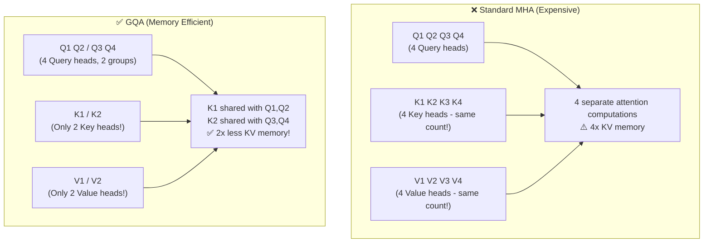

**Why GQA matters:**

```python
# GQA memory savings ka calculation

def kv_cache_size(seq_len, num_heads, head_dim, dtype_bytes=4):
    """KV cache memory calculate karo"""
    # K aur V dono ke liye
    size_bytes = 2 * seq_len * num_heads * head_dim * dtype_bytes
    return size_bytes / 1024  # KB me

# Standard MHA
mha_heads = 8
head_dim = 64

# GQA (quarter the KV heads)
gqa_kv_heads = 2

seq_lengths = [100, 500, 1000, 2000]

print("Sequence Length | MHA KV Cache | GQA KV Cache | Savings")
print("-" * 60)
for seq_len in seq_lengths:
    mha_cache = kv_cache_size(seq_len, mha_heads, head_dim)
    gqa_cache = kv_cache_size(seq_len, gqa_kv_heads, head_dim)  # Fewer KV heads
    savings = (1 - gqa_cache/mha_cache) * 100
    print(f"{seq_len:15d} | {mha_cache:8.1f} KB   | {gqa_cache:8.1f} KB   | {savings:.0f}% less!")
```

**Expected Output:**
```
Sequence Length | MHA KV Cache | GQA KV Cache | Savings
------------------------------------------------------------
            100 |      400.0 KB   |      100.0 KB   | 75% less!
            500 |     2000.0 KB   |      500.0 KB   | 75% less!
           1000 |     4000.0 KB   |     1000.0 KB   | 75% less!
           2000 |     8000.0 KB   |     2000.0 KB   | 75% less!
```

---

<a name="8"></a>
## 8. 🌀 RoPE — Rotary Positional Embedding

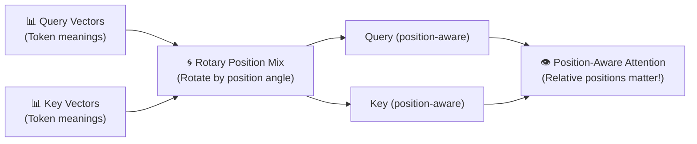

**Kya fark padta hai:**

```python
import torch
import math

# Old way (GPT-2): Position add karo
def old_positional_encoding(x, position):
    """Simple sinusoidal position — add karo"""
    dim = x.shape[-1]
    pe = torch.zeros(dim)
    for i in range(0, dim, 2):
        pe[i] = math.sin(position / (10000 ** (2*i/dim)))
        pe[i+1] = math.cos(position / (10000 ** (2*i/dim)))
    return x + pe  # Simple addition

# New way (RoPE): Position se rotate karo
def apply_rope_simple(q, position, head_dim):
    """RoPE: Rotate query by position angle"""
    freq = torch.tensor([position / (10000 ** (2*i/head_dim))
                          for i in range(head_dim//2)])
    cos_freq = torch.cos(freq)
    sin_freq = torch.sin(freq)

    # Query ke halves rotate karo
    q_r = q[:head_dim//2]   # Real part
    q_i = q[head_dim//2:]   # Imaginary part

    q_rotated_r = q_r * cos_freq - q_i * sin_freq
    q_rotated_i = q_r * sin_freq + q_i * cos_freq

    return torch.cat([q_rotated_r, q_rotated_i])

# Example
head_dim = 8
q_token = torch.randn(head_dim)

q_pos1 = apply_rope_simple(q_token.clone(), position=1, head_dim=head_dim)
q_pos5 = apply_rope_simple(q_token.clone(), position=5, head_dim=head_dim)
q_pos10 = apply_rope_simple(q_token.clone(), position=10, head_dim=head_dim)

print("Original Q:", q_token.round(decimals=2).tolist())
print("Q at pos 1:", q_pos1.round(decimals=2).tolist())
print("Q at pos 5:", q_pos5.round(decimals=2).tolist())
print("Q at pos 10:", q_pos10.round(decimals=2).tolist())
# Har position par Q differently rotated hai!
# Attention compute hote samay relative position capture hoti hai
```

**RoPE ke fayde:**
- Relative positions better samajh aati hain
- Long-range context handling improve hoti hai
- Modern transformer designs me bahut common hai (LLaMA, Mistral, etc.)

---

<a name="9"></a>
## 9. 📏 RMSNorm — Normalization

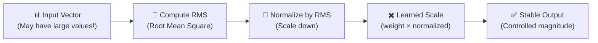

### LayerNorm vs RMSNorm:

```python
import torch
import torch.nn as nn

class LayerNorm(nn.Module):
    """GPT-2 Style - More computation"""
    def __init__(self, dim, eps=1e-6):
        super().__init__()
        self.weight = nn.Parameter(torch.ones(dim))
        self.bias = nn.Parameter(torch.zeros(dim))
        self.eps = eps

    def forward(self, x):
        mean = x.mean(-1, keepdim=True)
        var = x.var(-1, keepdim=True, unbiased=False)
        x_norm = (x - mean) / (var + self.eps).sqrt()
        return self.weight * x_norm + self.bias

class RMSNorm(nn.Module):
    """SusaGPT Style - Simpler, Faster!"""
    def __init__(self, dim, eps=1e-6):
        super().__init__()
        self.weight = nn.Parameter(torch.ones(dim))
        self.eps = eps

    def forward(self, x):
        # Sirf RMS calculate karo — no mean subtraction needed!
        rms = x.pow(2).mean(-1, keepdim=True).add(self.eps).sqrt()
        normalized = x / rms
        return self.weight * normalized

# Demo: Unstable vector ko normalize karo
dim = 8
unstable_input = torch.tensor([[100.0, -500.0, 0.001, 1000.0, -0.1, 300.0, -200.0, 50.0]])

ln = LayerNorm(dim)
rn = RMSNorm(dim)

ln_out = ln(unstable_input)
rn_out = rn(unstable_input)

print("Unstable input:", unstable_input[0].tolist())
print(f"Input range: [{unstable_input.min():.1f}, {unstable_input.max():.1f}]")
print(f"\nAfter LayerNorm range: [{ln_out.min():.3f}, {ln_out.max():.3f}]")
print(f"After RMSNorm range:  [{rn_out.min():.3f}, {rn_out.max():.3f}]")
print("\nBoth normalize effectively!")
print("RMSNorm is faster: no mean subtraction required")

# Parameter count comparison
ln_params = sum(p.numel() for p in ln.parameters())
rn_params = sum(p.numel() for p in rn.parameters())
print(f"\nLayerNorm params: {ln_params} (weight + bias)")
print(f"RMSNorm params:   {rn_params} (weight only, no bias!)")
```

---

<a name="10"></a>
## 10. ⚡ SwiGLU — Smart Feed Forward

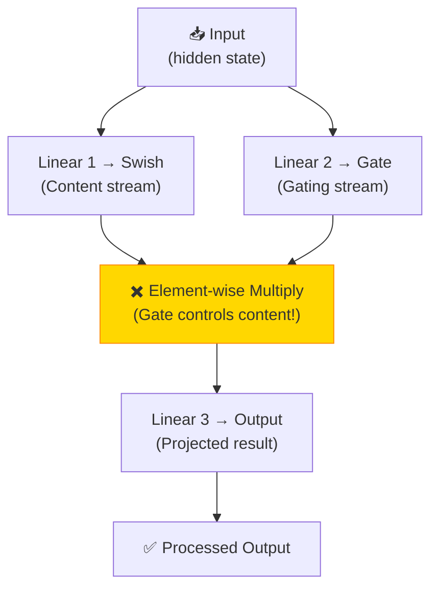

### SwiGLU vs Simple FFN:

```python
import torch
import torch.nn as nn
import torch.nn.functional as F

class SimpleFFN(nn.Module):
    """GPT-2 Style: Simple GELU activation"""
    def __init__(self, dim):
        super().__init__()
        self.fc1 = nn.Linear(dim, dim * 4)
        self.fc2 = nn.Linear(dim * 4, dim)

    def forward(self, x):
        x = F.gelu(self.fc1(x))  # Single stream
        return self.fc2(x)

class SwiGLU(nn.Module):
    """SusaGPT/LLaMA Style: Gated activation"""
    def __init__(self, dim, hidden=None):
        super().__init__()
        hidden = hidden or dim * 4 // 3  # Slightly different hidden dim
        self.w1 = nn.Linear(dim, hidden, bias=False)  # Gate
        self.w2 = nn.Linear(hidden, dim, bias=False)  # Output
        self.w3 = nn.Linear(dim, hidden, bias=False)  # Content

    def forward(self, x):
        # Gate stream (Swish activation)
        gate = F.silu(self.w1(x))   # Swish = x * sigmoid(x)
        # Content stream
        content = self.w3(x)
        # Gating: multiply karke decide karo kitna pass karna hai
        gated = gate * content
        return self.w2(gated)

# Visualization: Gating ka effect
dim = 16
x = torch.randn(1, 5, dim)  # (batch, seq, dim)

old_ffn = SimpleFFN(dim)
new_ffn = SwiGLU(dim)

old_out = old_ffn(x)
new_out = new_ffn(x)

print(f"Input:        {x.shape}")
print(f"SimpleFFN:    {old_out.shape}")
print(f"SwiGLU:       {new_out.shape}")

# Swish activation demonstration
x_vals = torch.linspace(-3, 3, 7)
swish_vals = x_vals * torch.sigmoid(x_vals)  # SiLU = x * sigmoid(x)
gelu_vals = F.gelu(x_vals)

print("\nActivation comparison at x = [-3, -2, -1, 0, 1, 2, 3]:")
print(f"GELU:  {gelu_vals.round(decimals=2).tolist()}")
print(f"Swish: {swish_vals.round(decimals=2).tolist()}")
# Swish is smoother and handles negative values better in practice
```

---

<a name="11"></a>
## 11. 🎯 Weight Tying

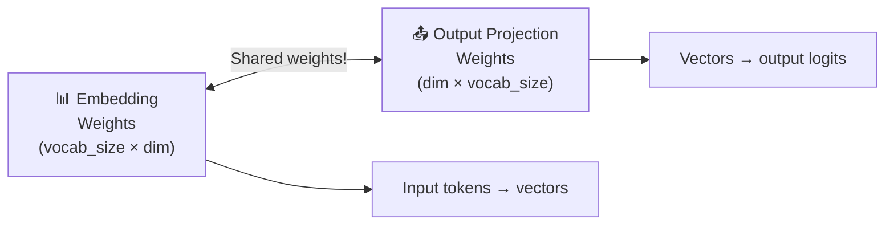

**Weight tying = input space aur output space same weights share karte hain**

```python
import torch.nn as nn

class ModelWithWeightTying(nn.Module):
    def __init__(self, vocab_size, dim):
        super().__init__()
        self.embedding = nn.Embedding(vocab_size, dim)
        # Output projection SAME weights use karta hai embedding se!
        self.output_projection = nn.Linear(dim, vocab_size, bias=False)
        # Weight tying
        self.output_projection.weight = self.embedding.weight  # Same object!

    def forward(self, token_ids):
        x = self.embedding(token_ids)      # IDs → vectors
        logits = self.output_projection(x)  # vectors → logits (same weights!)
        return logits

vocab_size, dim = 1000, 64
model = ModelWithWeightTying(vocab_size, dim)

# Parameters check
total_params = sum(p.numel() for p in model.parameters())
tied_params = sum(p.numel() for p in set(model.parameters()))  # unique params

print(f"Total parameter references: {total_params:,}")
print(f"Actual unique parameters:   {tied_params:,}")
print(f"Saved by weight tying:     {total_params - tied_params:,}")
# Without tying: embedding + projection = 2 * vocab_size * dim = 128,000
# With tying: only 64,000 unique parameters!
```

---

## 12. 📈 Base Training Flow

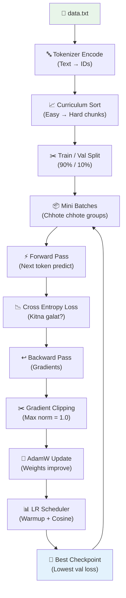

### Data Curriculum — Easy to Hard:

```python
# Curriculum learning: easy examples pehle dikhao
def curriculum_score(chunk):
    """
    Easy chunk = short, simple, low punctuation
    Hard chunk = long, complex, mixed language
    Returns: score (lower = easier)
    """
    length_score = len(chunk.split())              # Bade chunk = harder
    punct_score = chunk.count(',') + chunk.count(';')  # Zyada punctuation = harder
    multilingual_score = sum(1 for c in chunk if ord(c) > 127)  # Non-ASCII = harder

    total_score = length_score + punct_score * 3 + multilingual_score
    return total_score

# Example chunks
chunks = [
    "AI is good.",                           # Short, simple
    "Machine learning algorithms are complex.", # Medium
    "Deep neural networks with attention mechanisms process sequences.", # Longer
    "Transformers ने NLP को revolutionize किया है।",  # Mixed language
]

# Sort by difficulty
scored = [(chunk, curriculum_score(chunk)) for chunk in chunks]
scored.sort(key=lambda x: x[1])

print("Curriculum Order (Easy → Hard):")
for i, (chunk, score) in enumerate(scored, 1):
    print(f"  {i}. [Score: {score:3d}] '{chunk[:50]}...'")
```

---

## 13. 🔧 Fine-Tuning Flow

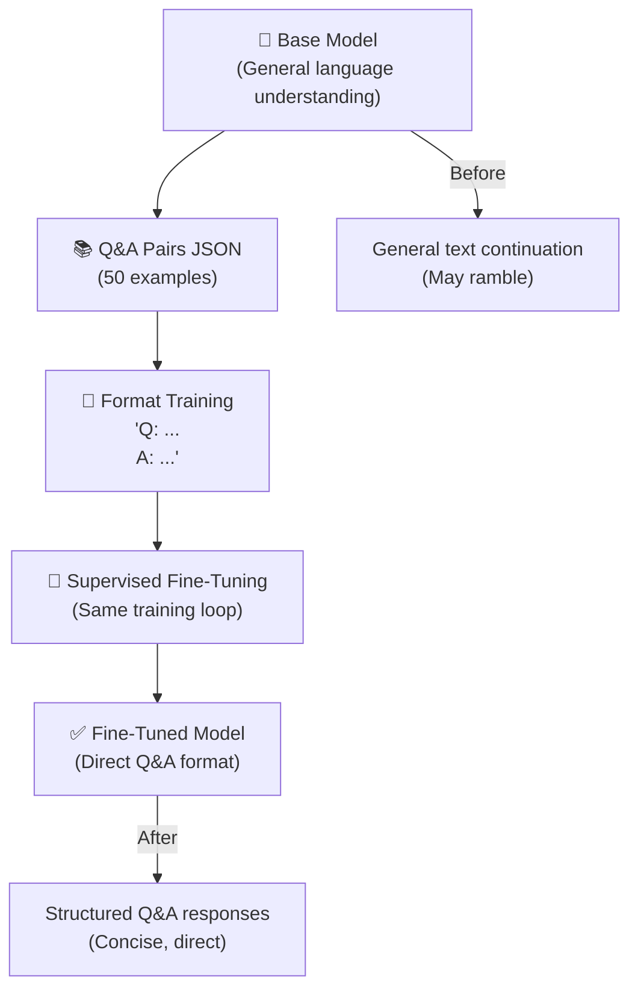

---

## 14. ⚖️ RLHF-Style Alignment

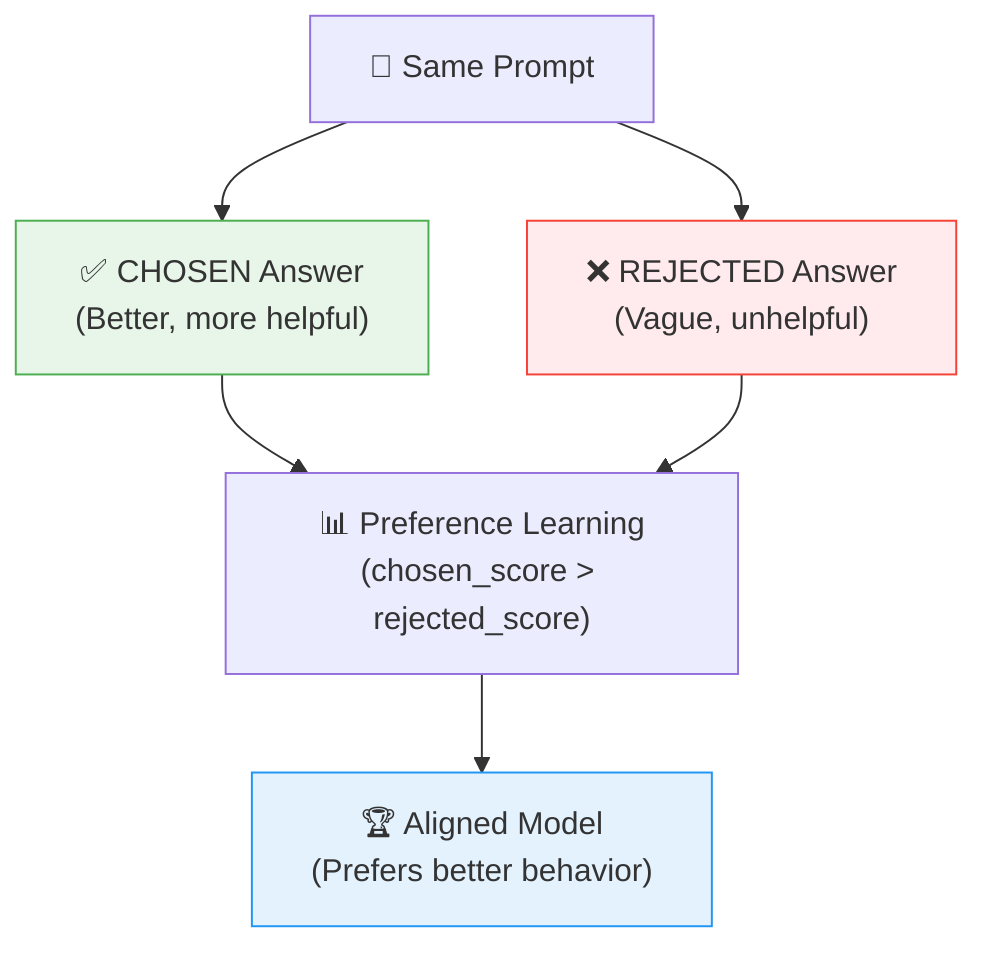

**Preference Data Example:**

```python
preference_example = {
    "prompt": "Python me list sort kaise karein?",

    "chosen": {
        "response": """Python me list sort karne ke 2 tarike hain:

1. list.sort() — in-place sort karta hai
   my_list = [3, 1, 2]
   my_list.sort()  # [1, 2, 3]

2. sorted() — nayi sorted list return karta hai
   sorted_list = sorted(my_list)  # Original unchanged

Reverse sort ke liye: sort(reverse=True)""",
        "quality": "Detailed, with code examples, covers both methods"
    },

    "rejected": {
        "response": "Python me sort() use karo.",
        "quality": "Too brief, no examples, incomplete"
    }
}

print("Prompt:", preference_example["prompt"])
print("\n✅ CHOSEN (Better) Response:")
print(preference_example["chosen"]["response"])
print(f"Quality: {preference_example['chosen']['quality']}")
print("\n❌ REJECTED Response:")
print(preference_example["rejected"]["response"])
print(f"Quality: {preference_example['rejected']['quality']}")
```

---

## 15. 📝 Generation Flow

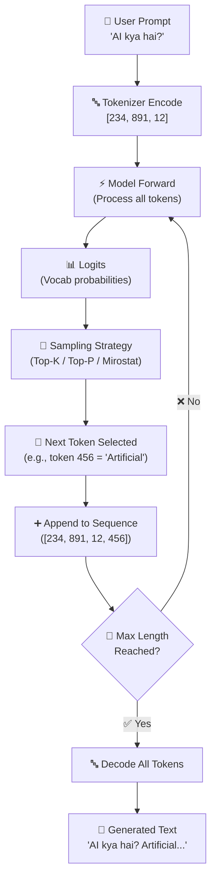

---

## 16. 🎲 Sampling Options

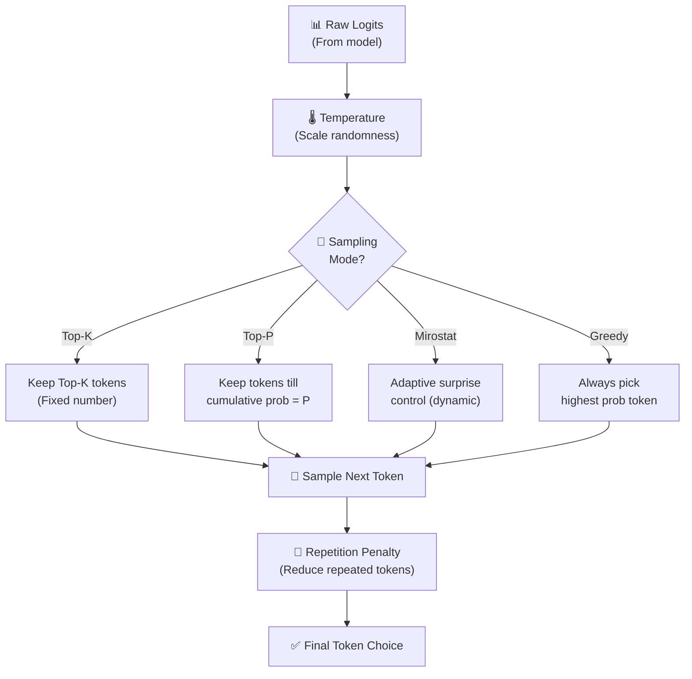

| Mode | Kab Use | Output Type |
|------|---------|------------|
| Greedy | Math solvers, exact Q&A | Deterministic |
| Top-K | Creative writing | Semi-random |
| Top-P | Conversational AI | Natural |
| Mirostat | Long generation | Controlled quality |

---

## 17. 🔑 KV Cache

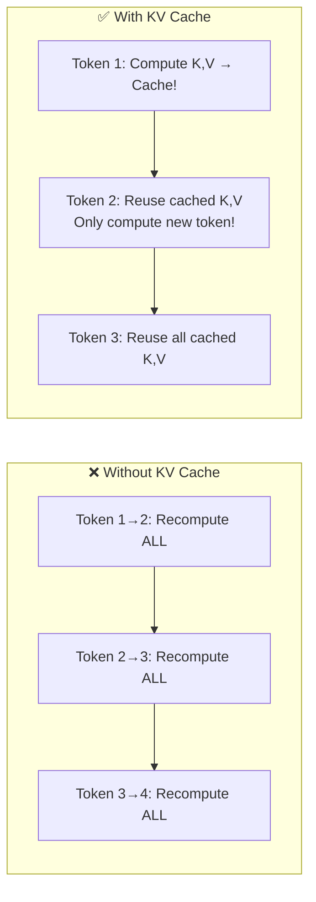

**Speed impact:**

```python
# KV Cache benefit visualization

def time_without_cache(seq_len):
    """Total computation = sum of 1 + 2 + 3 + ... + n (triangular)"""
    return seq_len * (seq_len + 1) / 2

def time_with_cache(seq_len):
    """Total computation = seq_len (each step only new token)"""
    return seq_len

print("Sequence Length | Without Cache | With Cache | Speedup")
print("-" * 55)
for length in [10, 50, 100, 500]:
    wo = time_without_cache(length)
    wi = time_with_cache(length)
    speedup = wo / wi
    print(f"{length:14d} | {wo:13.0f} | {wi:10.0f} | {speedup:.0f}x faster!")
```

---

## 18. 🔍 Beam Search

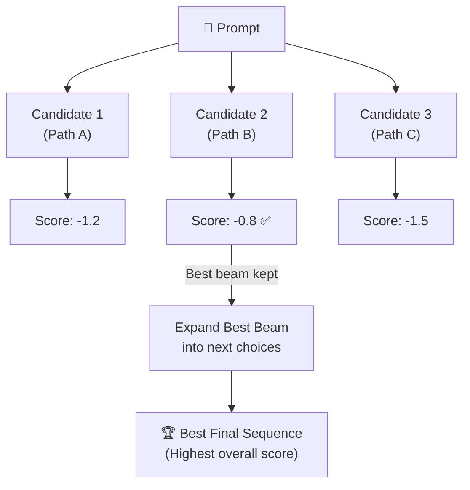

---

## 19. 📊 Evaluation Flow

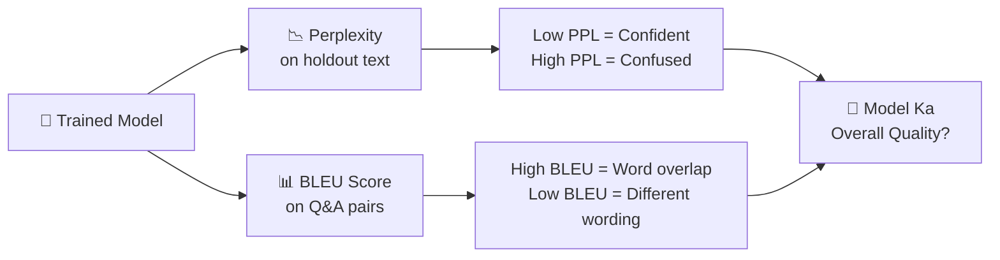

**Remember:**
- 📉 **Perplexity**: Lower is better (kam confused = better)
- 📊 **BLEU**: Higher is generally better (more overlap with reference)

---

## 20. 🗜️ Quantization Flow

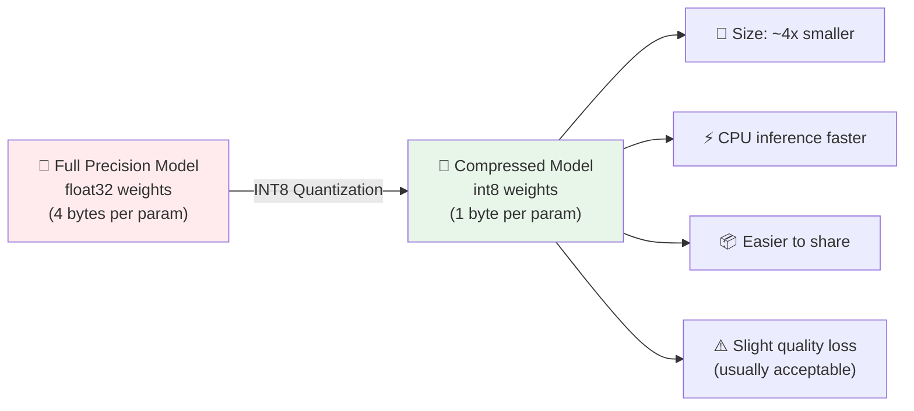

---

## 21. 🚀 API Flow

```mermaid
flowchart TD
    CI["💻 Client\n(curl, app, website)"] -->|"POST /generate\n{prompt: 'AI kya hai?'}"| API["⚡ FastAPI App\n(api.py)"]
    API --> LM["🤖 Load Model\n(if not cached)"]
    LM --> GEN["📝 Generate Text\ntop-k, top-p sampling"]
    GEN -->|"JSON Response\n{text: '...', tokens: 50}"| CI

    API -->|"GET /health"| H["Status: OK"]
    API -->|"GET /model-info"| MI["Architecture info"]
    API -->|"GET /docs"| DOCS["Swagger UI\nAuto-generated!"]
```

---

## 22. 🔄 Research Loop

```mermaid
flowchart TD
    A["🔨 Train Model"] --> B["📊 Measure Metrics\n(Perplexity + BLEU)"]
    B --> C{"✅ Metrics\nGood Enough?"}
    C -- "❌ No" --> D["🔧 Improve\nData / Model / Training"]
    D --> A
    C -- "✅ Yes" --> E["🚀 Deploy\nor Fine-Tune More"]

    style A fill:#E8F5E9
    style E fill:#E3F2FD
```

**Ye machine learning ka scientific method hai:**
1. Build karo
2. Numbers dekho
3. Improve karo
4. Repeat karo

---

## 23. 🏆 SusaGPT Skills Map

```mermaid
mindmap
  root(("🏆 SusaGPT\nSkills"))
    🐍 Python
      Project Structure
      Config Management
    🔤 Tokenizer
      Byte-level BPE
      Encode/Decode
      Hindi Support
    🏗️ Architecture
      Attention/GQA
      RoPE Positional
      RMSNorm
      SwiGLU FFN
      Weight Tying
    🎯 Training
      AdamW
      Gradient Clipping
      LR Scheduler
      Curriculum Learning
      Mixed Precision
    🔧 Fine-tuning
      Q&A Supervision
      RLHF Alignment
    📤 Generation
      Top-K/P Sampling
      Mirostat
      KV Cache
      Beam Search
    📊 Evaluation
      BLEU Score
      Perplexity
    🚀 Deployment
      INT8 Quantization
      FastAPI REST API
```

---

## 24. 📚 Student Learning Path

```mermaid
flowchart TD
    S1["📖 Step 1\nTokenizer samjho\n(tokenizer.py)"] --> S2["🏗️ Step 2\nModel samjho\n(model.py)"]
    S2 --> S3["🎯 Step 3\nTraining loop samjho\n(train.py)"]
    S3 --> S4["🔧 Step 4\nFine-tuning samjho\n(fine_tune.py)"]
    S4 --> S5["⚖️ Step 5\nRLHF samjho\n(rlhf.py)"]
    S5 --> S6["📝 Step 6\nGeneration samjho\n(generate.py)"]
    S6 --> S7["📊 Step 7\nEvaluation samjho\n(evaluate.py)"]
    S7 --> S8["🚀 Step 8\nAPI + Quantization\n(api.py, quantize.py)"]

    style S1 fill:#E8F5E9
    style S8 fill:#E3F2FD
```

---

## 🧪 Exercises — Diagrams Ko Practice Karo!

### Exercise 1: Architecture Retrace ⭐

**Bina diagram dekhe likho — ek token ki journey:**

```
Start: Token ID [234]
↓ Kya hoga?
↓ ...
End: Next token prediction
```

<details>
<summary>✅ Answer</summary>

```
Token ID [234]
↓ Embedding Layer: [234] → [0.12, -0.77, 0.41, ...]
↓ Transformer Block 1:
    → RMSNorm
    → Grouped Query Attention (context-aware)
    → Residual Add
    → RMSNorm
    → SwiGLU FFN
    → Residual Add
↓ Transformer Block 2 (same structure)
↓ ... (N blocks)
↓ Final RMSNorm
↓ Output Projection: [dim] → [vocab_size logits]
↓ Softmax: logits → probabilities
↓ Next Token Selection (sampling)
↓ Next Token ID!
```

</details>

---

### Exercise 2: Sampling Choose Karo ⭐⭐

**Kaunsa sampling method best hoga har situation me?**

```
A) Legal document analysis → accurate, deterministic results chahiye
B) Fictional story writing → creative, diverse text chahiye
C) Conversational chatbot → natural, varied responses chahiye
D) Code completion → syntactically correct code chahiye
```

<details>
<summary>✅ Answers</summary>

```
A) Legal → Greedy or very low temperature Top-P
   (Deterministic, no hallucination risk)

B) Fiction → High temperature + Top-K or Top-P
   (Creative, diverse vocabulary)

C) Chatbot → Top-P (nucleus sampling)
   (Natural conversations, controlled randomness)

D) Code → Low temperature Greedy or Top-K(k=5)
   (Syntactically correct, somewhat deterministic)
```

</details>

---

### Exercise 3: KV Cache Calculate Karo ⭐⭐⭐

**Agar ek sequence 100 tokens generate karta hai bina KV cache ke, aur 100 tokens KV cache ke saath — kitna computation difference hoga?**

Upar diya formula use karo.

<details>
<summary>✅ Calculation</summary>

```python
def compute_ratio(seq_len):
    without_cache = seq_len * (seq_len + 1) / 2  # Triangular number
    with_cache = seq_len
    return without_cache / with_cache

for length in [10, 50, 100]:
    ratio = compute_ratio(length)
    print(f"{length} tokens: {ratio:.1f}x more computation without cache!")

# Results:
# 10 tokens: 5.5x more
# 50 tokens: 25.5x more
# 100 tokens: 50.5x more
# KV cache bahut important hai long generation ke liye!
```

</details>

---

## 📝 Quick Test

**Q1:** Transformer block me Residual Add kyu zaroori hai?

```
A) Speed increase ke liye
B) Gradient flow easy karne ke liye, information stable rakhne ke liye
C) Memory save karne ke liye
D) Vocabulary badhane ke liye
```

<details><summary>Answer</summary>**B** ✅</details>

---

**Q2:** KV Cache generation me kya optimize karta hai?

```
A) Model size chhota karta hai
B) Purane tokens ke K,V recompute nahi karne padte — only new token compute hota hai
C) Vocabulary search fast karta hai
D) Batch size improve karta hai
```

<details><summary>Answer</summary>**B** ✅</details>

---

**Q3:** Data Curriculum me pehle kaunse examples dikhate hain?

```
A) Hardest examples pehle
B) Random order
C) Easiest examples pehle (short, simple, less complex)
D) Longest examples pehle
```

<details><summary>Answer</summary>**C** ✅ — Easy se hard order stability improve karta hai</details>

---

## 🏆 Final Student Summary

> **Agar student in diagrams aur SusaGPT project dono samajh leta hai, to usse ye clear ho jata hai:**

```
📄 Text Data
     ↓
🔤 Tokenizer (BPE)
     ↓
🔢 Token IDs
     ↓
🏗️ Transformer Model (RoPE + GQA + SwiGLU + RMSNorm)
     ↓
🎯 Base Training (Loss → Gradients → AdamW)
     ↓
🔧 Fine-Tuning (Q&A format)
     ↓
⚖️ RLHF Alignment (Prefer better responses)
     ↓
📝 Generation (Top-K/P, KV Cache, Beam Search)
     ↓
📊 Evaluation (Perplexity + BLEU)
     ↓
🗜️ Quantization (INT8)
     ↓
🚀 API Deployment (FastAPI)
```

> **Yani student ko sirf theory nahi,**
> **balki ek complete mini-LLM system ka visual + practical understanding mil jata hai!** 🎉
