# 🎓 SusaGPT Se Kaunsi Skills Sikhne Ko Milengi
> **Ye file batati hai ki SusaGPT project ko samajhne ke baad kaunsi real-world skills milti hain — with examples aur exercises**

---

## 🗺️ Skills Ka Big Picture

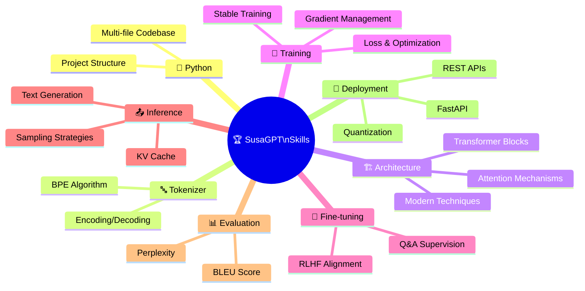

---

## 1. 🐍 Python Project Structure Ki Skill

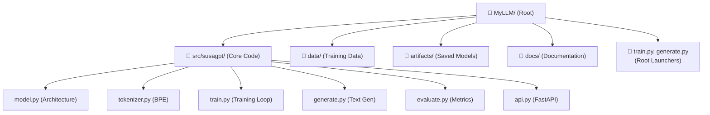

**Jo cheezein sikhte ho:**
- Multi-file Python project organize karna
- Config alag file me rakhne ka fayda
- Separation of concerns (training vs generation vs API)
- Clean project structure

**Real Skill:** Har software project me — sirf AI me nahi — ye structure kaam aati hai!

---

## 2. 🔤 Tokenizer Samajhne Ki Skill

### How It Actually Works:

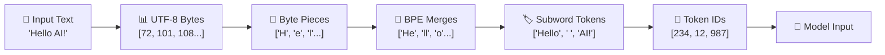

### Real Working Demo:

```python
# Simplified BPE Tokenizer logic samjhne ke liye

# Step 1: Text ko bytes me todna
text = "Hello AI world"
bytes_list = list(text.encode('utf-8'))
print("Bytes:", bytes_list[:10], "...")
# Output: [72, 101, 108, 108, 111, 32, 65, 73, 32, 119] ...

# Step 2: Character pieces banana
chars = [chr(b) for b in bytes_list]
print("Characters:", chars)
# Output: ['H', 'e', 'l', 'l', 'o', ' ', 'A', 'I', ' ', 'w', 'o', 'r', 'l', 'd']

# Step 3: Pair frequency count karna (BPE ka core)
def count_pairs(tokens):
    pairs = {}
    for i in range(len(tokens) - 1):
        pair = (tokens[i], tokens[i+1])
        pairs[pair] = pairs.get(pair, 0) + 1
    return pairs

# Simulate: training corpus me common pairs
sample_corpus_tokens = ['H', 'e', 'l', 'l', 'o', ' ', 'H', 'e', 'l', 'p']
pairs = count_pairs(sample_corpus_tokens)
print("\nPair frequencies:", pairs)
# Most common pair: ('H', 'e') = 2 times, ('e', 'l') = 2 times

# Step 4: Best pair merge karna
most_common = max(pairs, key=pairs.get)
print(f"\nBest pair to merge: {most_common}")
# Output: Best pair to merge: ('H', 'e') or ('e', 'l')

# Step 5: Merge aur new token banana
new_token = ''.join(most_common)
print(f"New token created: '{new_token}'")
# Ye process vocab_size tak repeat hota hai!

# Real world benefits:
print("\n--- Tokenizer Benefits ---")
examples = {
    "English": "Hello World",
    "Hindi": "नमस्ते दुनिया",
    "Mixed": "Hello नमस्ते World",
    "Code": "def function():",
    "Rare word": "supercalifragilistic"
}

for lang, text in examples.items():
    bytes_count = len(text.encode('utf-8'))
    chars_count = len(text)
    print(f"{lang}: '{text[:20]}...' → {chars_count} chars, {bytes_count} bytes")

# Byte-level BPE = koi bhi script tokenize ho sakti hai!
```

**Output:**
```
Bytes: [72, 101, 108, 108, 111, 32, 65, 73, 32, 119] ...
Characters: ['H', 'e', 'l', 'l', 'o', ' ', 'A', 'I', ' ', 'w', 'o', 'r', 'l', 'd']

Pair frequencies: {('H', 'e'): 2, ('e', 'l'): 2, ('l', 'l'): 1, ...}

Best pair to merge: ('H', 'e')
New token created: 'He'

--- Tokenizer Benefits ---
English: 'Hello World' → 11 chars, 11 bytes
Hindi: 'नमस्ते दुनिया' → 13 chars, 37 bytes
Mixed: 'Hello नमस्ते World' → 18 chars, 42 bytes
Code: 'def function():' → 15 chars, 15 bytes
Rare word: 'supercalifragilis...' → 20 chars, 20 bytes
```

---

## 3. 🏗️ Transformer Architecture Ki Skill

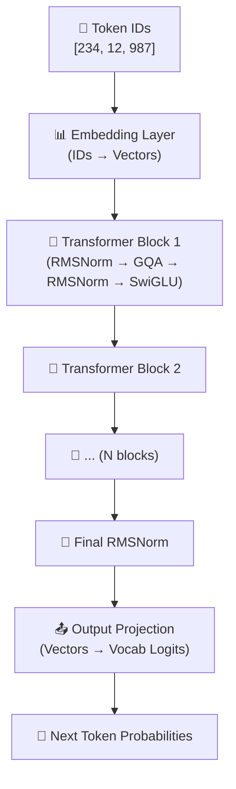

### Transformer Block Ka Andar:

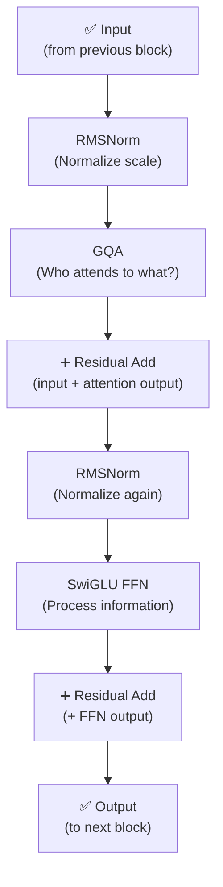

**Ye skills real LLM code me directly apply hoti hain!**

---

## 4. 🎯 Neural Network Training Ki Skill

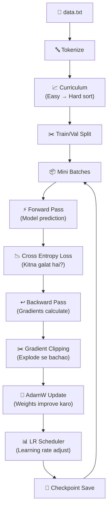

### Real Training Concepts With Code:

```python
import torch
import torch.nn as nn

# ===== Loss - Kitna galat hai? =====
criterion = nn.CrossEntropyLoss()

# Example:
# Model ne predict kiya: token 5 = 70%, token 3 = 20%, token 8 = 10%
# Sahi answer tha: token 5
logits = torch.tensor([[0.7, 0.1, 0.05, 0.05, 0.1]])  # Model output
target = torch.tensor([0])                              # Sahi answer index

loss = criterion(logits, target)
print(f"Loss: {loss.item():.4f}")  # Agar sahi predict kiya to low loss

# ===== AdamW - Smart Optimizer =====
model = nn.Linear(10, 10)  # Example model
optimizer = torch.optim.AdamW(
    model.parameters(),
    lr=3e-4,          # Learning rate
    weight_decay=0.1  # Regularization (overfitting se bachao)
)

# ===== Gradient Clipping - Explode Rokna =====
# Training step example
dummy_loss = torch.tensor(2.5, requires_grad=True)
dummy_loss.backward()

# Bina clipping ke
all_params = [p for p in model.parameters()]
total_grad_norm_before = torch.norm(
    torch.stack([p.grad.norm() for p in all_params if p.grad is not None])
)
print(f"Gradient norm BEFORE clipping: {total_grad_norm_before:.4f}")

# Clipping ke saath (max norm = 1.0)
torch.nn.utils.clip_grad_norm_(model.parameters(), max_norm=1.0)
print("Gradient clipping applied! Training stable hoga.")

# ===== LR Scheduler - Warmup + Cosine =====
import math

def get_lr(step, warmup_steps=100, total_steps=1000, max_lr=3e-4, min_lr=3e-5):
    """Warmup + Cosine LR decay"""
    if step < warmup_steps:
        # Warmup: dheere dheere LR badhao
        return max_lr * step / warmup_steps
    else:
        # Cosine decay: dheere dheere LR ghatao
        progress = (step - warmup_steps) / (total_steps - warmup_steps)
        return min_lr + (max_lr - min_lr) * 0.5 * (1 + math.cos(math.pi * progress))

# LR schedule visualize karo
print("\nLR Schedule:")
for step in [0, 50, 100, 300, 500, 800, 1000]:
    lr = get_lr(step)
    bar = "█" * int(lr / max(3e-4, 1e-8) * 20)
    print(f"  Step {step:4d}: LR={lr:.6f} {bar}")
```

---

## 5. 🔧 Fine-Tuning Ki Skill

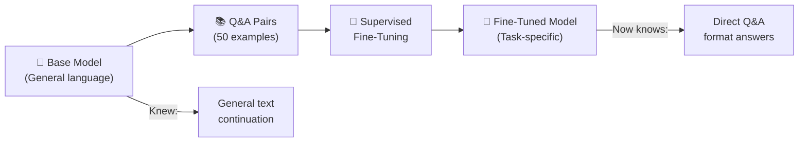

**Real working example:**

```python
# Q&A Fine-tuning ka format
qa_example = {
    "question": "PyTorch kya hai?",
    "answer": "PyTorch ek open-source deep learning framework hai jo research aur production dono ke liye use hota hai."
}

# Format: Question → Answer pattern
def format_qa_for_training(qa):
    return f"Q: {qa['question']}\nA: {qa['answer']}\n"

formatted = format_qa_for_training(qa_example)
print("Training input format:")
print(formatted)
# Output:
# Q: PyTorch kya hai?
# A: PyTorch ek open-source deep learning framework hai...

# Model sikhta hai: Q: ke baad kya aata hai, us pattern ko follow karo
# Result: Direct, concise answers
```

---

## 6. 🎯 RLHF-Style Alignment Ki Skill

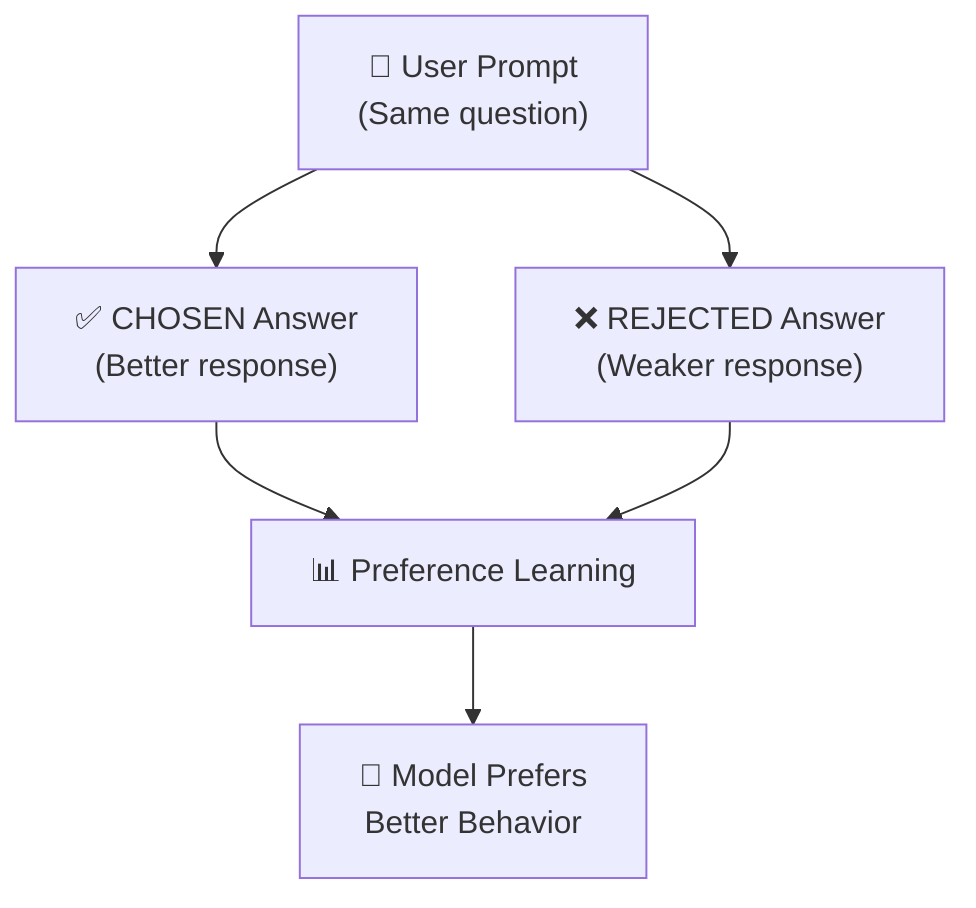

**Real preference data example:**

```python
preference_example = {
    "prompt": "AI ke baare me batao",
    "chosen": {
        "response": "AI yani Artificial Intelligence ek computer science ki branch hai jisme machines ko intelligent behavior sikhaya jata hai. Is me machine learning, deep learning aur neural networks include hain.",
        "why_chosen": "Informative, structured, comprehensive"
    },
    "rejected": {
        "response": "AI matlab robot. Robot kaam karta hai.",
        "why_rejected": "Too vague, incomplete, not helpful"
    }
}

print("Prompt:", preference_example["prompt"])
print("\nChosen (Better):")
print(f"  '{preference_example['chosen']['response'][:80]}...'")
print(f"  Why: {preference_example['chosen']['why_chosen']}")
print("\nRejected (Worse):")
print(f"  '{preference_example['rejected']['response']}'")
print(f"  Why: {preference_example['rejected']['why_rejected']}")

# Model ko train kiya jata hai:
# chosen_response ka log probability > rejected_response log probability
```

---

## 7. 📤 Text Generation Ki Skill

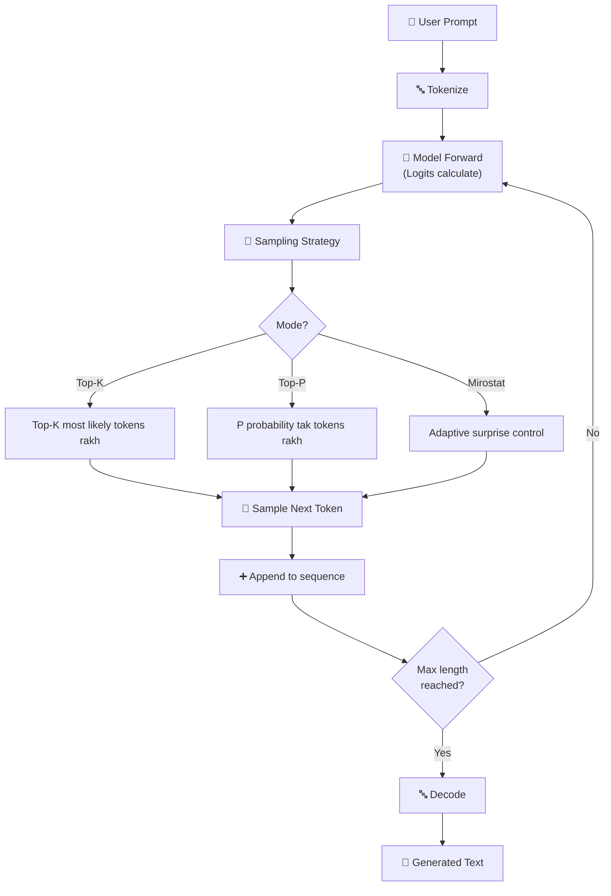

### Sampling Strategies Ka Real Comparison:

```python
import torch
import torch.nn.functional as F

# Simulated logits (model output)
vocab_size = 10
logits = torch.tensor([1.5, 0.5, 2.1, 0.1, 1.8, 0.3, 0.9, 0.2, 1.1, 0.7])
probs = F.softmax(logits, dim=-1)

print("Token Probabilities:")
for i, p in enumerate(probs):
    bar = "█" * int(p.item() * 30)
    print(f"  Token {i}: {p.item():.3f} {bar}")

# ===== Strategy 1: Top-K Sampling =====
def top_k_sampling(logits, k=3):
    top_values, top_indices = torch.topk(logits, k)
    top_probs = F.softmax(top_values, dim=-1)
    chosen = top_indices[torch.multinomial(top_probs, 1)]
    return chosen.item()

# ===== Strategy 2: Top-P (Nucleus) Sampling =====
def top_p_sampling(logits, p=0.9):
    sorted_probs, sorted_indices = torch.sort(F.softmax(logits, dim=-1), descending=True)
    cumulative = torch.cumsum(sorted_probs, dim=-1)
    # P threshold tak tokens rakh
    mask = cumulative - sorted_probs < p
    filtered_probs = sorted_probs * mask.float()
    resampled = sorted_indices[torch.multinomial(filtered_probs, 1)]
    return resampled.item()

# ===== Strategy 3: Greedy (Deterministic) =====
def greedy_sampling(logits):
    return torch.argmax(logits).item()

# Compare karein!
print("\nSampling Results (run multiple times to see randomness):")
for _ in range(3):
    g = greedy_sampling(logits)
    k = top_k_sampling(logits, k=3)
    p = top_p_sampling(logits, p=0.9)
    print(f"  Greedy: {g} (always same) | Top-K: {k} | Top-P: {p}")
```

---

## 8. 📊 Model Evaluation Ki Skill

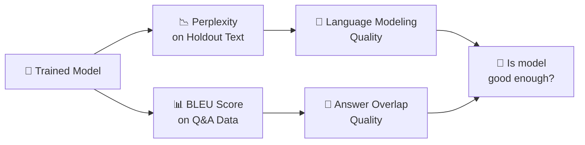

### Metrics Ka Real Meaning:

```python
import math

# ===== Perplexity =====
def calculate_perplexity(log_probs):
    """
    Perplexity = exp(average negative log probability)
    Low perplexity = confident model = better!
    """
    avg_neg_log_prob = -sum(log_probs) / len(log_probs)
    perplexity = math.exp(avg_neg_log_prob)
    return perplexity

# Example 1: Confident model
confident_probs = [math.log(0.9), math.log(0.85), math.log(0.88)]
perp_confident = calculate_perplexity(confident_probs)
print(f"Confident model perplexity: {perp_confident:.2f}")

# Example 2: Confused model
confused_probs = [math.log(0.2), math.log(0.15), math.log(0.25)]
perp_confused = calculate_perplexity(confused_probs)
print(f"Confused model perplexity: {perp_confused:.2f}")

print(f"\n→ Lower perplexity better hoti hai!")
print(f"→ {perp_confident:.1f} < {perp_confused:.1f} means confident model better hai")

# ===== BLEU Score (simplified) =====
def simple_bleu(generated, reference):
    """Simplified 1-gram BLEU"""
    gen_words = set(generated.lower().split())
    ref_words = set(reference.lower().split())
    matching = gen_words & ref_words
    if len(gen_words) == 0:
        return 0.0
    return len(matching) / len(gen_words)

reference_answer = "PyTorch ek deep learning framework hai jo GPU acceleration support karta hai"
generated_answer = "PyTorch ek framework hai jo machine learning ke liye use hota hai"
bad_answer = "Python mujhe pasand hai kyunki ye easy hai"

bleu_good = simple_bleu(generated_answer, reference_answer)
bleu_bad = simple_bleu(bad_answer, reference_answer)

print(f"\nBLEU Scores:")
print(f"Good answer BLEU: {bleu_good:.2f}")
print(f"Bad answer BLEU:  {bleu_bad:.2f}")
print(f"→ Higher BLEU = more word overlap with reference answer")
```

---

## 9. 🗜️ Model Compression Ki Skill

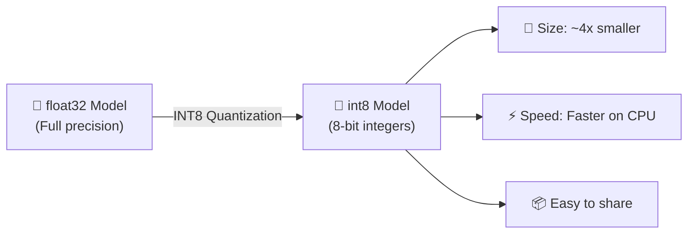

**Real concept:**

```python
import torch

# float32 vs int8 memory
float32_value = torch.tensor([3.14159], dtype=torch.float32)
int8_value = torch.tensor([127], dtype=torch.int8)

print(f"float32 bit size: {float32_value.element_size() * 8} bits = {float32_value.element_size()} bytes")
print(f"int8 bit size:    {int8_value.element_size() * 8} bits = {int8_value.element_size()} bytes")
print(f"Memory saving:    {float32_value.element_size() / int8_value.element_size()}x less memory!")

# Model size impact
model_params = 1_000_000  # SusaGPT
float32_size_mb = (model_params * 4) / 1_048_576  # 4 bytes per float32
int8_size_mb = (model_params * 1) / 1_048_576     # 1 byte per int8

print(f"\nSusaGPT (~1M params):")
print(f"  float32 size: {float32_size_mb:.2f} MB")
print(f"  int8 size:    {int8_size_mb:.2f} MB")
print(f"  Savings:      {float32_size_mb - int8_size_mb:.2f} MB")
```

---

## 10. 🚀 API Deployment Ki Skill

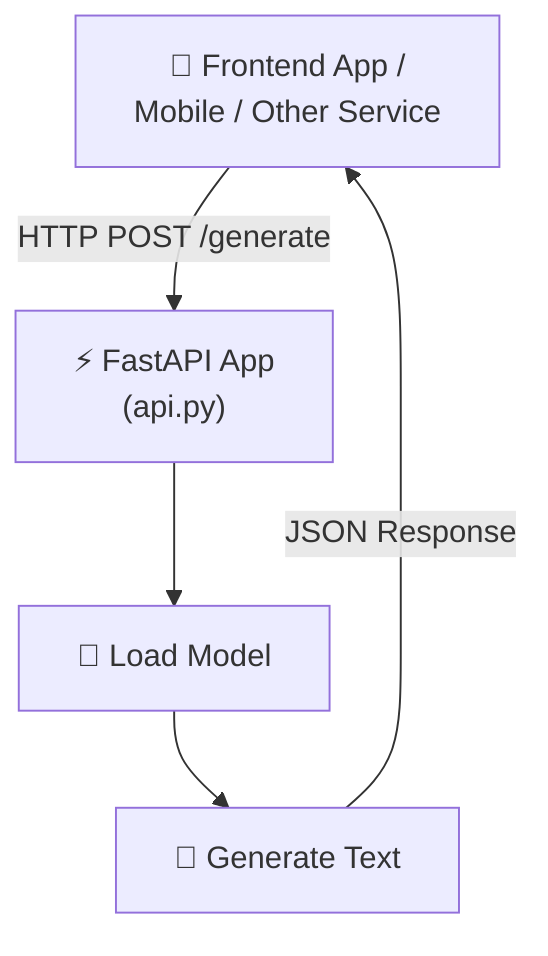

**Real API structure:**

```python
# api.py ka simplified concept
from fastapi import FastAPI
from pydantic import BaseModel

app = FastAPI(title="SusaGPT API")

class GenerateRequest(BaseModel):
    prompt: str
    max_tokens: int = 100
    temperature: float = 0.8

class GenerateResponse(BaseModel):
    generated_text: str
    tokens_generated: int

# Endpoints
@app.get("/health")
async def health():
    return {"status": "ok", "model": "SusaGPT"}

@app.get("/model-info")
async def model_info():
    return {
        "name": "SusaGPT",
        "architecture": "Transformer",
        "features": ["RoPE", "SwiGLU", "RMSNorm", "GQA"]
    }

@app.post("/generate", response_model=GenerateResponse)
async def generate(request: GenerateRequest):
    # Model se text generate karo
    generated = f"[SusaGPT response to: {request.prompt}]"  # Simplified
    return GenerateResponse(
        generated_text=generated,
        tokens_generated=len(generated.split())
    )

# Test karo: curl http://localhost:8000/generate -X POST -H "Content-Type: application/json" -d '{"prompt": "AI kya hai?"}'
```

---

## 11. 🧠 AI Product Thinking Ki Skill

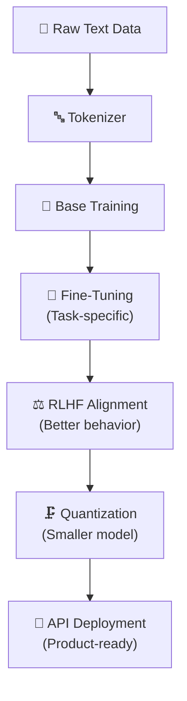

**Ye skills sikhne ke baad sochoge ki:**
- Data → Tokenizer → Model → Training → Fine-tuning → Alignment → Deployment
- Har stage ka purpose kya hai
- Kab kya karna chahiye
- Kaise improvement measure karein

---

## 12. 🔬 Research Mindset Ki Skill

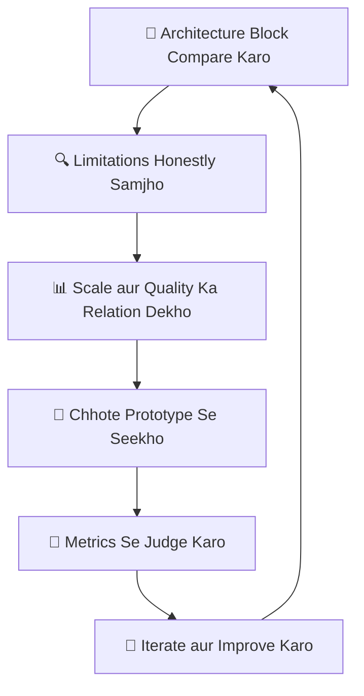

---

## 📊 Skills to Job Role Mapping

| Skill | AI Engineer | ML Engineer | Backend Dev |
|-------|-------------|-------------|------------|
| Python Structure | ✅ | ✅ | ✅ |
| Tokenizer | ✅ | ✅ | ⭕ |
| Transformer Architecture | ✅ | ✅ | ❌ |
| Training Engineering | ⭕ | ✅ | ❌ |
| Fine-tuning | ✅ | ✅ | ❌ |
| RLHF Alignment | ✅ | ✅ | ❌ |
| Text Generation | ✅ | ⭕ | ❌ |
| Evaluation Metrics | ✅ | ✅ | ⭕ |
| Quantization | ⭕ | ✅ | ❌ |
| FastAPI Deployment | ✅ | ⭕ | ✅ |

---

## 🧪 Exercises — Skills Apply Karo!

### Exercise 1: Tokenizer Understanding ⭐

**Q:** Byte-level BPE tokenizer word-level tokenizer se better kyu hai Hindi text ke liye?

<details>
<summary>✅ Answer Dekho</summary>

```
Word-level tokenizer problems:
- "प्रोग्रामिंग" naya word hai → <UNK> ban jata hai
- Hindi ka vocabulary bahut bada hoga
- Mixed Hindi-English text handle nahi hota

Byte-level BPE solutions:
- Har character UTF-8 bytes me represent hota hai
- Common byte pairs merge hote hain → useful subwords bante hain
- "प्रो" + "ग्रा" + "मिंग" → parts me toot sakta hai
- Koi word <UNK> nahi banta!
- Hindi, Urdu, English, Code — sab tokenize ho sakta hai
```

</details>

---

### Exercise 2: Training Loop Trace Karo ⭐⭐

**Step-by-step trace karo kya hota hai jab model ek batch process karta hai:**

```
Input batch: ["AI kya hai?", "Machine learning samjhao"]

Step 1: Tokenize → ___________
Step 2: Forward pass → ___________
Step 3: Loss calculate → ___________
Step 4: Backward pass → ___________
Step 5: Gradient clipping → ___________
Step 6: AdamW update → ___________
Step 7: Result → ___________
```

<details>
<summary>✅ Answer Dekho</summary>

```
Step 1: Tokenize → [[234, 12, 5, ...], [456, 78, 9, ...]]
Step 2: Forward pass → Model ne next token predict kiya (logits nikalein)
Step 3: Loss calculate → Expected token vs predicted token ka CrossEntropy loss
         Example: Loss = 2.34 (high = model abhi galat hai)
Step 4: Backward pass → Har parameter ke liye gradient calculate hua
         "Kis direction me weight change karein loss kam karne ke liye?"
Step 5: Gradient clipping → Agar koi gradient > max_norm, clip kar diya
         Training unstable hone se bachao
Step 6: AdamW update → Weights ko gradient direction me thoda badla
         weight = weight - lr * gradient
Step 7: Result → Loss thoda kam hua (2.34 → 2.31)
         Agle batch me thoda better predict karega!
```

</details>

---

### Exercise 3: Sampling Strategy Choose Karo ⭐⭐

**Kaunsi situation me kaunsa sampling use karoge?**

```
Situation A: Customer support chatbot — consistent, professional answers chahiye
Situation B: Creative story writing app — diverse, creative output chahiye
Situation C: Math problem solver — exact, deterministic answer chahiye
Situation D: Poetry generator — beautiful, varied language chahiye
```

<details>
<summary>✅ Answer Dekho</summary>

```
A) Customer support → Low temperature + Top-P
   (Consistent responses, professional tone, not too random)

B) Creative writing → High temperature + Top-K or Top-P
   (Diverse vocabulary, creative outputs)

C) Math solver → Greedy or Very low temperature
   (Deterministic! 2+2=4, always, no randomness)

D) Poetry → Mirostat
   (Adaptive randomness, not too boring, not too wild = good poetry)
```

</details>

---

## 📝 Quick Test — Samajh Check Karo!

**Q1:** Fine-tuning aur base training me main difference kya hai?

```
A) Fine-tuning naya model banata hai, base training existing ko improve karta hai
B) Base training general data par hota hai, fine-tuning specific task ke liye hota hai
C) Koi fark nahi
D) Fine-tuning zyada data use karta hai
```

<details><summary>Answer</summary>**B** ✅ — Base training general language seekhta hai, fine-tuning specific task pe focus karta hai</details>

---

**Q2:** Gradient clipping kya problem solve karta hai?

```
A) Model ko faster train karta hai agar gradients bohot bade ho jayen
B) Exploding gradients ko rokta hai jo training ko unstable karte hain
C) Memory usage reduce karta hai
D) Vocabulary size control karta hai
```

<details><summary>Answer</summary>**B** ✅ — Exploding gradients → training crash → clipping se stable hoti hai</details>

---

**Q3:** Perplexity lower hone ka matlab kya hai?

```
A) Model zyada confused hai
B) Model zyada confident aur better predictor hai
C) Model ka size chhota hai
D) Training data chhota hai
```

<details><summary>Answer</summary>**B** ✅ — Lower perplexity = model zyada confidently next token predict karta hai</details>

---

## 🏆 Final Verdict

> **Agar koi SusaGPT ko achchhe se samajh leta hai,**
> **to wo ek chhote modern LLM ko:**
>
> `Tokenize → Train → Fine-tune → Align → Generate → Evaluate → Optimize → Deploy`
>
> **poori pipeline samajh leta hai.**
>
> Ye skill set **beginner se intermediate AI engineer** banne ke liye kaafi strong base deta hai!

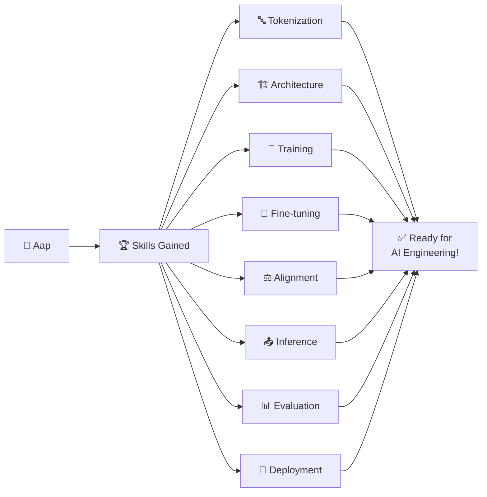
