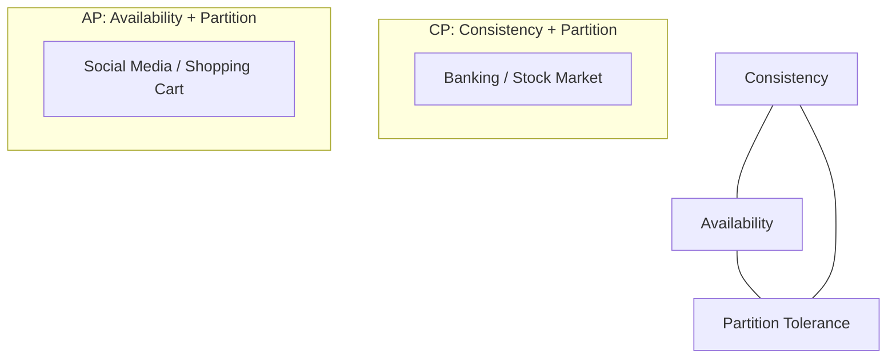

# CAP Theorem: The Law of Distributed Systems

## 1. Beginner-friendly Hinglish Explanation 🇮🇳
Bhai, **CAP Theorem** distributed systems ka "Sachaai" (Universal Truth) hai. 

Ye kehta hai ki agar aapka system "Distributed" hai (yaani data alag-alag servers par hai), toh aap in teen cheezon mein se sirf **DO** hi choose kar sakte ho:
1. **Consistency (C)**: Har user ko hamesha "Same" aur "Latest" data dikhe.
2. **Availability (A)**: System hamesha "Chalta" rahe, chahe koi server down ho jaye.
3. **Partition Tolerance (P)**: Servers ke beech ka connection tootne par bhi system kaam kare.
Distributed systems mein **P** (Partition Tolerance) toh compulsory hai, isliye asal muqabla **C vs A** ke beech hota hai.

---

## 2. Deep Technical Explanation
The CAP theorem, also known as Brewer's theorem, states that a distributed data store cannot simultaneously provide more than two of the following three guarantees:

### 1. Consistency (C)
Every read receives the most recent write or an error. It's about having a "Single System Image."
- **How**: Using consensus protocols like Raft or Paxos.
- **Tradeoff**: High latency or unavailability during failures.

### 2. Availability (A)
Every request receives a (non-error) response, without the guarantee that it contains the most recent write.
- **How**: Using load balancers and multiple replicas.
- **Tradeoff**: Users might see "Old" data.

### 3. Partition Tolerance (P)
The system continues to operate despite an arbitrary number of messages being dropped (or delayed) by the network between nodes.
- **Why it's Mandatory**: In any distributed system, network failure *will* happen. Therefore, you must choose between CP and AP.

---

## 3. Architecture Diagrams
**The CAP Triangle:**

---

## 4. Scalability Considerations
- **CP Systems**: Harder to scale horizontally because every write needs a "Consensus" (all servers must agree), which gets slower as you add more servers.
- **AP Systems**: Very easy to scale (Eventual Consistency). You just keep adding servers.

---

## 5. Failure Scenarios
- **Network Split**: Server A and Server B can't talk. 
    - In **CP**, both stop accepting writes to prevent data corruption.
    - In **AP**, both keep working, but their data will become different (diverge).

---

## 6. Tradeoff Analysis
- **Consistency vs. Latency**: Strong consistency requires "Waiting" for all nodes to sync.
- **Availability vs. Correctness**: High availability might mean showing a user a "Deleted" post because the deletion hasn't reached that specific server yet.

---

## 7. Reliability Considerations
- **Eventual Consistency**: A popular middle ground (AP) where data *will* become consistent "eventually" (usually in milliseconds).
- **Quorum**: A technique to balance C and A by requiring a majority (e.g., 2 out of 3) of nodes to agree.

---

## 8. Security Implications
- **Conflicting Updates**: In AP systems, two users might edit the same data during a partition. Solving this securely (to avoid data loss) is critical.

---

## 9. Cost Optimization
- **AP is Cheaper**: Strong consistency (CP) requires expensive, high-speed networks and high-performance hardware to minimize the "Wait time."

---

## 10. Real-world Production Examples
- **CP**: Google Spanner, MongoDB (in default mode), HBase.
- **AP**: Cassandra, DynamoDB, CouchDB.

---

## 11. Debugging Strategies
- **Tracing Synchronization**: Checking the "Lag" between the Primary and Replica servers.
- **Conflict Resolution**: Seeing how the system handles "Last Write Wins" or "Vector Clocks."

---

## 12. Performance Optimization
- **PACELC Theorem**: An extension of CAP that explains the tradeoff between **Latency** and **Consistency** even when there is NO failure.

---

## 13. Common Mistakes
- **Designing for CA**: Designing a system and assuming the "Network will never fail." (Impossible in the real world).
- **Ignoring Partitions**: Not having a strategy for what happens when servers lose connection.

---

## 14. Interview Questions
1. Why is 'P' mandatory in a distributed system?
2. Explain a scenario where you would choose CP over AP.
3. How does the 'Quorum' model relate to CAP?

---

## 15. Latest 2026 Architecture Patterns
- **Globally Distributed CP**: Systems like **Spanner** that use "Atomic Clocks" to achieve strong consistency globally with very low latency.
- **Serverless Consistency**: Cloud providers offering "Consistency-as-a-Service" where you can toggle the CAP tradeoff per API call.
- **AI-Managed Partitioning**: AI agents that detect network latency and move data closer to the user to maintain "Pseudo-Consistency."
