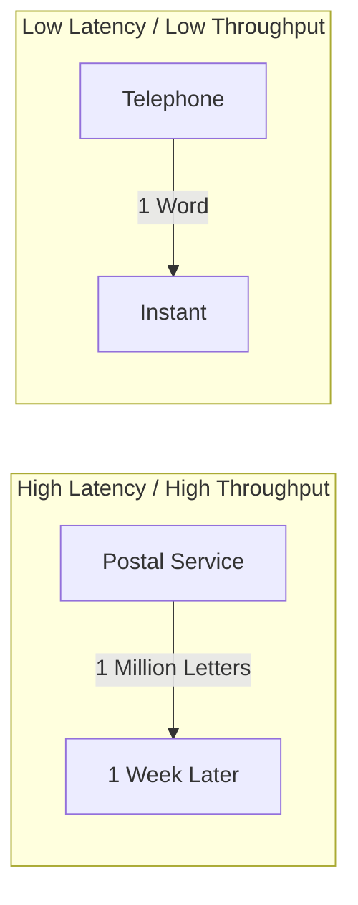

# Latency vs. Throughput: The Speed Metrics

## 1. Beginner-friendly Hinglish Explanation 🇮🇳
Bhai, **Latency** aur **Throughput** ko ek "Raste (Road)" ki tarah samjho. 

- **Latency (Speed)**: Ye ek car ki speed hai. Ek car ko point A se B tak pahunchne mein kitna time lagta hai? (E.g., 50ms). 
- **Throughput (Volume)**: Ye raste ki "Chaudai" (Width) hai. Ek ghante mein kitni gaadiyaan us raste se nikal sakti hain? (E.g., 10,000 cars/hr). 
System design mein, aap chahte ho ki latency **Kam** ho (Fast response) aur throughput **Zyada** ho (More users handle karein).

---

## 2. Deep Technical Explanation
These are the two primary metrics used to measure the performance of a system.

### Latency (Delay)
The time it takes for a single unit of data to move across a network from one point to another.
- **Unit**: milliseconds (ms) or microseconds (μs).
- **Factors**: Network propagation, CPU processing, Disk I/O.
- **P99 Latency**: The maximum latency for the 99% of requests. (Most important for UX).

### Throughput (Bandwidth)
The amount of data or the number of requests that a system can process in a given period.
- **Unit**: Requests Per Second (RPS), Transactions Per Second (TPS), or Megabits Per Second (Mbps).
- **Factors**: Parallel processing, I/O Bandwidth, Memory speed.

---

## 3. Architecture Diagrams
**The Relationship:**

---

## 4. Scalability Considerations
- **Scaling Throughput**: Usually done by adding more servers (Horizontal Scaling).
- **Scaling Latency**: Much harder. Requires moving data closer to the user (CDN), faster algorithms, or better hardware (SSDs).

---

## 5. Failure Scenarios
- **Buffering / Queuing**: If throughput is high but processing is slow, requests start "Waiting" in a queue, which increases **Latency** (Queueing Delay).
- **TCP Congestion**: When you try to push more data than the network can handle, packets drop and latency spikes.

---

## 6. Tradeoff Analysis
- **Batching**: Sending 100 requests together increases **Throughput** but also increases **Latency** (because the first request has to wait for the 100th one to be ready).
- **Real-time vs. Analytical**: Real-time systems prioritize **Latency** (Chat); Analytical systems prioritize **Throughput** (Big Data processing).

---

## 7. Reliability Considerations
- **Timeouts**: If latency is too high, the client should "Stop waiting" and retry.
- **Circuit Breakers**: If a service's latency spikes, stop sending it traffic to avoid a total system crash.

---

## 8. Security Implications
- **DDoS Attacks**: These are "Throughput attacks" that try to overwhelm your system's processing capacity.
- **Side-Channel Attacks**: Measuring the **Latency** of an operation to guess secret data (e.g., how long it takes to check a password).

---

## 9. Cost Optimization
- **Bandwidth Costs**: High throughput means high data transfer bills.
- **Optimization**: Reducing the "Size" of the payload (Compression) improves both latency and cost.

---

## 10. Real-world Production Examples
- **High-Frequency Trading (HFT)**: Spends millions to reduce latency by even 1 **microsecond**.
- **Netflix**: Focuses on throughput to stream 4K video to millions of users, even if the "Start time" (latency) is a few seconds.

---

## 11. Debugging Strategies
- **Flame Graphs**: Seeing where the CPU is spending time during a request (to find latency).
- **Load Testing**: Using tools like **JMeter** or **Locust** to find the "Maximum Throughput" before the system breaks.

---

## 12. Performance Optimization
- **Zero-copy I/O**: Reducing the time to copy data between memory buffers.
- **HTTP/3 (QUIC)**: Reducing the "Handshake Latency" of connections.

---

## 13. Common Mistakes
- **Averages (Mean)**: Never look at "Average Latency." Always look at **Tail Latency** (P95, P99). Average hides the users who are having a terrible experience.
- **Optimizing the Wrong Thing**: Reducing code latency by 1ms when the database call is taking 500ms.

---

## 14. Interview Questions
1. How does 'Batching' affect Latency and Throughput?
2. What is 'P99 Latency' and why is it better than the 'Average'?
3. Can a system have High Throughput but also High Latency? Give an example.

---

## 15. Latest 2026 Architecture Patterns
- **Optical Interconnects**: Using photons (light) instead of electrons to reduce rack-to-rack latency to near zero.
- **AI-Native Packet Routing**: Using AI to predict network congestion and route packets through the "Fastest" path in real-time.
- **Kernel-bypass Networking (DPDK)**: Allowing applications to talk directly to the network card, skipping the slow Linux Kernel.
	
