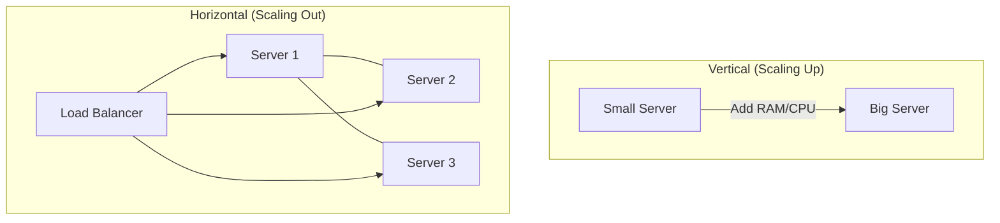

# Scalability Basics: Designing for 10x Growth

## 1. Beginner-friendly Hinglish Explanation 🇮🇳
Bhai, **Scalability** ka matlab hai "Apne system ko rubber ki tarah khichna." 

Socho aapne ek chai ki dukaan kholi. Roz 10 log aate hain, aap akele sambhal lete ho. Lekin agar kal 1,000 log aa jayein, toh aap kya karoge? 
1. **Vertical Scaling**: Aap ek super-fast robot le aaoge jo bahut tez chai banata hai. (Lekin uski bhi ek limit hai). 
2. **Horizontal Scaling**: Aap 10 aur log (servers) hire karoge aur 10 aur counters khol doge. 
Software mein scalability ka matlab hai ki bina code badle, sirf "Resources" add karke system ko millions of users ke liye taiyar karna.

---

## 2. Deep Technical Explanation
Scalability is the property of a system to handle a growing amount of work by adding resources to the system.

### Vertical Scaling (Scaling Up)
Adding more power (CPU, RAM) to an existing machine.
- **Pros**: Simple, no code changes.
- **Cons**: Hardware limits, Single Point of Failure (SPOF), Downtime during upgrade.

### Horizontal Scaling (Scaling Out)
Adding more machines to the network.
- **Pros**: Virtually infinite, High Availability.
- **Cons**: Complex, requires a Load Balancer, requires "Stateless" application design.

### Dimensions of Scaling
- **Load Scaling**: Handling more requests per second.
- **Data Scaling**: Handling more data (Petabytes).
- **Complexity Scaling**: Handling more features without slowing down.

---

## 3. Architecture Diagrams
**Vertical vs Horizontal Scaling:**

---

## 4. Scalability Considerations
- **Statelessness**: If your server stores a user's login session in its local RAM, a second server won't know the user is logged in. (Fix: **Redis/JWT**).
- **Database Bottleneck**: Usually, the DB is the first thing that breaks during scaling.

---

## 5. Failure Scenarios
- **The 'Wall'**: Reaching the maximum limit of Vertical Scaling (e.g., a server with 1TB RAM costs too much).
- **Uneven Load**: One server in a horizontal cluster getting 90% of the traffic because of a bad Load Balancer algorithm.

---

## 6. Tradeoff Analysis
- **Simplicity vs. Scale**: Vertical is easier to manage; Horizontal is harder but safer.
- **Cost vs. Resilience**: A single massive server might be cheaper than 10 small ones, but it's much riskier.

---

## 7. Reliability Considerations
- **Health Checks**: The system must detect when a new server joins the cluster and is ready to take traffic.
- **Graceful Degradation**: If the system is overloaded, it should turn off "Extra" features (like 'Recommended Products') to keep the "Core" features (like 'Buy Now') working.

---

## 8. Security Implications
- **Wider Attack Surface**: More servers means more entry points for hackers.
- **Internal Communication**: In horizontal scaling, servers talk to each other. This communication must be encrypted (mTLS).

---

## 9. Cost Optimization
- **Right-sizing**: Not using a "Large" instance when a "Small" one is enough.
- **Elasticity**: Scaling down to 0 or 1 server when there is no traffic.

---

## 10. Real-world Production Examples
- **Google**: Everything is horizontally scaled. No single "Supercomputer" runs search.
- **Discord**: Uses a custom "Orchestrator" to scale their Erlang-based chat servers across thousands of nodes.

---

## 11. Debugging Strategies
- **Distributed Logging**: Seeing what happened on Server #54 when User #1024 tried to login.
- **Tracing**: Measuring the "Overhead" of the Load Balancer.

---

## 12. Performance Optimization
- **Connection Pooling**: Reusing database connections across the cluster.
- **Load Balancing Algorithms**: Moving from "Round Robin" to "Least Connections" for better balance.

---

## 13. Common Mistakes
- **Hardcoding IPs**: Using a server's IP address in the code instead of a Load Balancer DNS.
- **Storing Files Locally**: Saving user profile pictures on the server's local disk. (Use **S3** instead!).

---

## 14. Interview Questions
1. When should you choose Vertical over Horizontal scaling?
2. What are the challenges of making a stateful application horizontally scalable?
3. What is 'Elasticity' and how is it different from 'Scalability'?

---

## 15. Latest 2026 Architecture Patterns
- **Nanoscale Clusters**: Using tiny **Wasm (WebAssembly)** isolates to run thousands of small services on a single node, scaling them in microseconds.
- **AI-Driven Auto-scaling**: AI models that analyze social media trends to scale your "Gift Shop" servers *before* the holiday sale actually starts.
- **Cloud-Agnostic Scaling**: Using **Kubernetes** and **Crossplane** to scale across AWS and Azure at the same time.
