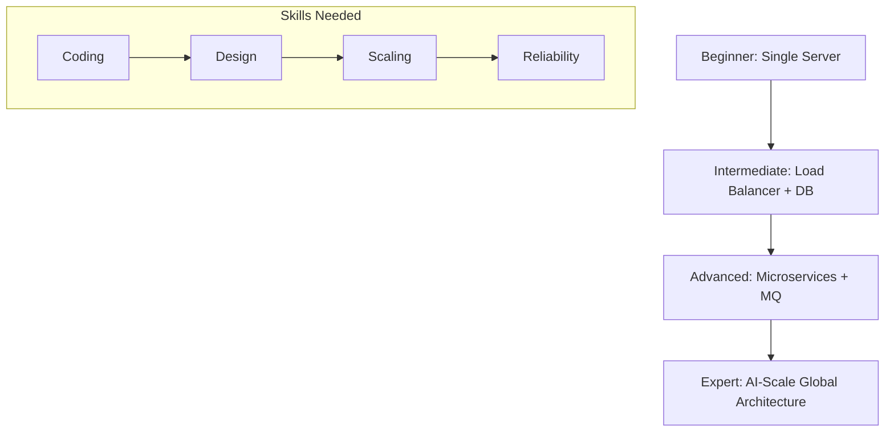

# System Design Roadmap 2026: From Beginner to Expert

## 1. Beginner-friendly Hinglish Explanation 🇮🇳
Bhai, **System Design Roadmap** ek "Path" hai jo aapko ek "Coder" se ek "Architect" banata hai. 

2026 mein sirf "Websites" banana kafi nahi hai. Ab aapko AI-scale systems, distributed databases, aur high-traffic reliability ke baare mein pata hona chahiye. Ye roadmap aapko step-by-step sikhayega ki kaise ek simple app se lekar "Million Users" wale global systems design karte hain.

---

## 2. Deep Technical Explanation
The 2026 roadmap focuses on the shift from "Monolithic" to "Agentic" and "Global-Scale" architectures.

### Level 1: Foundations (Months 1-2)
- Understanding Hardware (CPU, RAM, Disk, Network).
- Mastering CAP Theorem and PACELC.
- Learning Networking (TCP/IP, DNS, TLS).

### Level 2: Scalability & Data (Months 3-5)
- Database Internals (B-Trees vs LSM Trees).
- SQL vs NoSQL vs Vector DBs.
- Sharding and Partitioning.
- Caching Layers (L1, L2, CDN).

### Level 3: Distributed Systems (Months 6-9)
- Consensus (Raft/Paxos).
- Message Queues (Kafka, RabbitMQ).
- Event-Driven Architecture (EDA).
- Microservices & Service Mesh.

### Level 4: Reliability & Ops (Months 10-12)
- Observability (Tracing, Metrics, Logs).
- SRE Principles (SLOs, SLIs).
- Cost Optimization & FinOps.
- AI-Native Infrastructure.

---

## 3. Architecture Diagrams
**The Mastery Progression:**

---

## 4. Scalability Considerations
- **Learning Curve**: You can't learn everything at once. Focus on "Horizontal Scaling" principles early on.
- **Deep Dives**: Picking one area (e.g., Databases) and becoming an expert in it.

---

## 5. Failure Scenarios
- **Learning Outdated Tech**: Spending months on tech that is obsolete in 2026 (like legacy monolith management).
- **Surface-Level Learning**: Memorizing diagrams without understanding the "Why" (e.g., why choose Cassandra over MySQL?).

---

## 6. Tradeoff Analysis
- **Broad Knowledge vs. Deep Expertise**: You need to know a little bit of everything, but you must be an expert in at least one pillar.
- **Theory vs. Practice**: Reading books vs. building real distributed systems in a lab.

---

## 7. Reliability Considerations
- **Hands-on Labs**: Building a system and then "Breaking it" (Chaos Engineering) to see how it recovers.
- **Production Experience**: Working on real-world systems with real traffic.

---

## 8. Security Implications
- **DevSecOps**: Security is now a part of the roadmap from day one, not an afterthought.
- **Identity First**: Understanding OIDC, OAuth2, and Zero Trust.

---

## 9. Cost Optimization
- **Cloud Economics**: Understanding how much your design will cost in AWS/Azure/GCP.
- **Resource Efficiency**: Writing code and designing architectures that use fewer resources.

---

## 10. Real-world Production Examples
- **Google L7 Engineers**: Their roadmap includes managing globally distributed "Spanner" databases.
- **Meta SREs**: Focus on "Hardware-Software Co-design" for AI training clusters.

---

## 11. Debugging Strategies
- **Scenario-based Learning**: "The API is slow—where do you look first?" (Database, Network, or Code?).
- **Root Cause Analysis (RCA)**: Learning how to write post-mortems.

---

## 12. Performance Optimization
- **Profilers**: Using tools to see where the CPU time is going.
- **Benchmarking**: Comparing different databases under heavy load.

---

## 13. Common Mistakes
- **Skipping Fundamentals**: Trying to learn Kubernetes before understanding how a Linux process works.
- **Tool-First Thinking**: Thinking that "Learning Kafka" is the same as "Learning Distributed Systems."

---

## 14. Interview Questions
1. What is the most important book you've read on System Design? (Hint: DDIA).
2. How do you stay updated with architectural trends in 2026?
3. Can you describe a system you built and the scaling challenges you faced?

---

## 15. Latest 2026 Architecture Patterns
- **Agentic Orchestration**: Designing systems that are managed and scaled by AI Agents.
- **Quantum-Safe Networking**: Learning about the new protocols that will protect data against quantum computers.
- **Sovereign Infrastructure**: Designing systems that can run entirely "on-prem" or in a private cloud for data privacy.
