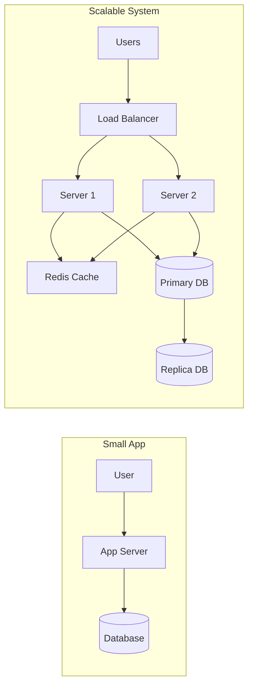

# What is System Design: The Architect's Mindset

## 1. Beginner-friendly Hinglish Explanation 🇮🇳
Bhai, **System Design** ka matlab hai "Ek badi building ka naksha (blueprint) banana." 

Jab aap ek chota sa app banate ho, toh aap sirf "Code" ki chinta karte ho. Lekin jab aapko Facebook ya WhatsApp jaisa system banana ho jise "Crores" log use karein, toh aapko ye sochna padta hai ki: 
- "Data kahan save hoga?"
- "Agar ek server down ho gaya toh kya hoga?"
- "System fast kaise rahega jab 1 million log ek sath login karein?"
System Design coding nahi hai, ye "Design" aur "Planning" hai taaki aapka software kabhi "Crash" na ho aur hamesha "Scalable" rahe.

---

## 2. Deep Technical Explanation
System Design is the process of defining the **Architecture**, **Interfaces**, and **Data** for a system to satisfy specific requirements.

### HLD vs LLD
- **HLD (High-Level Design)**: The "Big Picture." It defines the components like Load Balancers, Databases, Microservices, and how they talk to each other. It focuses on external entities and system boundaries.
- **LLD (Low-Level Design)**: The "Minute Details." It defines class diagrams, database schemas, API signatures, and specific algorithms. It's about implementation details.

### The Scalability Mindset
Scaling is not just adding more RAM. It's about designing systems that can handle 10x, 100x, or 1000x growth without a full rewrite. It requires understanding **State**, **Concurrency**, and **Distribution**.

### Systems Thinking
Looking at the system as a whole rather than individual parts. Understanding how a change in the Database layer affects the API layer or the User Experience.

### Production Engineering Mindset
Designing for **Reliability**, **Maintainability**, and **Observability**. A system is not "done" when the code is pushed; it's done when it can survive production failures autonomously.

---

## 3. Architecture Diagrams
**The Evolution of a System:**

---

## 4. Scalability Considerations
- **Vertical Scaling**: Adding more RAM/CPU to your existing server. (Limited by hardware).
- **Horizontal Scaling**: Adding "More Servers" to your cluster. (Virtually infinite).
- **Statelessness**: Decoupling session state from individual servers to allow requests to flow to any available node.

---

## 5. Failure Scenarios
- **Single Point of Failure (SPOF)**: A single database instance that, if failed, halts the entire application.
- **Cascading Failure**: A failure in one microservice causing a chain reaction that brings down the entire system.
- **Thundering Herd**: Millions of clients hitting the system at once after a cache expiration.

---

## 6. Tradeoff Analysis
- **Latency vs. Accuracy**: Should the user see the "latest" data (high latency) or "eventually consistent" data (low latency)?
- **Consistency vs. Availability**: The core of the CAP theorem.
- **Complexity vs. Speed**: Simple architecture is easier to maintain but might be slower than a highly optimized complex one.

---

## 7. Reliability Considerations
- **Redundancy**: Having backups for every critical component.
- **Fault Tolerance**: The system should continue functioning even if some parts fail.
- **Retry Logic**: Handling transient network errors gracefully.

---

## 8. Security Implications
- **Threat Modeling**: Identifying potential attack vectors early in the design.
- **Zero Trust**: Never trust a request just because it's inside the internal network.
- **Least Privilege**: Services should only have the minimum permissions required.

---

## 9. Cost Optimization
- **Infrastructure as Code (IaC)**: Avoiding "Shadow IT" and manual resource wastage.
- **Reserved vs. Spot Instances**: Balancing reliability with significant cost savings.
- **Managed Services**: Paying for "Convenience" vs. building and managing it yourself.

---

## 10. Real-world Production Examples
- **Amazon**: Uses a "Cell-based Architecture" to limit the blast radius of failures.
- **Netflix**: Uses "Chaos Monkey" to intentionally kill production servers to test resilience.

---

## 11. Debugging Strategies
- **Tracing**: Following a single request's journey through multiple services.
- **Log Aggregation**: Centralizing logs to find patterns in distributed failures.
- **Anomaly Detection**: Using AI to detect weird patterns before they become outages.

---

## 12. Performance Optimization
- **Database Indexing**: Reducing disk I/O.
- **Asynchronous Processing**: Moving heavy tasks (like image resizing) out of the request-response cycle.
- **CDN Offloading**: Serving static assets from the edge.

---

## 13. Common Mistakes
- **Over-engineering**: Building a "Google-scale" system for a startup with 100 users.
- **Ignoring Data Growth**: Not planning for how the database will perform when it has 10TB of data.
- **No Monitoring**: Deploying a system and having no idea why it's slow or failing.

---

## 14. Interview Questions
1. How do you decide between a Monolith and Microservices?
2. What are the 3 most important metrics for a production system?
3. Explain how you would handle a sudden 10x traffic spike.

---

## 15. Latest 2026 Architecture Patterns
- **AI-Managed Scaling**: Using LLMs to predict traffic and scale infrastructure proactively.
- **Serverless-First**: Designing systems where the "Infrastructure" is completely invisible to the developer.
- **Sustainable Computing**: Designing for "Carbon Efficiency" alongside performance.
