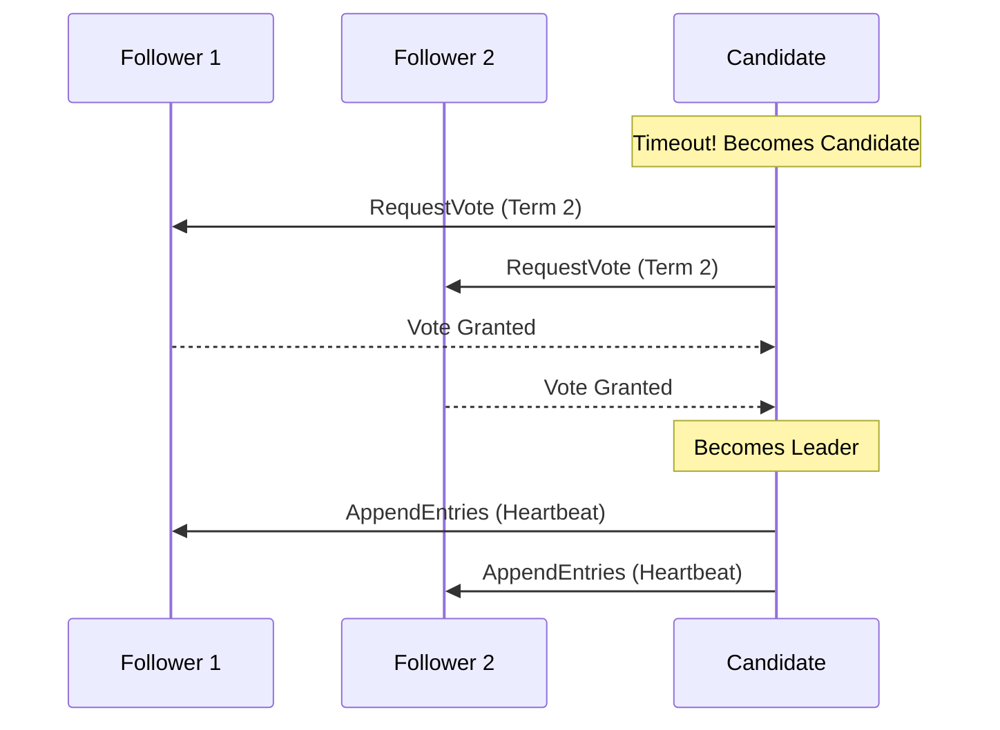

# Consensus Algorithms: How Nodes Agree

## 1. Beginner-friendly Hinglish Explanation 🇮🇳
Bhai, **Consensus** ka matlab hai "Sabki Sahmati" (Agreement). 

Socho 5 dosto ka group hai aur sabko decide karna hai ki aaj "Dinner" mein kya khana hai. 
- Agar sab alag-alag chillayenge toh kuch decide nahi hoga. 
- Aapko ek "Leader" chunna padega. 
- Wo Leader sabse puchega, aur jab "Majority" (kam se kam 3 log) ek dish par agree karenge, tabhi order place hoga. 
Distributed systems mein **Raft** aur **Paxos** yahi kaam karte hain—hazaron servers ke beech "Ek sachaai" (Single truth) banaye rakhte hain.

---

## 2. Deep Technical Explanation
Consensus is a fundamental problem in distributed systems: how to get a set of nodes to agree on a single data value or state, even if some nodes fail.

### The Requirements
1. **Termination**: All non-faulty processes eventually decide on a value.
2. **Agreement**: All processes that decide, must decide on the same value.
3. **Validity**: The decided value must have been proposed by at least one node.

### Paxos
The "Grandfather" of consensus. It's mathematically sound but notoriously hard to understand and implement. It uses "Proposers," "Acceptors," and "Learners."

### Raft
Designed to be more understandable than Paxos. It uses a **Leader-Follower** model:
1. **Leader Election**: If the leader dies, a new one is elected via a heartbeat/timeout mechanism.
2. **Log Replication**: The leader accepts writes and replicates them to a majority of followers.
3. **Safety**: A node can only become leader if it has all committed log entries.

---

## 3. Architecture Diagrams
**Raft Leader Election:**

---

## 4. Scalability Considerations
- **Throughput Bottleneck**: In Raft, *every* write must go through the Leader. Adding more followers doesn't increase write speed; it only increases read capacity and reliability.
- **Cluster Size**: Usually kept small (3, 5, or 7 nodes) because the cost of communication increases as the group gets larger.

---

## 5. Failure Scenarios
- **Partitioned Leader**: The old leader is cut off from the majority. It keeps trying to accept writes, but it can't commit them. Meanwhile, the majority elects a *new* leader. When the network heals, the old leader must "Step down" and overwrite its uncommitted logs.

---

## 6. Tradeoff Analysis
- **Strong Consistency vs. Availability**: Consensus provides **Strong Consistency** (CP system). If a majority is not available, the system *stops* accepting writes to ensure safety.

---

## 7. Reliability Considerations
- **Quorum**: A majority (n/2 + 1). If you have 5 nodes, you can survive the death of 2.
- **Log Compaction**: Periodically taking a "Snapshot" of the state so the log doesn't grow to infinity.

---

## 8. Security Implications
- **Leader Hijacking**: An attacker trying to forge messages to become the leader. (Solution: **mTLS** and **signed messages**).
- **Partition Attacks**: Intentionally cutting off nodes to force constant leader elections (DDoS on the coordination layer).

---

## 9. Cost Optimization
- **Witness Nodes**: Nodes that help in voting (consensus) but don't store the full data, saving on storage costs.

---

## 10. Real-world Production Examples
- **etcd**: Uses Raft. It's the "Brain" of Kubernetes.
- **ZooKeeper**: Uses ZAB (ZooKeeper Atomic Broadcast), similar to Paxos.
- **CockroachDB**: Uses Raft for each data range to achieve global consistency.

---

## 11. Debugging Strategies
- **Term Monitoring**: Watching for "Term increments" to see if the leader is flapping (failing and restarting).
- **Log Diffs**: Checking if followers' logs are diverging from the leader's.

---

## 12. Performance Optimization
- **Batching**: The leader batches multiple user requests into a single log entry.
- **Pipelining**: Sending log entries to followers without waiting for a response for the previous one.

---

## 13. Common Mistakes
- **Even Number of Nodes**: Using 4 nodes is worse than 3. (4 needs 3 for a majority, so it can only survive 1 failure. 3 also needs 2 for a majority and survives 1 failure. 4 adds cost without extra resilience).
- **Low Timeouts**: Setting a leader election timeout too low, causing "Election loops" during minor network spikes.

---

## 14. Interview Questions
1. What is the difference between Paxos and Raft?
2. Why do we usually use an odd number of nodes in a consensus cluster?
3. What happens in Raft when a network partition creates two leaders?

---

## 15. Latest 2026 Architecture Patterns
- **Leaderless Consensus**: New protocols (like **Epaxos**) where any node can handle writes, increasing throughput by 10x.
- **Hardware-Accelerated Raft**: Using FPGA cards to handle heartbeat and log replication at the speed of light.
- **AI-Managed Quorums**: AI agents that dynamically move the "Leader" node to the geographic region with the most traffic to reduce latency.
