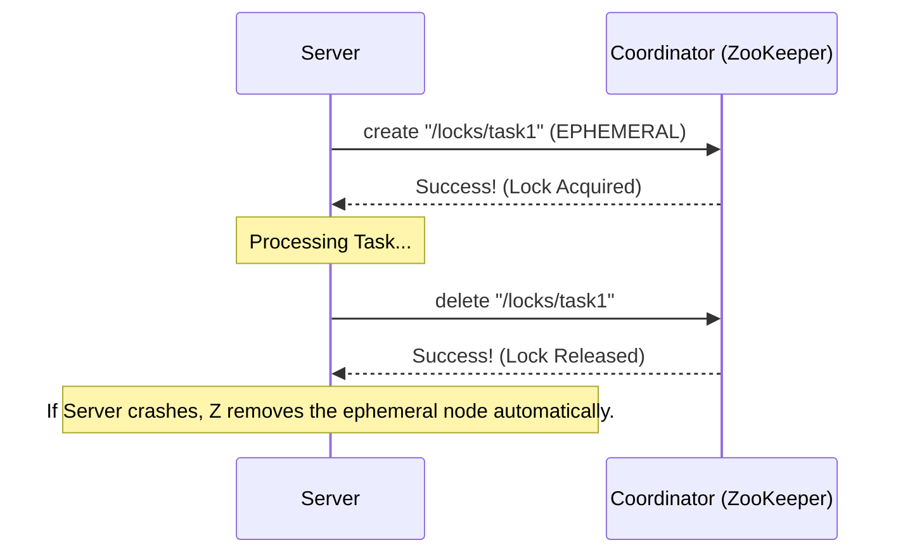

# Distributed Coordination: Keeping it Together

## 1. Beginner-friendly Hinglish Explanation 🇮🇳
Bhai, **Distributed Coordination** ka matlab hai "Sab computers ke beech sync banana." 

Socho 100 log ek sath ek hi Excel sheet edit kar rahe hain. 
- "Row #5 ko kaun lock karega?" 
- "Kaun decide karega ki pehle kisne save kiya?" 
- "Agar computer #5 crash ho gaya, toh uski zimmedari kaun lega?" 
Distributed coordination ek "Police force" ki tarah hai jo locks, configuration, aur "Service discovery" ko manage karti hai taaki chaos na ho.

---

## 2. Deep Technical Explanation
Distributed coordination is the management of interactions between autonomous processes in a distributed system.

### Key Use Cases
1. **Distributed Locking**: Ensuring only one node processes a specific task (e.g., generating a monthly invoice).
2. **Leader Election**: Selecting a "Master" node to coordinate others.
3. **Configuration Management**: Updating a config setting on 1000 nodes at the same time.
4. **Service Discovery**: Letting Node A find the IP address of Node B.
5. **Barriers**: Making 10 nodes wait until all of them have reached a certain point before starting the next step.

---

## 3. Architecture Diagrams
**Distributed Lock Flow:**

---

## 4. Scalability Considerations
- **Coordination Bottleneck**: You cannot coordinate 1 million nodes through a single ZooKeeper cluster. You need to "Partition" the coordination.
- **Hierarchical Coordination**: Splitting a large cluster into smaller "Sub-clusters" with their own coordinators.

---

## 5. Failure Scenarios
- **Expired Sessions**: A server is slow (GC pause), its connection to the coordinator times out, and its lock is released. Suddenly, another server takes the lock and you have two servers doing the same job (**Double-write problem**).

---

## 6. Tradeoff Analysis
- **Consistency vs. Performance**: Coordination requires consensus (CP). This means every lock request is much slower than a local memory lock.
- **Centralized vs. Peer-to-Peer**: Using a central service (ZooKeeper) vs. nodes talking directly (Gossip).

---

## 7. Reliability Considerations
- **Ephemeral Nodes**: In services like etcd/ZooKeeper, if a client crashes, its data (like locks) is automatically deleted after a timeout.
- **Watches**: Clients don't "Poll" the coordinator; they "Watch" a path and get a notification when it changes.

---

## 8. Security Implications
- **Access Control (ACLs)**: Ensuring that Service A cannot delete the locks or config of Service B.
- **Client Identity**: Using TLS certificates to authenticate clients connecting to the coordinator.

---

## 9. Cost Optimization
- **Reducing Writes**: Coordination services are write-heavy and use expensive SSDs. Minimizing "Lock churning" (frequently acquiring/releasing locks) saves IOPS and cost.

---

## 10. Real-world Production Examples
- **Kubernetes (etcd)**: Uses coordination to store the "Desired State" of the cluster.
- **Netflix (Eureka)**: A specialized service for service discovery.
- **Google (Chubby)**: Their internal lock service that manages global state.

---

## 11. Debugging Strategies
- **Session Timeout Logs**: Finding out why servers are losing their "Coordination state."
- **Z-Node Dumps**: Inspecting the raw data inside the coordinator to see who owns a lock.

---

## 12. Performance Optimization
- **Fencing Tokens**: A number that increases every time a lock is acquired. If a "Ghost" server (old lock owner) tries to write, the DB rejects it because its token is old.
- **Local Caching with Watches**: Storing config locally and only updating it when the coordinator sends a "Change" event.

---

## 13. Common Mistakes
- **Using a Coordinator for Data**: Putting large files or high-frequency logs into etcd. It's for "Small, critical metadata" ONLY.
- **Ignoring Network Jitter**: Setting coordination timeouts too low (e.g., 50ms) for a network with 100ms spikes.

---

## 14. Interview Questions
1. How does a 'Distributed Lock' differ from a local OS lock?
2. What are 'Fencing Tokens' and why are they needed?
3. Why is it a bad idea to use a regular SQL database for distributed locking?

---

## 15. Latest 2026 Architecture Patterns
- **Conflict-Free Coordination**: Using **CRDTs** (Conflict-free Replicated Data Types) to coordinate state without needing a central leader.
- **Global Coordination via Satellite**: Using low-latency satellite networks (Starlink) to coordinate data centers across continents with consistent delay.
- **Autonomous Recovery**: Coordination layers that use "Heuristic AI" to automatically kill and restart nodes that are "Behaving weirdly" before they cause an outage.
