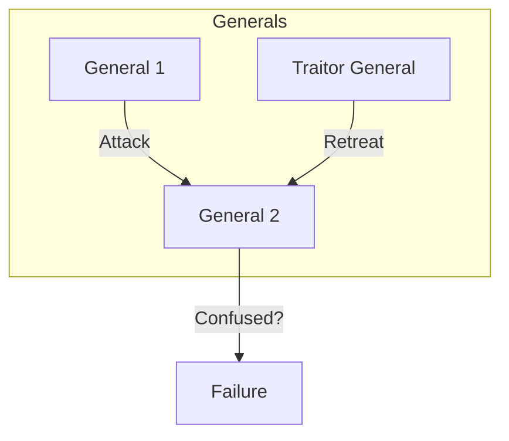

# Distributed System Challenges: Why it's Hard

## 1. Beginner-friendly Hinglish Explanation 🇮🇳
Bhai, **Distributed System** banana mushkil kyun hai? Kyun ki ye "Single Computer" jaisa nahi hai jahan sab kuch aapke control mein ho. 

Socho aap ek group project kar rahe ho aur sab log alag-alag shehar mein hain. 
- Kisi ka internet slow hai (**Latency**).
- Kisi ka phone switch off ho gaya (**Node Failure**).
- Koi galat information de raha hai (**Byzantine Fault**).
- Sabki ghadi alag time dikha rahi hai (**Clock Drift**).
In sab problems ke bawajood aapko "Ek sath" result dena hai. Yahi Distributed Systems ka asli challenge hai.

---

## 2. Deep Technical Explanation
Distributed systems face unique challenges that don't exist in single-node environments.

### 1. Network Unreliability
The network is a "Black Box." Packets can be lost, delayed, or reordered.
- **Challenge**: Distinguishing between a "Slow Node" and a "Dead Node."

### 2. Clock Synchronization
Physical clocks in computers (Quartz crystals) are not accurate. They "Drift."
- **Challenge**: Determining the order of events (Eventual vs. Linearizable).

### 3. Partial Failures
In a distributed system, some parts might be working while others have failed.
- **Challenge**: Handling "Zombies" (nodes that are alive but not responding) and "Net splits."

### 4. Consistency
Ensuring all nodes have the same data at the same time.
- **Challenge**: The CAP Theorem tradeoff.

---

## 3. Architecture Diagrams
**The 'Byzantine Generals' Problem:**

---

## 4. Scalability Considerations
- **Fan-out**: One request from a user triggering 100 internal requests to different nodes. If one node is slow, the whole request is slow.
- **Hotspots**: A single node (e.g., holding a famous celebrity's account) getting too much traffic.

---

## 5. Failure Scenarios
- **Split Brain**: Two nodes think they are both the "Master" and write different data to the same record.
- **Cascading Failure**: A timeout in service A causing service B to retry indefinitely, which then crashes service C due to overload.

---

## 6. Tradeoff Analysis
- **Correctness vs. Speed**: Do you want the result to be "Perfect" (slow) or "Fast" (maybe slightly wrong)?
- **Stateful vs. Stateless**: Stateless is easier to scale but stateful (like databases) is where the real complexity lies.

---

## 7. Reliability Considerations
- **Idempotency**: Ensuring that if a client sends the "Same request" twice (due to a timeout), the system only processes it once.
- **Exponential Backoff**: If a service is down, don't hit it every 1ms. Wait 1s, then 2s, then 4s...

---

## 8. Security Implications
- **Sybil Attack**: One person creating 1000 "Fake nodes" to take over the network.
- **Man-in-the-Middle (MITM)**: Someone intercepting and changing the messages between nodes.

---

## 9. Cost Optimization
- **Payload Compression**: Reducing the size of messages between nodes to save on "Egress costs."
- **Region Placement**: Keeping nodes close to each other to minimize latency and inter-region data costs.

---

## 10. Real-world Production Examples
- **NTP (Network Time Protocol)**: A system just to synchronize clocks across the internet.
- **ZooKeeper**: A distributed coordination service used to manage large clusters.

---

## 11. Debugging Strategies
- **Tracing IDs**: Every request gets a GUID that is passed to every node it touches.
- **Canary Deployments**: Deploying to 1% of nodes first to see if they "Break" under real traffic.

---

## 12. Performance Optimization
- **Batching Writes**: Instead of writing 100 times, wait 10ms and write once.
- **Request Hedging**: If Node A doesn't respond in 10ms, send the same request to Node B and take whoever responds first.

---

## 13. Common Mistakes
- **Assuming FIFO**: Thinking that messages will arrive in the order they were sent. (They won't!).
- **Relying on Local State**: Storing important data in a node's local `/tmp` folder.

---

## 14. Interview Questions
1. What is 'Split Brain' and how do you prevent it?
2. Explain the 'Byzantine Generals Problem' in simple terms.
3. How do you handle a 'Slow Node' in a cluster of 1000 nodes?

---

## 15. Latest 2026 Architecture Patterns
- **Time-as-a-Service**: Using "Hardware Time Appliances" to get nanosecond-precision clocks across the globe.
- **Self-Healing Networks**: SDNs (Software Defined Networks) that use AI to automatically route around "Flaky" nodes.
- **Privacy-Preserving Computation**: Performing distributed calculations without the nodes ever "Seeing" the raw data (using ZK-Proofs).
