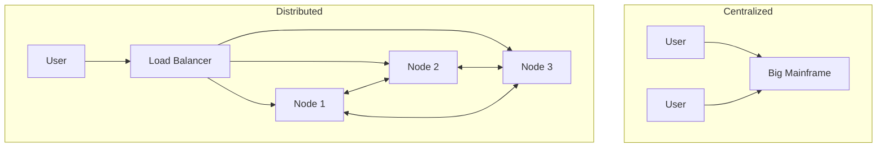

# Distributed Systems Introduction: Beyond the Single Machine

## 1. Beginner-friendly Hinglish Explanation 🇮🇳
Bhai, **Distributed System** ka matlab hai "Ek kaam ko karne ke liye 10 logon ki team." 

Pehle ke zamane mein ek bada super-computer hota tha, lekin wo mehanga aur risk bhara tha (agar wo kharab hua toh sab khatam). Aaj ke zamane mein hum "Chote-chote" hazaron computers (nodes) ko ek sath jod dete hain jo ek "Network" ke zariye baat karte hain. User ko lagta hai ki wo ek hi app use kar raha hai, lekin piche hazaron computers mil kar kaam kar rahe hote hain.
Ye Google, Facebook, aur Amazon ki "Backbone" hai.

---

## 2. Deep Technical Explanation
A distributed system is a collection of independent computers that appear to its users as a single coherent system.

### Key Characteristics
- **No Shared Memory**: Nodes communicate only via message passing.
- **Concurrent Execution**: Components run at the same time.
- **Independent Failure**: One node crashing shouldn't stop the system (ideally).
- **No Global Clock**: Each node has its own time, making "Ordering of events" extremely difficult.

### Why go Distributed?
- **Scalability**: Add more nodes to handle more load.
- **Reliability**: Failover to another node if one dies.
- **Geo-Distribution**: Keeping data close to users in different countries.

---

## 3. Architecture Diagrams
**Centralized vs. Distributed:**

---

## 4. Scalability Considerations
- **Data Sharding**: How to split a 100TB database across 10 servers.
- **Load Balancing**: Ensuring no single node is overwhelmed while others are idle.

---

## 5. Failure Scenarios
- **Network Partition (Split Brain)**: Half the servers think the other half is dead and both try to become the "Leader," leading to data corruption.
- **Clock Drift**: One server thinking it's 2:00 PM while another thinks it's 2:01 PM, causing errors in time-sensitive logs or transactions.

---

## 6. Tradeoff Analysis
- **Simplicity vs. Scale**: A monolith is much easier to debug than 100 distributed microservices.
- **Consistency vs. Performance**: Waiting for all nodes to agree (slow) vs. accepting data quickly (potentially inconsistent).

---

## 7. Reliability Considerations
- **Replication**: Keeping copies of data on multiple nodes.
- **Consensus**: Using protocols like **Raft** to ensure all nodes agree on the "State" of the system.

---

## 8. Security Implications
- **Communication Security**: In a single machine, function calls are safe. In a distributed system, every "Call" goes over the network and must be encrypted.
- **Node Identity**: How does Node A know that Node B is actually part of our system and not a hacker's machine?

---

## 9. Cost Optimization
- **Commodity Hardware**: Using thousands of "Cheap" servers instead of one "Expensive" mainframe.
- **Data Locality**: Reducing network costs by processing data on the same node where it's stored.

---

## 10. Real-world Production Examples
- **Apache Kafka**: A distributed event streaming platform.
- **Google Spanner**: A globally distributed database that uses Atomic Clocks.
- **Blockchain**: A decentralized distributed ledger.

---

## 11. Debugging Strategies
- **Observability**: You cannot "Step-through" a distributed system. You need distributed tracing (Jaeger/Zipkin).
- **Log Correlation**: Using a unique Request ID to find related logs across 20 different servers.

---

## 12. Performance Optimization
- **Gossip Protocols**: Nodes sharing small bits of information with each other to maintain a "Global View" without a central server.
- **Quorum-based Reads/Writes**: Reading from multiple nodes to ensure data accuracy.

---

## 13. Common Mistakes
- **The 8 Fallacies of Distributed Computing**: E.g., assuming "The network is reliable" or "Latency is zero."
- **Over-designing**: Building a distributed system for a task that could run on a single Raspberry Pi.

---

## 14. Interview Questions
1. What are the 'Fallacies of Distributed Computing'?
2. How do you handle 'Clock Drift' in a system?
3. What is the difference between 'Vertical' and 'Horizontal' scalability in the context of distributed systems?

---

## 15. Latest 2026 Architecture Patterns
- **Planet-Scale Consensus**: New algorithms that allow consensus across the globe in <50ms.
- **Agentic Mesh**: Distributed systems where nodes use "Small LLMs" to self-heal and optimize their own network routing.
- **Decentralized Cloud**: Running distributed systems across user devices (Edge nodes) rather than central data centers.
