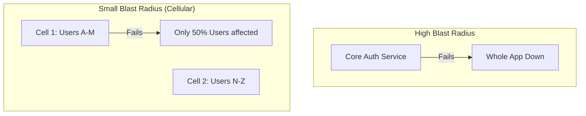

# Failure in Distributed Systems: Designing for the Inevitable

## 1. Beginner-friendly Hinglish Explanation 🇮🇳
Bhai, Distributed System mein "Failure" koi accident nahi hai, ye ek "Feature" hai. 

Socho aap ek bade office mein kaam kar rahe ho jahan 500 log hain. Har hafte koi na koi bimaar padega, kisi ka computer kharab hoga, ya kisi ki seat change hogi. Aap ye nahi keh sakte ki "Office band kar do kyunki ek banda bimaar hai." Aapko aisa system banana hai ki log aate-jaate rahein par kaam chalta rahe. 
Distributed system mein bhi yahi hota hai: Servers crash honge, network wire katega, software mein bug aayega—lekin user ko hamesha "Success" message milna chahiye.

---

## 2. Deep Technical Explanation
In a single machine, failure is usually total (crash). In a distributed system, failure is **Partial**.

### Types of Failure
1. **Crash-Stop**: A node stops working and never comes back.
2. **Crash-Recovery**: A node stops, but eventually restarts.
3. **Omission**: A node misses some messages.
4. **Byzantine**: A node behaves "Maliciously" or sends wrong data (Software bugs or hacking).

### The "Grey Failure"
The most dangerous type. A node is "Alive" (responding to pings) but "Broken" (returning errors or taking 10 seconds per request). Most monitoring systems miss this.

---

## 3. Architecture Diagrams
**Blast Radius of Failure:**

---

## 4. Scalability Considerations
- **Mean Time To Failure (MTTF)**: As you add more servers, the probability of *at least one* server being down at any given moment becomes **100%**. Scaling requires moving from "Repairing servers" to "Replacing servers."

---

## 5. Failure Scenarios
- **The 'Zombie' Node**: A node that is extremely slow, holding up resources (connections/threads) and causing a backup in all services that call it.
- **Dependency Hell**: Service A needs B, B needs C, C is down. Now A and B are also down.

---

## 6. Tradeoff Analysis
- **Fail-Fast vs. Fail-Safe**: Should the system return an error immediately (Fail-fast) or try to provide a "Backup" experience (Fail-safe)?
- **Redundancy vs. Cost**: Keeping 10 copies of data is very safe but very expensive.

---

## 7. Reliability Considerations
- **Circuit Breaker**: Cutting off the connection to a failing service so it has time to recover.
- **Bulkheading**: Isolating components so a failure in "Profile Pic Upload" doesn't stop "Payment Processing."
- **Timeout**: Never wait indefinitely for a response.

---

## 8. Security Implications
- **Fail-Secure**: If the "Auth Service" fails, the system should "Close all doors" (deny access) rather than "Open all doors."
- **Audit Logs**: Recording failures to see if they were caused by a coordinated attack.

---

## 9. Cost Optimization
- **Self-Healing Infrastructure**: Using scripts to automatically restart "Stuck" containers instead of paying an SRE to do it manually at 3 AM.
- **Error Budgets**: Allowing a certain amount of failure (e.g., 0.1%) to move faster and save on over-engineering costs.

---

## 10. Real-world Production Examples
- **AWS S3 Outage (2017)**: A single typo in a command brought down a large chunk of the internet because it caused a cascading failure.
- **Hystrix (Netflix)**: The library that popularized the "Circuit Breaker" pattern in distributed systems.

---

## 11. Debugging Strategies
- **Post-Mortems**: Analyzing a failure after it happened to find the root cause, not someone to blame.
- **Observability (Pillar 3: Traces)**: Finding exactly which node in a chain of 50 nodes started returning the error.

---

## 12. Performance Optimization
- **Exponential Backoff with Jitter**: When retrying, wait $2^n$ seconds + a random "Jitter." This prevents all clients from hitting the system at exactly the same time after a recovery.

---

## 13. Common Mistakes
- **Infinite Retries**: Retrying a request that will always fail (e.g., "Invalid User ID"), which just wastes resources.
- **Ignoring Silent Failures**: Not having alerts for when a service's "Error Rate" goes from 0% to 1%.

---

## 14. Interview Questions
1. What is a 'Cascading Failure' and how do you stop it?
2. Explain the 'Circuit Breaker' pattern with a real-life analogy.
3. How do you distinguish between a network failure and a node crash?

---

## 15. Latest 2026 Architecture Patterns
- **Autonomous Chaos Engineering**: AI agents that constantly "Inject" small failures into production and automatically fix the code/config if the system doesn't handle them well.
- **Immutable Infrastructure**: Instead of "Fixing" a broken server, the system automatically deletes it and starts a brand new "Clean" one from an image.
- **eBPF Monitoring**: Using kernel-level hooks to detect failures that are invisible to regular application logs.
	
