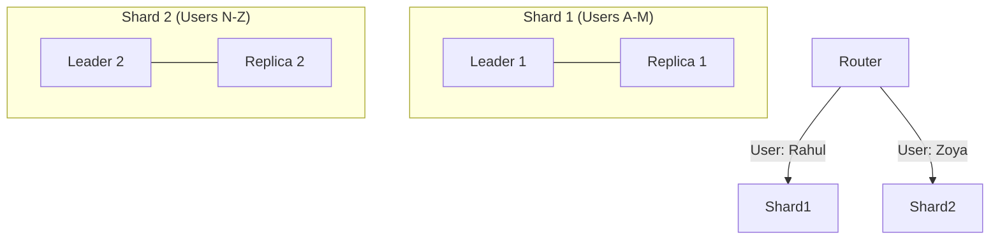

# Partitioning and Replication: Scaling and Protecting Data

## 1. Beginner-friendly Hinglish Explanation 🇮🇳
Bhai, **Partitioning** aur **Replication** ko ek "Library" ki tarah samjho. 

- **Partitioning (Sharding)**: Agar ek almari (server) mein saari kitabein nahi aa rahi, toh aap unhe 10 almarion mein baant dete ho (E.g., A-F tak ek mein, G-M tak dusri mein). Isse aap "Unlimited" data store kar sakte ho.
- **Replication**: Agar library mein aag lag jaye toh? Isliye aap har kitab ki 3 copies banate ho aur unhe alag-alag building (data centers) mein rakhte ho. Isse agar ek server kharab ho jaye, toh data "Loss" nahi hota.

---

## 2. Deep Technical Explanation
These are the two fundamental techniques for scaling and providing high availability to data systems.

### Partitioning (Sharding)
Breaking a large dataset into smaller, manageable chunks (Partitions).
- **Horizontal Partitioning (Sharding)**: Putting different rows into different tables.
- **Vertical Partitioning**: Putting different columns into different tables.
- **Key-based Sharding**: Using a hash of the ID to decide the destination node.
- **Range-based Sharding**: Putting IDs 1-1000 in Node A, 1001-2000 in Node B.

### Replication
Keeping copies of the same data on multiple nodes.
- **Single-Leader**: One node handles writes; others copy from it (Read Replicas).
- **Multi-Leader**: Multiple nodes handle writes (Good for multi-region).
- **Leaderless**: Any node can handle a write (e.g., Cassandra).

---

## 3. Architecture Diagrams
**Sharding + Replication:**

---

## 4. Scalability Considerations
- **Re-sharding**: What happens when Shard 1 is full? Moving data between shards without downtime is the "Holy Grail" of scaling.
- **Skewed Data**: One shard getting 90% of traffic (e.g., a "Hot Key" like a viral tweet).

---

## 5. Failure Scenarios
- **Replication Lag**: A user updates their profile on the Leader, then immediately reads from a Replica and sees their "Old" profile.
- **Shard Failure**: If a shard is lost and has no replicas, that specific portion of the user base (e.g., users A-M) can't use the app.

---

## 6. Tradeoff Analysis
- **Partitioning**: Increases **Throughput** but makes "Joins" and "Global queries" (queries across all shards) very slow.
- **Replication**: Increases **Availability** but adds "Consistency" challenges and extra storage costs.

---

## 7. Reliability Considerations
- **Quorum Reads/Writes**: Writing to $W$ nodes and reading from $R$ nodes to ensure $R + W > N$ (where $N$ is total replicas). This guarantees you see the latest data.
- **Automatic Failover**: If the Leader dies, the system should automatically promote a Replica to be the new Leader.

---

## 8. Security Implications
- **Data Sovereignty**: Ensuring that "German users' data" is only sharded and replicated within servers located in Germany (GDPR).
- **Encryption at Rest**: Every shard and replica must be individually encrypted.

---

## 9. Cost Optimization
- **Tiered Replication**: Keeping 3 copies of "Recent" data but only 1 copy of "1-year old" data on cheap storage.
- **Compute-Storage Separation**: Scaling the "Storage nodes" (Shards) independently from the "Query nodes."

---

## 10. Real-world Production Examples
- **Cassandra**: Uses leaderless replication and a "Gossip" protocol.
- **MySQL Vitess**: A sharding layer used by YouTube to scale MySQL to millions of QPS.
- **Elasticsearch**: Uses "Shards" and "Replicas" to index and search trillions of documents.

---

## 11. Debugging Strategies
- **Lag Monitoring**: Alerts if the Replica is more than 5 seconds behind the Leader.
- **Entropy Checking**: Running a process to ensure that the data on the Replica is *exactly* the same as on the Leader (Anti-entropy).

---

## 12. Performance Optimization
- **Consistent Hashing**: Minimizing the amount of data that needs to move when you add or remove a shard node.
- **Asynchronous Replication**: Writing to the replica in the background to keep user latency low.

---

## 13. Common Mistakes
- **Poor Shard Key**: Choosing a key that doesn't distribute data evenly (e.g., 'Country' where 90% of users are from India).
- **Over-replication**: Having 10 replicas when 3 is enough—wasting money and increasing write latency.

---

## 14. Interview Questions
1. What is 'Consistent Hashing' and why is it useful for sharding?
2. Explain the difference between 'Synchronous' and 'Asynchronous' replication.
3. How do you handle 'Hot Keys' in a sharded database?

---

## 15. Latest 2026 Architecture Patterns
- **Serverless Sharding**: Databases that automatically split and merge shards based on real-time traffic without manual intervention.
- **AI-Optimized Shard Keys**: Using machine learning to analyze access patterns and suggest the best possible shard key for your data.
- **Multi-Cloud Replication**: Replicating data across AWS, GCP, and Azure simultaneously to avoid "Cloud Lock-in" and maximize uptime.
