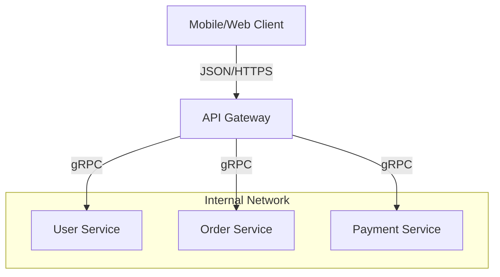

# API Gateways: The Front Door of Microservices

## 1. Beginner-friendly Hinglish Explanation 🇮🇳
Bhai, **API Gateway** ek "Bade Hotel ka Receptionist" hai. 

Jab aap ek bade hotel mein jaate ho, toh aap sidha kitchen ya laundry room mein nahi ghuste. Aap reception par jaate ho. Receptionist decide karta hai ki: 
- "Aap valid guest ho ya nahi?" (**Authentication**).
- "Aapko kahan jana hai?" (**Routing**).
- "Aap ek sath 100 sawal toh nahi puch rahe?" (**Rate Limiting**).
Microservices architecture mein, API Gateway saari requests ko handle karta hai aur unhe sahi service tak pahunchata hai.

---

## 2. Deep Technical Explanation
An API Gateway is a server that acts as an API front-end, receives API requests, enforces throttling and security policies, passes requests to the back-end service, and then passes the response back to the requester.

### Core Responsibilities
1. **Routing**: Mapping `/users` to the User Service and `/orders` to the Order Service.
2. **Authentication & Authorization**: Validating JWTs or API Keys before the request hits internal services.
3. **Rate Limiting / Throttling**: Protecting services from being overwhelmed.
4. **Protocol Translation**: E.g., converting a REST (HTTP/JSON) request from a mobile app into a gRPC (Binary) request for an internal microservice.
5. **Aggregation**: Combining data from multiple services into a single response to reduce round-trips for the client.

---

## 3. Architecture Diagrams
**API Gateway Pattern:**

---

## 4. Scalability Considerations
- **Performance Overhead**: Since *every* request goes through the gateway, it can become a bottleneck.
- **Horizontal Scaling**: Scaling the gateway layer itself to handle millions of requests per second.

---

## 5. Failure Scenarios
- **Single Point of Failure (SPOF)**: If the API Gateway crashes, your entire app is "Dark," even if all backend microservices are working perfectly.
- **Gateway Timeout**: The gateway waits for a slow backend service until its own threads are exhausted, leading to a total crash.

---

## 6. Tradeoff Analysis
- **Gateway vs. No Gateway**: Using a gateway simplifies the client but adds a "Network Hop" (latency).
- **Fat Gateway vs. Thin Gateway**: Should the gateway have a lot of logic (Aggregation/Transformation) or just be a simple proxy?

---

## 7. Reliability Considerations
- **Retries & Timeouts**: Configuring how the gateway handles flaky backend services.
- **Circuit Breakers**: The gateway should stop sending traffic to a backend service that is returning 500 errors.

---

## 8. Security Implications
- **SSL Termination**: Decrypting HTTPS at the gateway so internal services don't have to waste CPU on it.
- **IP Whitelisting**: Only allowing traffic from specific countries or IPs.
- **WAF Integration**: Protecting against SQL injection and XSS at the entry point.

---

## 9. Cost Optimization
- **Caching at the Gateway**: Caching responses for common GET requests (like `/product/123`) to avoid hitting backend services and databases.

---

## 10. Real-world Production Examples
- **Kong / Tyk**: Popular open-source API Gateways.
- **AWS API Gateway / Azure API Management**: Fully managed cloud services.
- **Netflix (Zuul)**: Their internal gateway that handles billions of requests.

---

## 11. Debugging Strategies
- **Correlation IDs**: Injecting a unique ID into the headers so you can track the request from the gateway to the database.
- **Request/Response Logs**: Seeing exactly what the client sent vs what the gateway forwarded.

---

## 12. Performance Optimization
- **Async I/O**: Using non-blocking frameworks (like Netty or Node.js) so the gateway can handle 10,000 connections with very few threads.
- **Gzip/Brotli**: Compressing data before sending it back to the mobile app.

---

## 13. Common Mistakes
- **Putting Business Logic in the Gateway**: Writing code like `if (user.isGoldMember) { ... }` inside the gateway. (Business logic belongs in the microservices!).
- **Ignoring Gateway Latency**: Adding 5 different "Middleware" steps (Auth, Logging, Metric, Transformation) that add 100ms to every request.

---

## 14. Interview Questions
1. What is the difference between a 'Load Balancer' and an 'API Gateway'?
2. How do you handle 'Single Point of Failure' in an API Gateway?
3. Explain 'Request Aggregation' and its benefits for mobile apps.

---

## 15. Latest 2026 Architecture Patterns
- **GraphQL Federation**: Using an API Gateway as a "Graph Router" that combines multiple GraphQL schemas into one.
- **AI-Driven Rate Limiting**: Using machine learning to detect "Bot-like" behavior and selectively throttling only suspicious users.
- **Wasm Extensions**: Using WebAssembly to run custom security/transformation logic at the gateway with the speed of C++.
