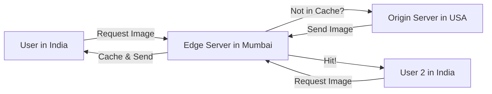

# CDN Architecture: Bringing Content to the Edge

## 1. Beginner-friendly Hinglish Explanation 🇮🇳
Bhai, **CDN (Content Delivery Network)** ka matlab hai "Gully ki dukaan." 

Agar aapko ek packet biscuit chahiye, toh aap factory (Main Server) nahi jaoge, balki apni gully ki dukaan (Edge Server) par jaoge kyunki wo pass hai. 
System design mein, agar aapka main server USA mein hai aur user India mein, toh data aane mein 200ms lagenge. Lekin agar aap wahi data (images, videos) India ke ek server par "Cache" kar do, toh user ko 10ms mein mil jayega. Isse speed badhti hai aur main server par load kam hota hai.

---

## 2. Deep Technical Explanation
A CDN is a geographically distributed group of servers which work together to provide fast delivery of Internet content.

### Core Components
- **Origin Server**: The "Source of Truth" where your original content lives (e.g., S3 bucket).
- **Edge Servers (PoPs - Points of Presence)**: Servers located close to users that cache content.
- **Request Routing**: DNS or Anycast logic that sends a user to the "Closest" PoP.

### Types of Content
- **Static**: Images, JS, CSS, Video files. (Highly cacheable).
- **Dynamic**: User-specific data. (Hard to cache, but CDNs can still help via "Connection Pooling" and "Edge Computing").

---

## 3. Architecture Diagrams
**How a CDN works:**

---

## 4. Scalability Considerations
- **Fan-out**: A single file on the origin being requested by 1 million edge servers.
- **Cache Hit Ratio**: The percentage of requests served from the CDN vs the Origin. Higher is better.

---

## 5. Failure Scenarios
- **Origin Shield Failure**: If the "Shield" server (a layer between Edge and Origin) fails, the origin might be hit with a "Thundering Herd" of requests from all edge servers at once.
- **Stale Content**: Serving an old version of your website because you forgot to "Purge" the CDN cache after a deployment.

---

## 6. Tradeoff Analysis
- **Cost vs. Latency**: Having a PoP in every city is fast but expensive. Having 5 global PoPs is cheap but slower.
- **Push vs. Pull**: "Pushing" content to CDN manually vs. the CDN "Pulling" it automatically on the first request.

---

## 7. Reliability Considerations
- **Failover to Origin**: If a CDN PoP is down, the user's request should automatically go to the next closest PoP or the Origin.
- **DDoS Mitigation**: CDNs act as a "Shield" for your origin, absorbing massive traffic attacks.

---

## 8. Security Implications
- **Signed URLs**: Ensuring that only paid users can access a private video hosted on a CDN.
- **WAF at the Edge**: Blocking bad actors (bots/scrapers) before they even reach your data center.

---

## 9. Cost Optimization
- **Cache Tags**: Purging only specific files instead of the whole site to save on bandwidth and origin hits.
- **Image Optimization**: Using the CDN to automatically resize and convert images to WebP to reduce file size.

---

## 10. Real-world Production Examples
- **Netflix (Open Connect)**: They have their own hardware (CDN boxes) inside ISP offices to serve movies locally.
- **Akamai**: One of the oldest and largest CDNs in the world.
- **Cloudflare**: A modern CDN that also offers "Serverless" logic at the edge.

---

## 11. Debugging Strategies
- **Cache Headers**: Checking `CF-Cache-Status: HIT` or `MISS` in the browser dev tools.
- **Purge Logs**: Seeing when and why a file was deleted from the cache.

---

## 12. Performance Optimization
- **Gzip/Brotli at Edge**: Compressing the content at the PoP level.
- **Origin Shield**: A central CDN layer that protects the origin from redundant requests from multiple PoPs.

---

## 13. Common Mistakes
- **Caching Sensitive Data**: Accidentally caching a user's private dashboard or bank balance.
- **Infinite TTL**: Setting a cache time of 1 year and having no way to update the file when there is a bug.

---

## 14. Interview Questions
1. How does a CDN improve both Latency and Throughput?
2. What is the 'Thundering Herd' problem in the context of CDNs?
3. How do you handle 'Dynamic Content' in a CDN?

---

## 15. Latest 2026 Architecture Patterns
- **Edge Computing (Cloudflare Workers)**: Running entire backend logic (like A/B testing or Auth) inside the CDN server itself.
- **Real-time Video CDN**: Using **WebRTC** on CDNs to stream live events with <1 second of latency.
- **AI-Managed Pre-fetching**: Using AI to predict which movies will be popular tomorrow and "Pushing" them to local CDN nodes overnight.
