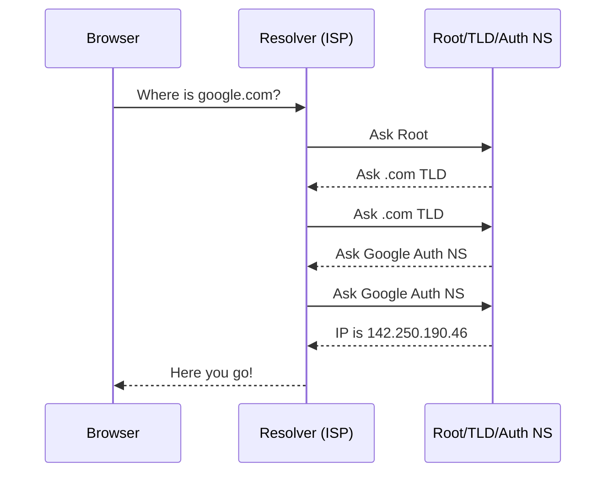

# DNS and Routing: The Internet's GPS

## 1. Beginner-friendly Hinglish Explanation 🇮🇳
Bhai, **DNS** ka matlab hai "Internet ki Phonebook." 

Aapko `facebook.com` yaad rehta hai, lekin computer ko sirf `157.240.22.35` (IP address) samajh aata hai. Jab aap browser mein naam dalte ho, toh DNS usse IP mein convert karta hai. 
**Routing** ka matlab hai "Sahi rasta dikhana." Socho aapne India se ek request bheji, toh wo request "Palk Strait" se jayegi ya "Suez Canal" se? Routing decide karti hai ki data kitne jumps mein aur kitni tez server tak pahunchega.

---

## 2. Deep Technical Explanation
DNS and Routing are the core mechanisms that connect clients to servers globally.

### DNS (Domain Name System)
- **Hierarchical**: Root -> TLD (.com) -> Domain (google) -> Subdomain (mail).
- **Caching**: Your browser, OS, and ISP all cache DNS records to avoid constant lookups.
- **Record Types**:
    - **A Record**: Maps name to IPv4.
    - **AAAA Record**: Maps name to IPv6.
    - **CNAME**: Maps name to another name (Alias).
    - **NS Record**: Defines the "Authoritative" name server for the domain.

### Routing
- **BGP (Border Gateway Protocol)**: The protocol that routes data across the internet's autonomous systems (AS).
- **Anycast Routing**: One IP address exists in multiple locations. The request goes to the "Closest" one. (Used by CDNs).
- **Latent-based Routing**: Routing users based on the lowest network delay.

---

## 3. Architecture Diagrams
**DNS Lookup Flow:**

---

## 4. Scalability Considerations
- **TTL (Time to Live)**: If you set it too high, you can't change your server IP quickly. If you set it too low, your DNS server gets hit with too much traffic.
- **Global Traffic Management (GTM)**: Using DNS to distribute load across different data centers in different continents.

---

## 5. Failure Scenarios
- **DNS Poisoning**: A hacker intercepts a DNS request and sends back their own "Fake" IP address. (Fix: **DNSSEC**).
- **BGP Hijacking**: An ISP accidentally (or maliciously) announces that it owns a certain IP range, stealing traffic from the real owner.
- **Propogation Delay**: Taking 24-48 hours for a DNS change to reach the whole world.

---

## 6. Tradeoff Analysis
- **A Record vs. CNAME**: A record is faster (one lookup), but CNAME is more flexible (easy to move between cloud services).
- **Latency vs. Accuracy**: Geolocation DNS might route a user to a "closer" server that is actually overloaded.

---

## 7. Reliability Considerations
- **Redundant Name Servers**: Never have just one DNS server. Use at least two (Primary/Secondary) in different locations.
- **Health Checks in DNS**: Modern DNS services (like Route 53) can stop returning an IP if the server at that IP is unhealthy.

---

## 8. Security Implications
- **DNS over HTTPS (DoH)**: Encrypting DNS queries so your ISP or hackers can't see what websites you are visiting.
- **DDoS on DNS**: Attacking the DNS infrastructure to bring down millions of websites (e.g., the Dyn attack).

---

## 9. Cost Optimization
- **Reducing Queries**: Using higher TTLs for static infrastructure to save on DNS query bills.
- **Using Private DNS**: Using internal DNS for microservices communication to avoid paying for public DNS queries.

---

## 10. Real-world Production Examples
- **Google Public DNS (8.8.8.8)**: One of the fastest and most reliable DNS resolvers in the world.
- **AWS Route 53**: A managed DNS service that supports latency-based and failover routing.

---

## 11. Debugging Strategies
- **dig / nslookup**: Tools to see exactly what records a DNS server is returning.
- **traceroute**: Seeing every "Hop" (router) your data touches on its way to the destination.

---

## 12. Performance Optimization
- **Prefetching**: Browsers looking up the IPs of links on a page before you even click them.
- **EDNS Client Subnet**: DNS servers using the user's IP prefix to provide a more accurate "Closest server" response.

---

## 13. Common Mistakes
- **Forgetting TTL**: Changing an IP and realizing half your users are still going to the old (dead) server for the next 2 hours.
- **Incorrect Glue Records**: Breaking your DNS by not properly linking your name servers to your registrar.

---

## 14. Interview Questions
1. What happens when you type 'google.com' in your browser? (Focus on DNS).
2. What is the difference between an 'A' record and a 'CNAME'?
3. How does 'Anycast' routing help in scaling a CDN?

---

## 15. Latest 2026 Architecture Patterns
- **AI-Managed TTL**: DNS servers that automatically lower the TTL when they detect a server is becoming unstable, preparing for a quick failover.
- **Decentralized DNS (Web3)**: Using blockchain-based DNS (like .eth or .sol) that cannot be censored or hijacked by any central authority.
- **Multi-Cloud Global Routing**: Using a single global Anycast IP that intelligently routes traffic across AWS, GCP, and Cloudflare based on real-time price and performance.
