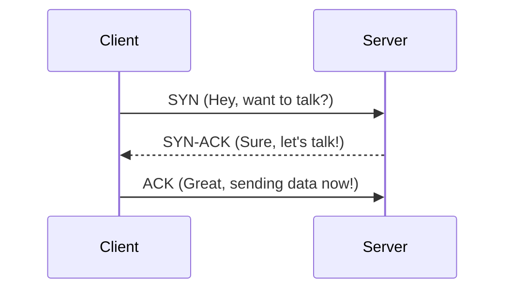

# Networking for System Design: The Digital Highway

## 1. Beginner-friendly Hinglish Explanation 🇮🇳
Bhai, **Networking** system design ka "Nervous System" hai. 

Socho aapne ek bahut bada mall banaya hai, lekin wahan pahunchne ke liye raste nahi hain, ya phir raste itne patle hain ki sirf ek cycle ja sakti hai. Kya wo mall chalega? Nahi. 
System design mein networking ka matlab hai ki data ko ek server se dusre server tak kaise "Tezi" aur "Suraksha" (Security) ke sath bheja jaye. Isme hum IP addresses, ports, aur protocols ki baat karte hain jo data ko sahi jagah pahunchate hain.

---

## 2. Deep Technical Explanation
Networking is the medium through which distributed components interact. Understanding the OSI Model (specifically Layers 3, 4, and 7) is crucial.

### Key Concepts
- **TCP (Transmission Control Protocol)**: Reliable, ordered, and error-checked delivery of a stream of data. (Used for Web, Email).
- **UDP (User Datagram Protocol)**: Fast, but unreliable. No ordering or handshake. (Used for Video streaming, Gaming).
- **IP (Internet Protocol)**: The "Address" of the node.
- **NAT (Network Address Translation)**: Allowing multiple machines in a private network to share one public IP.

### OSI Layers for Architects
- **Layer 3 (Network)**: Routing and IP.
- **Layer 4 (Transport)**: TCP/UDP, Port numbers, Load balancing.
- **Layer 7 (Application)**: HTTP, gRPC, API gateways, WAFs.

---

## 3. Architecture Diagrams
**TCP Handshake (The 3-Way Handshake):**

---

## 4. Scalability Considerations
- **Bandwidth**: The amount of data you can send.
- **Throughput**: The actual rate of successful data delivery.
- **Congestion Control**: How TCP slows down when the network is "Full" to prevent a total crash.

---

## 5. Failure Scenarios
- **Packet Loss**: A router drops your data because it's too busy. TCP will retry, but it adds **Latency**.
- **Jitter**: Variations in latency that cause video calls to stutter.
- **Head-of-Line Blocking**: One slow packet holding up the entire queue (Common in HTTP/1.1).

---

## 6. Tradeoff Analysis
- **TCP vs. UDP**: Reliability (TCP) vs. Speed/Low Latency (UDP).
- **Private vs. Public Network**: Security vs. Accessibility/Cost.

---

## 7. Reliability Considerations
- **TLS (Transport Layer Security)**: Ensuring that the data is not modified or read by anyone in the middle.
- **Retransmission**: Automatically resending data that was lost.

---

## 8. Security Implications
- **DDoS (Distributed Denial of Service)**: Flooding the network layer (L3/L4) to block legitimate traffic.
- **Firewalls/WAFs**: Filtering out "Bad" traffic before it reaches your servers.

---

## 9. Cost Optimization
- **Egress Costs**: Cloud providers charge a LOT for data leaving their network. Keeping data transfer within the same "Region" or "Availability Zone" is much cheaper.

---

## 10. Real-world Production Examples
- **Cloudflare**: A global network that protects and speeds up websites using "Anycast" routing.
- **BGP (Border Gateway Protocol)**: The "GPS" of the internet that decides how data moves between different internet providers.

---

## 11. Debugging Strategies
- **Ping/Traceroute**: Checking if a server is alive and seeing the "Path" data takes to reach it.
- **Wireshark/tcpdump**: Inspecting the actual packets to see why a connection is failing.

---

## 12. Performance Optimization
- **Keep-Alive**: Reusing the same TCP connection for multiple HTTP requests.
- **Compression (Gzip/Brotli)**: Making the data smaller so it travels faster.

---

## 13. Common Mistakes
- **Ignoring Round Trip Time (RTT)**: Forgetting that a request to a server in the USA from India will *always* take at least 150ms due to the speed of light.
- **Using TCP for Everything**: Using TCP for a real-time game where a 500ms retry delay makes the game unplayable.

---

## 14. Interview Questions
1. What is the difference between TCP and UDP?
2. Explain the 7 layers of the OSI model and why they matter to a developer.
3. How does a 'Load Balancer' work at Layer 4 vs Layer 7?

---

## 15. Latest 2026 Architecture Patterns
- **HTTP/3 over QUIC**: A protocol that runs over UDP to eliminate "Head-of-line blocking" and make mobile connections much faster.
- **Zero-Trust Networking (ZTNA)**: Moving away from VPNs to a model where every single request is authenticated, regardless of the network.
- **eBPF-powered Networking**: Using high-performance kernel hooks to route and filter traffic with near-zero CPU overhead.
