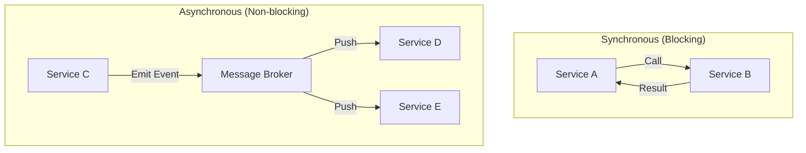

# Service Communication Patterns: How Systems Talk

## 1. Beginner-friendly Hinglish Explanation 🇮🇳
Bhai, **Service Communication** ka matlab hai ki aapki microservices ek dusre se baat kaise karti hain. 

Socho ek restaurant hai. 
1. **Synchronous**: Waiter kitchen mein khada hai aur jab tak khana nahi banta, wo wahin ruka rehta hai. (E.g., HTTP Call). Isme user ko turant result milta hai par agar kitchen slow hai toh waiter bhi block ho jayega. 
2. **Asynchronous**: Waiter order kitchen mein de kar chala jata hai aur dusre kaam karta hai. Jab khana taiyar hota hai, tab ek bell bajti hai. (E.g., Message Queue/Kafka). Isme system bahut resilient rehta hai par result turant nahi milta.

---

## 2. Deep Technical Explanation
In a microservices world, services need to exchange data reliably and efficiently.

### Synchronous Patterns
- **Request-Response**: One service calls another and waits for the result (HTTP, gRPC).
- **Pros**: Simple, easy to debug, consistent state.
- **Cons**: Tight coupling, cascading failures, "Thread blocking."

### Asynchronous Patterns
- **Pub-Sub (Publish-Subscribe)**: A service emits an event (e.g., "OrderPlaced") to a broker (Kafka), and multiple services (Inventory, Email, Shipping) listen and react.
- **Message Queuing**: A service puts a task in a queue (RabbitMQ) for another service to process later.
- **Pros**: Decoupling, high availability, handles traffic spikes (Buffering).
- **Cons**: Eventual consistency, complex debugging.

---

## 3. Architecture Diagrams
**Sync vs. Async Communication:**

---

## 4. Scalability Considerations
- **Sync Bottleneck**: If Service A calls B, and B calls C... the response time is the "Sum" of all latencies. This doesn't scale well.
- **Async Scalability**: Service A just drops a message and is done. This allows thousands of messages to be processed in parallel by different workers.

---

## 5. Failure Scenarios
- **Distributed Deadlock**: Service A waits for B, and B is waiting for A.
- **Poison Pill Message**: A message in the queue that causes the consumer service to crash every time it tries to process it, leading to an infinite "Crash-Restart" loop.

---

## 6. Tradeoff Analysis
- **Consistency vs. Availability**: Sync gives you strong consistency; Async gives you high availability but "Eventual Consistency."
- **Complexity**: Async is much harder to implement correctly (Handling retries, ordering, and duplicate messages).

---

## 7. Reliability Considerations
- **Dead Letter Queue (DLQ)**: A place to store "Broken" messages that couldn't be processed, so they can be inspected manually later.
- **Idempotent Consumers**: Ensuring that if a message is delivered twice, it doesn't cause side-effects (like charging a customer twice).

---

## 8. Security Implications
- **Event Injection**: A malicious service sending fake events to the broker to trigger unauthorized actions.
- **Encryption at Rest**: Messages sitting in a queue (like Kafka) must be encrypted.

---

## 9. Cost Optimization
- **Reducing Network Hops**: Using "Service Mesh" to route traffic efficiently.
- **Optimizing Payload**: Using binary formats (Avro/Protobuf) for events instead of bulky JSON to save on storage and transfer costs.

---

## 10. Real-world Production Examples
- **Uber**: Uses Kafka for almost all communication between their thousands of services.
- **Google**: Uses gRPC for high-performance synchronous calls.
- **Amazon**: Uses SQS/SNS for decoupled order processing.

---

## 11. Debugging Strategies
- **Distributed Tracing**: Essential for seeing how an event moved through 10 different async services.
- **Broker Monitoring**: Checking "Message Lag" to see if consumers are falling behind.

---

## 12. Performance Optimization
- **Batching**: Sending 10 messages to the broker in one go.
- **Compression**: Compressing messages before putting them in the queue.

---

## 13. Common Mistakes
- **Sync for Everything**: Using HTTP calls for things that could be async (like sending an email), making the user wait for no reason.
- **Missing Idempotency**: Not handling duplicate events, leading to inconsistent data.

---

## 14. Interview Questions
1. When would you prefer Asynchronous communication over Synchronous?
2. What is a 'Poison Pill' message and how do you handle it?
3. How do you ensure 'Exactly-once delivery' in a distributed system?

---

## 15. Latest 2026 Architecture Patterns
- **Cloud-Native Event Mesh**: A global layer that routes events across different cloud providers (AWS to Azure) automatically.
- **Zero-Latency Async**: Using persistent memory (Optane) to make async communication as fast as synchronous RAM access.
- **Agentic Event Loops**: AI agents that monitor the event flow and automatically "Scale up" specific consumer services before the queue starts lagging.
