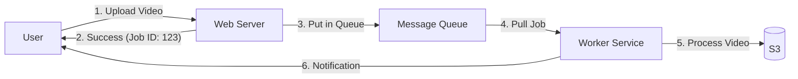

# Async Architecture: Designing for Non-Blocking Flows

## 1. Beginner-friendly Hinglish Explanation 🇮🇳
Bhai, **Async Architecture** ka matlab hai "Order de kar bhul jana." 

Socho aap Domino's mein pizza order karne gaye. 
- **Sync**: Aap counter par khade ho aur jab tak pizza nahi banta, aap wahin khade rehte ho. Aapka time waste ho raha hai. 
- **Async**: Aapne order diya, unhone aapko ek "Buzzer" diya aur aap ja kar baith gaye ya phone chalane lage. Jab pizza ready hua, buzzer baja aur aapne pizza le liya. 
System design mein, hum heavy tasks (like email bhejna, video process karna) ko "Background" mein dal dete hain taaki user ko turant "Success" mil jaye aur wo apna kaam continue kar sake.

---

## 2. Deep Technical Explanation
Asynchronous architecture decouples the request from the response, allowing systems to handle high-latency tasks without blocking resources.

### Core Components
1. **Message Broker**: The middleman (Kafka, RabbitMQ, SQS) that holds the tasks.
2. **Producer**: The service that creates the task/event.
3. **Consumer (Worker)**: The service that processes the task from the broker.
4. **Callback / Webhook**: How the system tells the user "It's done."

### Patterns
- **Fire and Forget**: Send the request and don't care about the result.
- **Polling**: Client keeps asking "Is it done yet?"
- **Push (Webhooks/WebSockets)**: Server pushes the result to the client when ready.

---

## 3. Architecture Diagrams
**Async Workflow:**

---

## 4. Scalability Considerations
- **Independent Scaling**: You can have 2 Web Servers but 100 Workers if the video processing is very slow.
- **Buffering**: During a traffic spike, the Queue holds the messages so the Workers don't crash. They just process them at their own pace.

---

## 5. Failure Scenarios
- **Broker Downtime**: If Kafka/RabbitMQ is down, the whole async flow breaks.
- **Consumer Lag**: Messages are coming in faster than workers can process them, leading to a huge backlog.
- **Duplicate Processing**: A worker processes a task but crashes before saying "Done." Another worker picks it up and processes it again.

---

## 6. Tradeoff Analysis
- **User Experience**: Fast initial response but delayed final result.
- **Complexity**: Much harder to track a request's state across multiple services and a queue.

---

## 7. Reliability Considerations
- **Persistence**: The Message Broker must save messages to disk so they aren't lost if the broker restarts.
- **Retries with DLQ**: If a worker fails, it should retry. If it fails 3 times, move the message to a "Dead Letter Queue" for human inspection.

---

## 8. Security Implications
- **Message Tampering**: Ensuring that messages in the queue cannot be modified by an attacker.
- **Unauthorized Consumption**: Ensuring only authorized workers can read from specific queues.

---

## 9. Cost Optimization
- **Batch Processing**: Workers processing 100 messages at once to save on Database connection overhead and compute costs.
- **Spot Instances**: Using cheap, interruptible cloud servers for background workers since they aren't "User-facing."

---

## 10. Real-world Production Examples
- **YouTube**: When you upload a video, it says "Processing..."—that's async architecture at work.
- **PayPal**: Payment is "Initiated" (Sync), but the actual fraud checks and bank transfers happen in the background (Async).

---

## 11. Debugging Strategies
- **Trace IDs**: Essential for seeing that "Request A" in the Web Server is the same as "Job B" in the Worker.
- **Queue Depth Monitoring**: Checking how many messages are "Waiting" in the queue.

---

## 12. Performance Optimization
- **Parallel Consumers**: Increasing the number of workers to reduce "Processing Latency."
- **Priority Queues**: Processing "Premium User" videos before "Free User" videos.

---

## 13. Common Mistakes
- **Sync in Async Clothing**: A web server waiting for a response from a queue before replying to the user. (This defeats the whole purpose!).
- **No Idempotency**: Charging a user twice because the "Payment Processed" message was delivered twice.

---

## 14. Interview Questions
1. Why is 'Idempotency' critical in Asynchronous systems?
2. How do you handle 'Consumer Lag' in a production environment?
3. What is a 'Dead Letter Queue' and when would you use it?

---

## 15. Latest 2026 Architecture Patterns
- **Serverless Event-Driven (EDA)**: Using **AWS EventBridge** or **Google Eventarc** to trigger functions across different cloud providers.
- **Edge Async**: Triggering background tasks directly from the CDN edge server.
- **AI-Managed Flow Control**: AI that monitors queue depth and automatically adjusts the "Priority" and "Retry" logic of messages in real-time.
